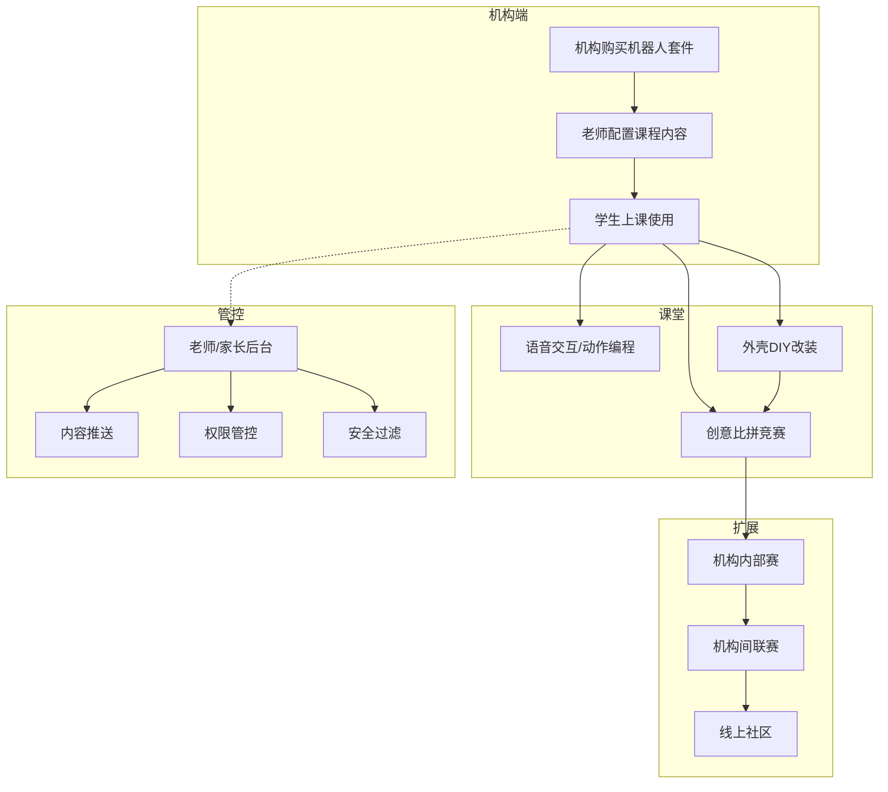

# Otto Robot 教育平台 — Brainstorm 记录

> 产出时间：2026-04-03
> 阶段：Step 2 - Brainstorm

## 问答决策记录

| 问题 | 决策 |
|------|------|
| 目标用户 | 教培机构，从初中晚托班开始启动 |
| 机器人角色 | 兴趣课（核心）+ 课间娱乐 + 机构引流，优先兴趣课 |
| 硬件模式 | 机构提供公用 + 学生可自购带回家 |
| 研发范围 | 全栈自研（硬件改版 + 固件 + 云端 + 前端） |
| 竞赛机制 | 三期：机构内部 → 机构间联赛 → 线上社区 |
| 家长管控 | 教学内容推送 + 家长推送 + 安全过滤，全部都要 |
| 商业模式 | 待定，PRD 不限定 |

## PRD 初稿（v1）

基于飞熊原始 6 条点子 + 问答决策，输出 PRD 初稿，包含：

### 6 大模块，27 条需求

**一、语音交互能力（R1-R5）**
- R1. 连接大模型语音对话
- R2. 语音指令控制动作
- R3. 语音回答知识问题
- R4. Wi-Fi / 4G 联网
- R5. 离线语音唤醒

**二、网页端配置（R6-R9）**
- R6. 可视化配置界面
- R7. 在线舵机校准
- R8. OTA 固件升级
- R9. PC + 平板适配

**三、硬件 DIY 扩展（R10-R13）**
- R10. 可替换外壳体系
- R11. 预设外壳方案
- R12. 标准化扩展接口（摄像头/大屏/舵机）
- R13. 即插即用自动适配

**四、动作编程训练（R14-R19）**
- R14. 图形化编程工具
- R15. 实时预览
- R16. 保存/命名/分享
- R17. 课程体系
- R18. AI 辅助动作生成
- R19. 音乐节拍同步

**五、竞赛平台（R20-R23）**
- R20. 机构内部赛（外观选美/动作展示/功能创新）
- R21. 机构间联赛（二期）
- R22. 线上社区（三期）
- R23. 评分标准模板

**六、权限管控（R24-R27）**
- R24. 三级权限（管理员/教师/家长）
- R25. 内容推送
- R26. 安全过滤
- R27. 使用监控

### 用户流程图

