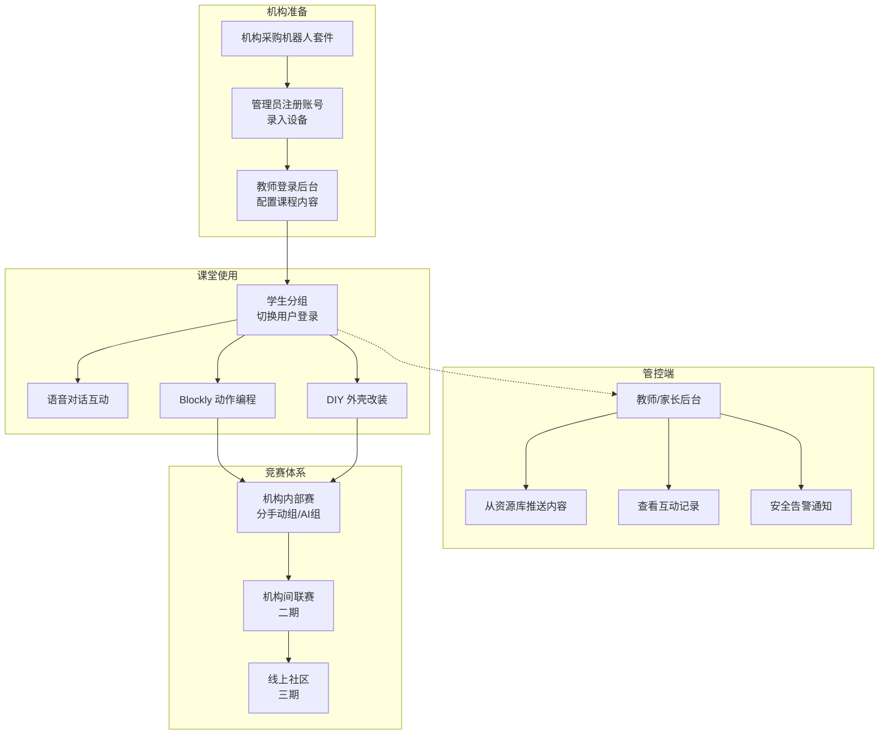

# Otto Robot 教育平台产品需求文档（终稿）

## 1. 问题定义

初中晚托班市场同质化严重，缺乏差异化竞争力。基于 Otto DIY 开源机器人进行二次研发，打造一套 **桌面 AI 人形机器人教育平台**，作为晚托班的特色兴趣课程内容，同时提供课间娱乐和机构引流价值。

### 1.1 核心用户

| 角色 | 描述 | 核心诉求 |
|------|------|----------|
| 学生 | 12-15 岁初中生，在晚托班上课 | 好玩、有成就感、能和同学比拼 |
| 教师 | 晚托班授课教师，负责机器人课程 | 易教学、有现成教案、课堂可控 |
| 机构管理者 | 晚托班运营方 | 招生差异化、课程特色、成本可控 |
| 家长 | 关注孩子学习和安全 | 学习有价值、内容安全、可了解孩子动态 |

### 1.2 产品定位

从单机机器人 → 教育生态平台，覆盖硬件、固件、云端、前端全栈。

### 1.3 关键参数

- 目标硬件成本：基础版 ≤ 250 元/台（含 PSRAM + 音频芯片，不含扩展模块）
- 课堂配比：建议 2-3 名学生共用 1 台机器人
- 网络环境：独立 5GHz Wi-Fi AP，单课堂支持 15-20 台设备同时在线
- 4G 为可选扩展模块，基础版仅 Wi-Fi

---

## 2. 用户流程

---

## 3. 功能需求

### 3.1 语音交互能力

- **R1.** 机器人支持连接大模型（Qwen/DeepSeek/GLM 等），通过语音进行自然语言对话
- **R2.** 支持语音指令控制机器人动作（如"跳个舞"、"向前走 3 步"、"做个太空步"），支持同义表达（如"跳舞"/"跳个舞"/"表演舞蹈"均识别为跳舞指令），识别失败时引导用户重新表述
- **R3.** 支持语音回答知识类问题，回答内容需符合以下标准：使用初中生可理解的词汇、回答长度控制在 3 句话以内（追问可展开）、不涉及暴力/色情/政治等敏感话题
- **R4.** 基础版支持 Wi-Fi 联网（需 5GHz 频段支持）；4G 模块为可选扩展配件，用于无 Wi-Fi 环境
- **R5.** 支持离线语音唤醒（ESP-SR），无需联网即可激活。离线降级策略：仅支持唤醒和基础预设动作指令，AI 对话和云端功能不可用，屏幕显示"离线模式"提示

### 3.2 网页端配置与调试工具

- **R6.** 提供基于浏览器的可视化配置界面，支持机器人参数调整（舵机角度、行走速度等）。浏览器要求：Chrome ≥ 90、Safari ≥ 15、Edge ≥ 90
- **R7.** 支持在线校准机器人舵机初始位置，提供可视化滑块 + 实时角度反馈
- **R8.** 支持固件 OTA 升级，机构管理员可批量推送更新。升级策略：分批推送（每批 3-5 台），支持升级进度查看；升级失败自动回滚至上一版本；固件包需签名验证，防止恶意注入
- **R9.** 界面需适配 PC（≥1280px 宽）和平板（≥768px 宽），手机端提供精简版（家长查看用）

### 3.3 硬件 DIY 扩展体系

- **R10.** 设计可替换的外壳体系，支持 3D 打印自定义外壳（提供开源 STL 模板）。外壳安装后固件自动检测舵机是否受阻或传感器是否被遮挡，异常时提示检查外壳安装
- **R11.** 提供多种预设外壳方案（如机甲风、可爱风、卡通 IP 风等），降低创作门槛
- **R12.** 预留标准化扩展接口（I2C + GPIO 排针），支持即插即用添加：
  - 摄像头模块（视觉识别）
  - 大尺寸显示屏模块（字幕显示、丰富表情）
  - 额外舵机扩展（更多关节/手臂）
  - **硬件规格要求**：主板必须外扩 8MB PSRAM（ESP32-S3 原生 SRAM 不足以同时运行语音唤醒+音频编解码+舵机控制+Wi-Fi），配备外置音频芯片（如 ES8311）保证课堂环境音质
- **R13.** 扩展模块即插即用策略：单个模块插入后固件自动识别并初始化；多模块同时使用需通过硬件 I2C 多路复用器（主板预留 TCA9548A 电路），固件通过多路复用器管理不同地址的模块。地址冲突时管理后台提示冲突模块名称和建议操作

### 3.4 动作编程与训练系统

- **R14.** 提供网页端图形化编程工具（类似 Scratch），通过拖拽积木块编排动作序列。支持 28+ 预设动作积木 + 自定义舵机角度积木 + 控制流积木（循环/等待/条件）+ 传感器触发积木
- **R15.** 编程后点击"预览"按钮发送到机器人执行（非实时拖动即发送，避免网络拥塞）。提供浏览器端 3D 模拟预览，学生可先在模拟器中调试，再发送到真机。课堂限流：同一时间最多 5 台设备执行真机预览，其余排队等待
- **R16.** 支持自定义动作保存、命名、分享（课内分享、机构内分享）。支持版本历史（保留最近 10 个版本），误删可恢复（回收站保留 30 天）
- **R17.** 提供动作编程课程体系，作为兴趣课核心内容：
  - 入门级（4 节课）：拖拽预设动作积木，组合简单序列
  - 进阶级（4 节课）：自定义舵机角度，使用循环和条件
  - 高级（4 节课）：传感器触发、AI 辅助创作、音乐配合
  - 课程以平台内置互动教程呈现（每课：目标 → 引导 → 实操 → 挑战），配套教师教案文档
- **R18.** 支持 AI 辅助动作生成（云端能力）——用自然语言描述动作，AI 基于预设动作库组合/插值生成舵机序列。生成的动作可手动微调，保存后标记"AI 辅助"标签。竞赛中 AI 辅助作品单独分组评比，确保公平
- **R19.** 支持动作与音乐配合——学生在编程工具中上传/选择音乐，设定 BPM 和节拍点，手动将动作对齐到节拍。音乐在机器人本地播放（需 SD 卡或内置 Flash 存储），动作由机器人本地执行，避免网络延迟导致不同步

### 3.5 创意比拼与竞赛平台

- **R20.** 机构内部赛：
  - 外观选美：学生上传外壳照片到平台，同学在线投票（每人 3 票，不可投自己），实时显示票数排行
  - 动作技能展示（手动组）：比拼纯手动编程的动作创意和复杂度（动作数量 + 舵机使用维度 + 流畅度）
  - 动作技能展示（AI 组）：AI 辅助创作的动作，单独评比（创意度 + 与描述的匹配度）
  - 功能创新赛：比拼硬件扩展和功能组合创意
- **R21.** 机构间联赛（二期）：不同晚托班线上/线下竞赛，排行榜和积分体系
- **R22.** 线上社区（三期）：学生上传/下载/点赞/评论作品
- **R23.** 竞赛提供评分标准模板，教师可自定义评分维度和权重。默认模板包含：创意性（30%）、技术难度（30%）、完成度（20%）、展示效果（20%）

### 3.6 权限分级与内容管控

- **R24.** 三级权限体系：

| 角色 | 权限范围 |
|------|----------|
| 管理员（机构） | 管理所有设备和账号，设备分组（按班级），推送全局内容，查看全机构数据，配置安全策略 |
| 教师 | 管理本班设备和学生，推送课程内容，查看本班数据，管理班级竞赛 |
| 家长 | 查看自己孩子的使用情况，推送家庭内容 |

  家长账号与学生绑定方式：机构分配绑定码 → 家长扫码绑定 → 管理员审核确认

- **R25.** 内容推送：
  - 教师/管理员可定向推送学习内容到指定学生/班级的机器人
  - 家长可推送鼓励语、每日提醒等个性化内容
  - 推送内容支持文字、语音、动作序列
  - 推送时机可控：可设为"立即执行"、"下次对话时播报"、"课间播报"三种模式，避免打断上课
  - 推送频率可由机构管理员设置上限（如每天最多 N 条）
  - 推送队列：教师推送优先于家长推送；24 小时内未送达的推送自动过期
  - 提供**推送内容资源库**：预置课程内容包、节日主题包、鼓励语录等，教师可一键选用，无需自行准备素材

- **R26.** 安全过滤：
  - 对话内容**事后审计**：对话结束后 1 分钟内完成敏感词+AI 语义检测
  - 不良话题检测后：标记该次对话，通知教师（含触发关键词和上下文摘要），严重情况升级通知家长
  - 通知分级：一般（仅教师可见）、严重（通知家长），设置每天通知上限（如家长每天最多 3 条）
  - 可配置对话白名单/黑名单主题（教师/管理员可配置）
  - 离线模式降级：离线时仅支持预设安全回复模板，对话记录本地缓存，联网后补审

- **R27.** 使用监控：
  - 教师可查看班级学生上课互动记录（互动频次、使用时长、作品完成度）
  - 家长可查看孩子使用时长和对话摘要（由云端大模型自动生成，仅含主题标签和互动概要）
  - 管理员可查看机构整体数据统计（设备在线率、课程覆盖率、学生参与度趋势）
  - 学生参与度下降预警：连续 3 次课使用时长低于班级平均 50% 时，通知教师

### 3.7 多人共用与课堂管理

- **R28.** 用户切换机制：机器人支持多用户快速切换（语音"切换到 [姓名]"或按键切换），切换后加载该用户的编程作品和对话上下文
- **R29.** 课堂模式：教师可在后台设置课堂时段，课堂期间：家长推送自动转为"课后播报"；机器人可设置使用时长提醒（每人 15 分钟提醒轮换）
- **R30.** 紧急停止：机器人背部/底部设置物理紧急停止按钮，按下后所有舵机立即释放力矩。编程界面增加"停止执行"按钮，可远程中断正在执行的动作

### 3.8 设备管理与维护

- **R31.** 设备状态监控：教师/管理员可在后台查看每台设备状态（在线/离线、电量、网络信号强度、固件版本、最近错误日志）
- **R32.** 设备故障诊断：机器人异常时（舵机堵转、通信失败等）自动上报错误码，后台展示故障描述和建议处理方式。提供故障处理指南文档
- **R33.** 设备配置建议：每 15 台使用设备配置 3 台备用设备，备用设备可快速替换并自动同步配置

---

## 4. 非功能性需求

### 4.1 性能

| 指标 | 目标 |
|------|------|
| 语音唤醒响应 | < 500ms |
| 语音指令识别+执行 | < 2 秒（P95） |
| AI 对话首字响应 | < 2 秒（P95），使用流式 LLM + 流式 TTS 优化 |
| 动作编程预览 | < 1 秒（从点击到机器人开始执行） |
| OTA 升级 | 单台 < 5 分钟，支持分批并发 |
| 云端并发 | 10 个机构（150-200 台设备）同时在线，P95 延迟不超标 |

### 4.2 可用性

| 指标 | 目标 |
|------|------|
| 云端服务可用性 | ≥ 99.5%（月度） |
| 计划外停机降级 | 机器人进入离线模式，保留基础动作和预设对话 |
| 故障恢复 RTO | < 4 小时 |
| 数据 RPO | < 1 小时（学生作品和对话摘要） |

### 4.3 安全与隐私

- 学生对话记录、作品数据存储于国内云服务器
- 传输层加密（TLS 1.2+），存储层加密（AES-256）
- 学生个人信息仅收集：昵称、年级、所属班级。不收集真实姓名、身份证号、家庭住址
- 账号安全：密码最少 8 位，连续 5 次登录失败锁定 30 分钟，教师/管理员账号支持双因素认证
- 安全告警的对话内容保留范围：仅保留触发关键词的前后各 2 轮对话，完整对话不存储不展示

### 4.4 通信架构

- **控制通道**：MQTT（低频，动作指令、状态上报、OTA 触发）
- **媒体通道**：WebSocket（高频，语音流、编程数据同步）
- **课堂网络优化**：推荐教室部署独立 5GHz AP；非活跃设备降低心跳频率；常用 TTS 音频本地缓存

---

## 5. 成功标准

| 指标 | 标准 |
|------|------|
| 学习曲线 | 学生 2 节课后独立完成一个简单动作编程（≥3 个积木块，涉及 ≥1 个动作+1 个控制流） |
| 作品产出 | 学生 8 节课后完成一套自定义外壳 + 编程动作组合作品 |
| 机构价值 | 引入后学生出勤率和续课率有可见提升 |
| 差异化 | 机构反馈"机器人课程"成为招生亮点 |
| 竞赛承载 | 竞赛平台支撑至少 10 个机构同时参与 |
| 系统可靠性 | 课堂进行中因系统故障导致中断的次数 < 1 次/月/机构 |

---

## 6. 范围边界

- **不含**：硬件量产和供应链管理
- **不含**：具体教学大纲编写（由教育团队负责）
- **不含**：商业定价策略（待定）
- **MVP 阶段不含**：机构间联赛（二期）和线上社区（三期）
- **不含**：面向 6 岁以下儿童的适配（专注初中生）
- **不含**：机器人室内定位和自主导航
- **不含**：第三方开发者插件生态（远期考虑）

---

## 7. 关键决策

| 决策 | 理由 |
|------|------|
| 基于 Otto DIY 二次开发，非从零设计 | 降低研发成本，利用成熟开源生态 |
| 全栈自研（硬件改版 + 固件 + 云端 + 前端） | 掌握核心技术，灵活定制 |
| 硬件增加 PSRAM + 外置音频芯片 | ESP32-S3 原生 SRAM 不足，成本增加约 20 元但保证可用性 |
| 目标用户锁定初中生（12-15 岁） | 功能和交互围绕该年龄段 |
| 竞赛分手动组和 AI 组 | 确保 AI 辅助功能不破坏竞赛公平性 |
| 安全过滤用事后审计而非实时拦截 | 实时监听所有音频流复杂度过高，事后 1 分钟内审计可接受 |
| 音乐配合用本地播放而非云端流式 | 避免 Wi-Fi 延迟导致动作与音乐不同步 |
| 竞赛分三期推进 | 先验证机构内部需求，再扩展 |
| 商业模式待定 | PRD 不限定采购/租赁/自购模式 |

---

## 8. 依赖与假设

- Otto DIY 开源项目持续维护，ESP32-S3 + PSRAM 生态稳定
- 大模型 API（Qwen/DeepSeek 等）持续可用且成本可控
- 3D 打印能力（机构自备或外包）可用于外壳定制
- 晚托班有独立 5GHz Wi-Fi 环境或可接受 4G 扩展方案
- AI 动作生成训练数据集（需标注 500+ 样本"描述-舵机序列"对）
- 使用成熟权限框架（如 Casbin）实现 RBAC，不自研

---

## 9. 待解决问题

### 9.1 评审阶段已解决

| 问题 | 结论 |
|------|------|
| 4G vs 离线模式 | 基础版 Wi-Fi + 离线唤醒，4G 为可选扩展模块 |
| 课程体系形态 | 平台内置互动教程（12 节课） + 配套教师教案文档 |
| AI 动作生成在哪执行 | 云端能力，基于预设动作库组合/插值 |
| 推送时机控制 | 立即/下次对话/课间三种模式，队列+优先级+过期 |
| 安全过滤策略 | 事后审计（1 分钟内），非实时拦截 |
| 音乐节拍同步 | 音乐本地播放，手动对齐节拍 |
| I2C 多模块 | 硬件多路复用器（TCA9548A），非纯软件方案 |
| ESP32 内存 | 必须外扩 PSRAM + 外置音频芯片 |
| AI 作品竞赛公平 | AI 辅助作品标记，竞赛分 AI 组和手动组 |
| 多人共用 | 用户切换机制 + 课堂模式 + 使用时长提醒 |
| 编程安全 | 安全范围检测 + 紧急停止按钮 + 远程中断 |
| 教师推送负担 | 推送内容资源库，预置课程包 |

### 9.2 延期至实施阶段

- [Affects R12-R13] I2C 多路复用器具体电路设计
- [Affects R14] Blockly vs 自研编程工具选型
- [Affects R18] AI 动作生成的训练数据采集和模型方案
- [Affects R24-R27] 云端部署方案（自建 / 云服务 / 混合）
- [Affects R20-R23] 竞赛平台前端技术选型
- [Affects R29] 课堂轮换时长的最佳实践（需教学团队反馈）

---

## 10. 附录

### 10.1 参考资料

- Otto DIY 官网：https://ottodiy.tech
- Otto DIY GitHub：https://github.com/OttoDIY
- 闪猫侠固件源码：https://github.com/txp666/OTTO_ESP32
- 闪猫侠文档：https://github.com/txp666/ottodiy-docs
- 小智 AI 框架：https://github.com/78/xiaozhi-esp32
- Otto Blockly：https://github.com/OttoDIY/blockly

### 10.2 术语表

| 术语 | 说明 |
|------|------|
| Otto Robot | 基于 Otto DIY 的桌面人形机器人，ESP32-S3 + PSRAM 主控 |
| MCP | Model Context Protocol，机器人能力扩展协议 |
| Blockly | Google 开发的图形化编程框架 |
| OTA | Over-The-Air，固件空中升级 |
| ESP-SR | Espressif 语音识别库，支持离线唤醒 |
| PSRAM | 伪静态 RAM，ESP32-S3 外扩内存 |
| TCA9548A | I2C 多路复用器芯片，支持 8 路 I2C 设备 |
| RBAC | Role-Based Access Control，基于角色的访问控制 |

### 10.3 需求变更记录

| 版本 | 日期 | 变更 |
|------|------|------|
| v1 | 2026-04-03 | 初始版本，6 大模块 27 条需求 |
| v2 | 2026-04-03 | Plan 阶段补充：关键参数、离线降级、课程形态、推送时机等 |
| v3-终稿 | 2026-04-03 | Review 后终稿：新增 R28-R33、非功能性需求、通信架构；修改硬件规格、竞赛分组、安全过滤策略、音乐配合方案；共 33 条需求 |
