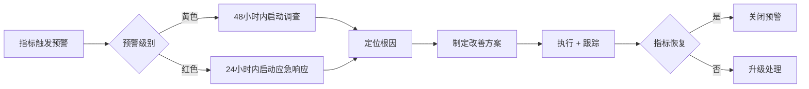

# 核心指标体系

> 一堂五步法 · 第二步：解决方案
> 修炼水平：L4-L5（有专业评估 → 有快速迭代的数据基础）

---

## 1. 十大典型指标总览

基于一堂产品内核修炼地图 L4-L5 方法论，围绕 OTTO 123 的三条核心价值链（获客 → 服务 → 复购），建立十大典型指标体系。

```
十大典型指标体系
│
├── 获客（3 个指标）
│   ├── 销转率：体验课 → 正式报名
│   ├── 动销率：活跃学生使用核心功能比例
│   └── 捕获率：目标机构成功签约比例
│
├── 服务（4 个指标）
│   ├── 留存率：12个月学生留存
│   ├── 完课率：报名学生完成全部课时
│   ├── 退款率：课程退款订单占比
│   └── 满意率：教师/学生/家长满意度
│
└── 复购（3 个指标）
    ├── 复购率：购买扩展模块的学生比例
    ├── 续费率：下一学期/月续费比例
    └── 推荐率：老带新/机构推荐新机构
```

### 指标选取逻辑

| 维度 | 选指标的标准 | 排除的候选指标 |
|------|-------------|---------------|
| 获客 | 反映渠道效率与产品吸引力 | 注册数（虚荣指标）、下载量（非核心） |
| 服务 | 反映真实交付质量与用户体验 | 页面浏览量（不等于学习效果） |
| 复购 | 反映长期价值与口碑传播力 | 点赞数（非商业价值） |

**核心原则**：每个指标都可被某一角色直接干预（管理员、教师、BD、产品经理），避免"知道了但做不了"的指标。

---

## 2. 获客指标详情

### 2.1 指标总览

| 指标 | 销转率 | 动销率 | 捕获率 |
|------|--------|--------|--------|
| 定义 | 体验课报名 → 正式缴费 | 月活跃学生中使用编程/AI 功能的比例 | 接触的机构中成功签约的比例 |
| MVP 目标 | ≥30% | ≥70% | ≥10% |
| 成熟目标 | ≥60% | ≥85% | ≥20% |
| 数据来源 | 报名系统 | 平台使用日志 | BD CRM |
| 采集频率 | 每月 | 每月 | 每季度 |
| 行业基准 | 20-40% | 50-70% | 5-15% |

### 2.2 销转率

**定义**：体验课报名学生中，最终正式缴费报名的比例。

销转率是教育行业最核心的获客效率指标。体验课的目的是让学生和家长在 1-2 节课内感受到 OTTO 123 的独特价值——亲手给机器人编程、看到机器人执行自己的创意。销转率低于 20% 意味着体验课设计或授课质量存在根本性问题，高于 60% 则说明产品价值传达极其有效。

**提升策略**：
- 体验课设置明确的"里程碑时刻"——让学生在第一节课就让机器人执行自己编排的动作
- 教师在体验课中引导学生向家长展示作品，形成"孩子开心、家长认可"的转化闭环
- 体验课结束后 24 小时内由教师一对一跟进，针对性解答家长疑虑

**分渠道差异**：学校社团课的销转率通常低于周末班（社团课由学校统一组织，学生自主报名意愿不一），但单次接触学生基数大；周末班销转率高但获客成本也高。

### 2.3 动销率

**定义**：月活跃学生中，实际使用核心功能（图形化编程、AI 语音对话、DIY 外壳设计）的比例。

动销率衡量的是"产品是否被真正用起来了"。一个学生登录了平台但只停留在旁观状态，不等于有效使用。OTTO 123 的核心价值在于"动手创造"，因此动销率聚焦于编程和 AI 功能的使用，而非单纯的登录或浏览。

**提升策略**：
- 新用户引导流程在首次登录时强制完成一个 3 分钟编程小任务，确保每位学生都能"上手即创造"
- 每周发布"本周挑战"（如"让机器人跳一段 8 拍舞蹈"），通过游戏化机制驱动功能使用
- 教师在课堂中预留 5-10 分钟的自由探索时间，鼓励学生尝试课内未覆盖的功能

**数据洞察**：动销率低于 50% 通常意味着产品上手门槛过高或课程设计缺乏吸引力，需要重点排查新手引导流程和第一节课的体验设计。

### 2.4 捕获率

**定义**：BD 团队接触的目标机构中，成功签约的比例。

捕获率反映的是商业模式的市场适配度。OTTO 123 面向学校社团课、晚托植入课、周末班三个渠道，不同渠道的捕获率差异显著。学校渠道的决策链条长（校长 → 教务处 → 科技老师），但一旦签约稳定性高；晚托渠道决策快但流失率相对较高。

**提升策略**：
- 建立"样板校/样板机构"案例库，用已有合作机构的数据（出勤率提升、续课率提升）作为谈判筹码
- 提供灵活的合作模式：先试运营 1 个月 → 数据验证 → 正式签约，降低机构决策风险
- BD 团队按区域和渠道专业化分工，积累垂直领域谈判经验

**数据洞察**：捕获率低于 5% 可能说明产品定价过高、价值主张不够清晰，或目标机构画像需要重新校准。

---

## 3. 服务指标详情

### 3.1 指标总览

| 指标 | 留存率 | 完课率 | 退款率 | 满意率 |
|------|--------|--------|--------|--------|
| 定义 | 12 个月后仍在学习的学生比例 | 报名学生完成 ≥80% 课时的比例 | 课程退款订单 / 总订单 | 问卷评分 ≥4/5 的比例 |
| MVP 目标 | ≥50% | ≥80% | ≤5% | ≥80% |
| 成熟目标 | ≥70% | ≥90% | ≤3% | ≥90% |
| 数据来源 | 学生注册 + 续费记录 | 出勤打卡系统 | 财务系统 | 季度问卷 |
| 采集频率 | 每学期 | 每月 | 每月 | 每季度 |
| 行业基准 | 30-50% | 60-80% | 3-8% | 70-85% |

### 3.2 留存率

**定义**：报名 12 个月后仍在持续学习（有续费或活跃使用记录）的学生比例。

留存率是教育产品的生命线。12 个月留存率低于 30% 意味着产品在做"一次性生意"，无法积累口碑和复利价值。OTTO 123 通过"硬件 DIY + 编程 + 竞赛"的组合拳提升粘性：学生投入了时间创作作品、定制了专属机器人外壳，迁移成本天然较高。

**提升策略**：
- 建立清晰的"成长阶梯"——入门 → 进阶 → 高级 → 竞赛，每个阶段有明确的目标和成就
- 引入机构内部赛和机构间联赛（二期），通过社交竞技保持学生参与热情
- 定期推出新的预设外壳方案和扩展模块，保持产品新鲜感

**分渠道差异**：学校社团课留存率预期高于晚托班（社团课有学期制保障），周末班取决于课程质量与家长满意度。综合留存率目标 ≥50%（MVP），≥70%（成熟期）。

### 3.3 完课率

**定义**：报名学生中，实际完成 ≥80% 课时的比例（以出勤打卡系统数据为准）。

完课率直接反映课程交付质量。学生缺课原因通常有三类：课程内容不吸引人、时间安排冲突、家庭因素。前三类可以通过产品和运营手段改善。完课率低于 60% 是严重警告信号，说明课程体系需要根本性重构。

**提升策略**：
- 课程设计采用"每课必有作品"原则，学生每节课都能带走一个可展示的成果
- 缺课自动触发补课提醒，提供线上录播回看或教师一对一补课
- 完课奖励机制——完成全部课时后获得电子证书 + 解锁高级课程权限

**与系统可靠性的关联**：PRD 要求课堂中断 <1 次/月/机构。频繁的系统故障直接影响完课率——机器人连不上、编程发送失败、语音对话无响应都会消耗课堂时间，导致课时浪费。

### 3.4 退款率

**定义**：课程退款订单数占总订单数的比例。

退款率是服务质量的"负面指标"，退款率高于 5% 说明产品或服务存在系统性问题。退款原因分类至关重要：教学质量问题、系统故障、家长预期不符、时间冲突等不同原因对应不同的改善方向。

**提升策略**：
- 退款前强制填写退款原因问卷，为运营优化提供精准数据
- 设置"犹豫期"机制——前 2 节课不满意可全额退款，降低家长决策心理负担的同时也过滤掉不匹配的用户
- 建立退款预警模型：连续 2 次缺课 + 家长满意度评分下降 → 教师主动介入沟通

**数据洞察**：退款率高于 10% 需要立即启动全面复盘，暂停新招生直到问题根因定位并修复。

### 3.5 满意率

**定义**：季度问卷调查中，评分 ≥4/5（满分 5 分）的受访者比例。调查覆盖教师、学生、家长三个角色。

满意率是"前瞻性指标"——满意度下降通常先于留存率和续费率下降 1-2 个季度。因此季度问卷是预警系统的核心输入。问卷设计需要覆盖不同角色关注的重点：教师关注易教性，学生关注趣味性，家长关注学习效果和安全性。

**提升策略**：
- 问卷设计控制在 5 分钟内完成，避免填写疲劳导致数据失真
- 针对评分 3 分以下的受访者，48 小时内安排电话回访深入了解问题
- 满意率数据按机构维度展示，帮助运营团队定位"问题机构"并重点帮扶

**分角色满意率权重**：教师满意率权重 40%（教师是交付核心）、家长满意率权重 40%（家长是付费决策者）、学生满意率权重 20%（学生是使用者，但付费决策权有限）。

---

## 4. 复购指标详情

### 4.1 指标总览

| 指标 | 复购率 | 续费率 | 推荐率 |
|------|--------|--------|--------|
| 定义 | 购买扩展模块/升级课程的学生比例 | 下一学期/月续费的学生比例 | 老带新或机构推荐新机构签约的比例 |
| MVP 目标 | ≥20% | ≥60% | ≥10% |
| 成熟目标 | ≥40% | ≥80% | ≥25% |
| 数据来源 | 订单系统 | 续费记录 | 推荐码/转介绍登记 |
| 采集频率 | 每学期 | 每学期 | 每季度 |
| 行业基准 | 15-30% | 50-70% | 5-15% |

### 4.2 复购率

**定义**：已购买基础课程的学生中，额外购买扩展模块（摄像头、大屏、额外舵机等）或升级课程（进阶/高级）的比例。

复购率衡量产品的"深度价值"——学生不仅在学，还愿意投入更多。OTTO 123 的硬件扩展体系（I2C + GPIO 标准化接口）天然支持复购：学生想要更酷的功能（视觉识别、更丰富的表情），就需要购买对应模块。

**提升策略**：
- 高级课程内容设计为"依赖扩展模块"——例如视觉识别课程必须搭配摄像头模块，创造自然复购需求
- 扩展模块采用"课堂体验 → 家庭购买"路径：学生在课堂上体验模块功能，回家后向家长提出购买需求
- 模块定价策略：单个模块 50-80 元，低于家长心理门槛，同时设置"套装优惠"提升客单价

**数据洞察**：复购率低于 15% 说明高级课程/扩展模块的价值主张不够 compelling，需要重新审视产品路线图。

### 4.3 续费率

**定义**：当前学期/周期结束的学生中，选择继续报名下一学期/周期的比例。

续费率是 OTTO 123 商业模型的基石。财务模型中 LTV/CAC 比值高达 10-192x 的前提就是高续费率——学生持续学习 2-3 年，LTV 才能充分释放。学校社团课续费率预期 70%+（学校统一续约），晚托班和周末班需要靠服务质量驱动。

**提升策略**：
- 学期末设置"成果展示日"——学生向家长展示学期作品（自定义外壳 + 编程动作组合），用实际成果驱动续费决策
- 早鸟优惠：当前学期结束前 2 周续费享受 95 折，降低拖延决策
- 续费意向预调研：学期中段（第 6-8 节课）向家长发送简短意向问卷，提前识别流失风险

**与财务模型的关联**：续费率每提升 10%，单学生 LTV 增长约 25-30%（基于 3 年学习周期计算）。续费率低于 50% 将导致 LTV/CAC 比值跌破 5x，商业模型可持续性受到威胁。

### 4.4 推荐率

**定义**：老学生/家长带来新学员报名，或已签约机构推荐新机构签约的比例。

推荐率是口碑传播的量化指标，也是获客成本最低的渠道。推荐率高于 15% 意味着产品已经建立了自传播能力，营销投入可以逐步降低。OTTO 123 在教育行业的差异化优势（机器人 + AI + 开源）天然具备话题性，但需要机制化的推荐流程才能转化为实际数据。

**提升策略**：
- 建立推荐奖励机制：老带新成功后双方各获得 1 节免费课或 1 个扩展模块
- 为教师提供"家长沟通话术模板"，在成果展示日引导家长分享到朋友圈
- 机构推荐：已签约机构推荐新机构签约后，双方各获得一定数量的免费扩展模块或课程升级

**分渠道差异**：周末班推荐率预期最高（家长社交圈密集），学校社团课推荐率体现为"校内口碑"影响其他学校决策，晚托班推荐率取决于机构管理者的主动推荐意愿。

---

## 5. 指标 Dashboard 设计

按角色分层设计 Dashboard，确保每个角色看到的是与自己直接相关的指标，避免信息过载。

### 5.1 管理员 Dashboard

**定位**：全局业务健康度监控，服务于运营决策。

| 模块 | 核心指标 | 展示形式 |
|------|----------|----------|
| 北极星指标 | 续费率 | 大数字卡片 + 趋势折线（近 6 个月） |
| 获客健康度 | 捕获率、销转率 | 漏斗图 + 环比变化 |
| 服务质量 | 留存率、完课率、退款率 | 仪表盘 + 预警标记 |
| 复购能力 | 续费率、推荐率、复购率 | 趋势图 + 分渠道对比 |
| 财务概览 | LTV/CAC、毛利率 | 数字卡片 + 目标线 |

**辅助信息**：
- 各机构指标排名（按续费率排序，标注红色/黄色预警机构）
- 指标环比变化箭头（上升/下降/持平），异常变化自动高亮

### 5.2 教师 Dashboard

**定位**：课堂交付质量自检，服务于教学改进。

| 模块 | 核心指标 | 展示形式 |
|------|----------|----------|
| 教学效果 | 本班完课率 | 进度条 + 班级平均值对比 |
| 学生参与 | 学生参与度排名 | 列表（使用时长、作品提交数） |
| 系统状态 | 课堂中断次数 | 计数器 + 近 4 周趋势 |
| 创作产出 | 作品提交率 | 饼图（已提交 / 未提交） |

**辅助信息**：
- 参与度下降预警学生名单（连续 3 次课低于班级平均 50%）
- 下节课待推送内容提醒

### 5.3 BD Dashboard

**定位**：销售漏斗管理，服务于获客效率提升。

| 模块 | 核心指标 | 展示形式 |
|------|----------|----------|
| 转化效率 | 捕获率 | 漏斗图（接触 → 意向 → 体验 → 签约） |
| 销售速度 | 平均签约周期 | 数字卡片（天数） |
| 客户质量 | 客户续约率 | 趋势图 |
| 管道管理 | 各阶段机构数量 | 看板视图 |

**辅助信息**：
- 样板机构案例库快速入口
- 竞品报价参考

### 5.4 家长端（精简）

**定位**：学习成果可视化，服务于续费决策。

| 模块 | 核心指标 | 展示形式 |
|------|----------|----------|
| 学习投入 | 孩子累计学习时长 | 数字 + 进度条 |
| 创作成果 | 作品完成度/数量 | 作品缩略图列表 |
| 互动情况 | 对话互动摘要（AI 生成） | 主题标签 + 互动频次 |

**设计原则**：家长端不超过 3 个核心指标，避免给家长造成"被监控"的负面感受。重点展示孩子的创作成果和学习成长，而非冷冰冰的数据。

---

## 6. 预警机制

当核心指标偏离目标值时，按严重程度触发黄色/红色预警，并启动对应的应对措施。

| 指标 | 黄色预警 | 红色预警 | 应对措施 |
|------|----------|----------|----------|
| 续费率 | <60% | <40% | 黄色：教师访谈 + 课程优化；红色：紧急复盘 + 产品改进 |
| 完课率 | <70% | <50% | 黄色：出勤跟踪 + 家长沟通；红色：课程内容调整 |
| 退款率 | >5% | >10% | 黄色：退款原因分析；红色：暂停招生 + 全面整改 |
| 留存率 | <50% | <30% | 黄色：流失原因调研；红色：运营模式重新评估 |
| 满意率 | <70% | <50% | 黄色：针对性改进；红色：暂停扩张 |
| 销转率 | <20% | <10% | 黄色：体验课流程优化；红色：产品价值主张重审 |
| 捕获率 | <8% | <3% | 黄色：BD 策略调整；红色：目标市场重新定义 |

### 预警处理流程



### 预警通知规则

- **黄色预警**：通知对应负责人（教师 → 教学主管，BD → 销售主管），每周汇总报告
- **红色预警**：通知管理层 + 对应负责人，每日跟踪直至恢复
- **连续 2 个周期黄色预警**：自动升级为红色预警
- 预警恢复后继续观察 2 个周期，确认稳定后关闭

---

## 7. 与 PRD 成功标准的映射

PRD 定义了 6 项成功标准（第 5 节），十大指标体系需要完整覆盖这些标准，确保产品迭代始终围绕核心目标。

| PRD 成功标准 | 对应指标 | 覆盖方式 |
|-------------|----------|----------|
| 学习曲线：学生 2 节课后独立完成简单动作编程（≥3 个积木块） | 动销率、完课率 | 动销率追踪编程功能使用率，完课率验证课程推进效率，两者间接验证学习曲线是否平滑 |
| 作品产出：学生 8 节课后完成自定义外壳 + 编程动作组合作品 | 完课率、动销率 | 作品提交数据作为完课率的核心佐证，动销率验证编程和 DIY 功能的实际使用深度 |
| 机构价值：引入后出勤率和续课率有可见提升 | 续费率、留存率 | 直接对应——续费率和留存率的提升是机构价值最直接的量化体现 |
| 差异化：机构反馈"机器人课程"成为招生亮点 | 推荐率、捕获率 | 推荐率衡量机构主动推荐意愿（最强的差异化验证），捕获率反映差异化对签约转化的推动 |
| 竞赛承载：竞赛平台支撑至少 10 个机构同时参与 | 捕获率 | 签约机构总数达到 10+ 是竞赛承载的前提，捕获率直接驱动机构规模增长 |
| 系统可靠性：课堂中断 <1 次/月/机构 | 完课率、退款率 | 系统故障直接影响课堂交付（完课率下降）和用户体验（退款率上升），两者是系统可靠性的间接代理指标 |

### 覆盖完整性验证

- 6 项 PRD 成功标准 → 10 项指标中 8 项参与覆盖
- 未直接参与的 2 项指标（复购率、满意率）通过续费率和推荐率间接关联
- 无 PRD 成功标准处于"无指标覆盖"的盲区

### 数据采集优先级

| 优先级 | 指标 | 理由 |
|--------|------|------|
| P0（上线即采集） | 完课率、续费率、退款率 | 直接影响业务健康度，数据来源已明确（出勤系统、续费记录、财务系统） |
| P1（MVP 阶段上线） | 留存率、动销率、销转率 | 需要 1-2 个学期数据积累才能形成有效趋势 |
| P2（成熟阶段上线） | 捕获率、满意率、推荐率、复购率 | 依赖规模化运营后才有统计意义 |

---

*文档版本：v2.0*
*更新日期：2026-04-04*
*方法论：一堂产品内核修炼地图 L4-L5 · 十大典型指标*
*关联文档：[产品功能体系](/solution/03-产品功能体系.md) | [迭代路线图](/solution/05-迭代路线图.md) | [单元模型与健康度](/business/03-单元模型与健康度.md)*
