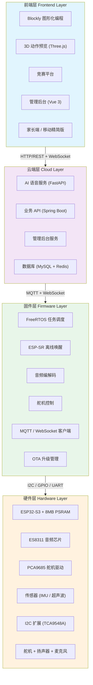
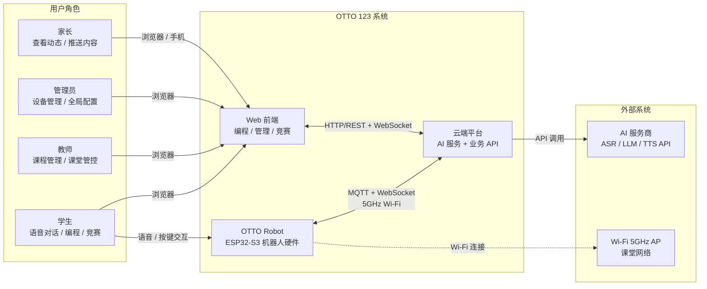
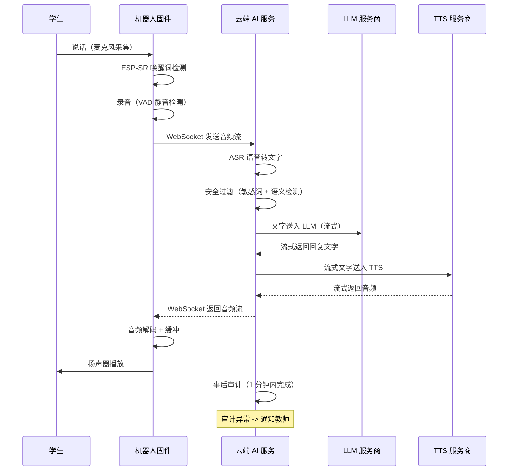
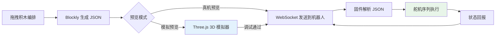
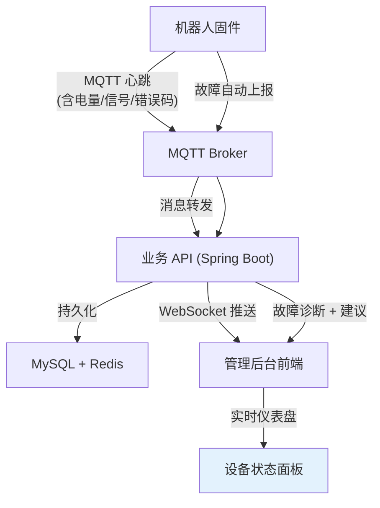
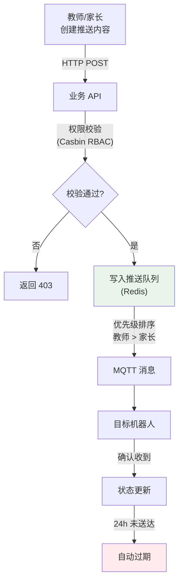

# 01. 系统架构总览

> 本文档是 OTTO 123 教育机器人平台的顶层架构设计文档，将 [_archive/prd/compound/2026-04-03-otto-robot-prd-final.md](/_archive/prd/compound/2026-04-03-otto-robot-prd-final.md) 中定义的 33 项需求映射到四层技术架构，明确各层职责、技术选型和关键数据流。

---

## 1. 概述

OTTO 123 是面向初中生的桌面 AI 人形机器人教育平台，覆盖硬件、固件、云端、前端全栈。系统以 ESP32-S3 为核心硬件，通过 Wi-Fi 连接云端 AI 服务，提供语音对话、图形化编程、竞赛比拼、课堂管理等功能。

架构设计的核心原则：

- **分层解耦**：硬件 / 固件 / 云端 / 前端各层独立演进，通过标准协议通信
- **成本可控**：单台硬件成本控制在 250 元以内，云端服务支持 10 个机构（150-200 台设备）并发
- **离线可用**：网络中断时机器人仍可完成唤醒、预设动作、本地音乐播放
- **课堂优先**：所有设计决策以课堂场景为第一优先级（15-20 台设备同时在线、2-3 人共用）

---

## 2. 四层架构模型

系统分为四个层级，自下而上分别是硬件层、固件层、云端层和前端层。各层通过明确的协议接口通信，支持独立开发和部署。

### 各层职责

| 层级 | 核心职责 | 对应 PRD 需求 |
|------|----------|---------------|
| 硬件层 | 传感器采集、舵机驱动、音频输入输出、扩展模块供电 | R4, R10, R12, R13, R30, R31, R32, R33 |
| 固件层 | 实时控制、离线唤醒、音频处理、通信协议、OTA | R2, R5, R7, R8, R13, R19, R28, R30 |
| 云端层 | AI 语音 pipeline、业务逻辑、权限管控、数据持久化 | R1, R3, R16, R18, R20-R27, R29 |
| 前端层 | 用户交互、编程工具、3D 预览、竞赛管理、数据展示 | R6, R9, R14, R15, R17, R20-R24, R27 |

---

## 3. 技术栈总表

| 层级 | 技术组件 | 版本 / 规格 | 用途说明 |
|------|----------|-------------|----------|
| **硬件** | ESP32-S3 | 双核 240MHz | 主控 MCU，负责实时任务调度和通信 |
| | PSRAM | 8MB Octal SPI | 运行语音唤醒 + 音频编解码 + Wi-Fi 的内存保障 |
| | ES8311 | I2S 音频 codec | 麦克风输入和扬声器输出，课堂环境音质保障 |
| | PCA9685 | 16 通道 PWM | 舵机驱动，支持 12+ 自由度 |
| | TCA9548A | 8 路 I2C 多路复用器 | 多扩展模块地址管理 |
| **固件** | C/C++ | C11 / C++17 | 固件开发语言 |
| | FreeRTOS | 内置于 ESP-IDF | 多任务调度（音频、舵机、通信并行） |
| | ESP-IDF | 5.x | 官方开发框架，含 Wi-Fi/BLE/OTA 组件 |
| | ESP-SR | WakeNet + MultiNet | 离线语音唤醒 + 本地命令词识别 |
| | ESP-IDF OTA | -- | 分批推送、签名验证、自动回滚 |
| **云端后端** | Python / FastAPI | Python 3.11+ | AI 语音服务（ASR/LLM/TTS 编排） |
| | Java / Spring Boot | 3.x | 业务 API（用户、设备、课程、竞赛） |
| | MySQL | 8.0 | 持久化存储（用户、作品、竞赛、日志） |
| | Redis | 7.x | 缓存（会话、设备状态、推送队列、限流） |
| **前端** | Vue 3 + Vite | Vue 3.4+ | 管理后台、竞赛平台、家长端 |
| | Three.js | r160+ | 3D 机器人动作预览 |
| | Google Blockly | 10.x | 图形化编程工具 |
| | Docsify | 4.x | 文档站点（本项目） |
| **通信** | MQTT (mosquitto) | 5.0 | 控制通道：动作指令、状态上报、OTA 触发、内容推送 |
| | WebSocket | -- | 媒体通道：语音流、编程数据同步、实时通知 |
| | HTTP/REST | -- | 管理接口：配置、用户管理、竞赛操作 |
| **AI Pipeline** | ASR | SenseVoiceSmall / SherpaASR | 语音识别（中文，支持课堂噪声环境） |
| | LLM | Qwen / DeepSeek / GLM | 自然语言对话（流式输出） |
| | TTS | EdgeTTS / 阿里云 | 语音合成（常用音频本地缓存加速） |
| **认证授权** | JWT | -- | 用户身份认证 |
| | Casbin | -- | RBAC 权限控制（管理员 / 教师 / 家长三级） |
| | SM2 | 可选 | 国密加密（参考 aipen 项目） |

---

## 4. 系统上下文图

以下 C4 上下文图展示系统与外部角色及依赖系统之间的关系。

### 外部依赖说明

| 外部系统 | 依赖方式 | 故障影响 | 降级策略 |
|----------|----------|----------|----------|
| Wi-Fi AP | 必需（基础版） | 机器人离线 | 进入离线模式，保留唤醒和预设动作 |
| AI 服务商 API | 必需（对话功能） | 无法 AI 对话 | 本地预设回复，联网后补审 |
| 浏览器 | 必需（管理/编程） | 无法操作后台 | 机器人本地仍可语音交互 |
| 3D 打印（外壳定制） | 可选 | 无法定制外壳 | 使用预设外壳方案 |

---

## 5. 核心数据流

### 5.1 语音交互流

从学生说话到机器人回复的完整链路，端到端目标延迟 < 2 秒（P95）。

**关键设计点**：
- ASR/LLM/TTS 均采用流式处理，首字响应 < 2 秒
- 安全过滤为事后审计模式，不阻塞正常对话流
- 常用 TTS 音频本地缓存，减少网络请求

### 5.2 动作编程流

学生在 Blockly 中编排动作，通过 3D 预览调试，最终发送到真机执行。

**课堂限流**：同一时间最多 5 台设备执行真机预览，其余排队等待，避免 Wi-Fi 拥塞。

### 5.3 设备管理流

机器人通过 MQTT 心跳上报状态，管理后台实时展示。

### 5.4 内容推送流

教师/家长创建推送内容，通过 MQTT 分发到目标机器人。

**推送时机**：立即执行 / 下次对话时播报 / 课间播报（课堂模式下家长推送自动转为课后播报）。

---

## 6. PRD 需求映射总览

下表将 PRD 中全部 33 项需求（R1-R33）映射到架构层级和主要技术组件。

| 需求编号 | 需求摘要 | 主负责层级 | 关键技术组件 |
|----------|----------|------------|--------------|
| R1 | 大模型语音对话 | 云端层 + 固件层 | FastAPI, LLM API, WebSocket, ESP-SR |
| R2 | 语音指令控制动作 | 固件层 + 云端层 | ESP-SR MultiNet, LLM 意图识别, PCA9685 |
| R3 | 语音回答知识问题 | 云端层 | LLM API, TTS, 安全过滤 pipeline |
| R4 | Wi-Fi 联网（5GHz） | 硬件层 | ESP32-S3 Wi-Fi 6 |
| R5 | 离线语音唤醒 | 固件层 | ESP-SR WakeNet, 本地命令词 |
| R6 | 网页端可视化配置 | 前端层 + 云端层 | Vue 3, HTTP/REST API |
| R7 | 在线舵机校准 | 前端层 + 固件层 | Vue 3 滑块, WebSocket 实时反馈, PCA9685 |
| R8 | 固件 OTA 升级 | 固件层 + 云端层 | ESP-IDF OTA, MQTT, 签名验证 |
| R9 | 多端适配（PC/平板/手机） | 前端层 | Vue 3 响应式布局 |
| R10 | 可替换外壳 + 自动检测 | 硬件层 + 固件层 | 舵机阻力检测, 传感器遮挡检测 |
| R11 | 预设外壳方案 | -- | 设计资源（非技术需求） |
| R12 | 标准化扩展接口 | 硬件层 | I2C/GPIO 排针, PSRAM, ES8311 |
| R13 | 扩展模块即插即用 | 硬件层 + 固件层 + 云端层 | TCA9548A, 固件自动识别, 管理后台冲突提示 |
| R14 | 图形化编程工具 | 前端层 | Google Blockly, 自定义积木定义 |
| R15 | 3D 模拟预览 + 真机执行 | 前端层 + 固件层 | Three.js, WebSocket, 课堂限流（Redis） |
| R16 | 动作保存/分享/版本 | 云端层 | MySQL, 文件存储, 版本历史 |
| R17 | 动作编程课程体系 | 前端层 + 云端层 | Vue 3 互动教程, 教案文档 |
| R18 | AI 辅助动作生成 | 云端层 | FastAPI, LLM API, 动作库插值算法 |
| R19 | 动作与音乐配合 | 固件层 | SD 卡本地播放, 舵机时序控制 |
| R20 | 机构内部赛 | 前端层 + 云端层 | Vue 3 竞赛模块, MySQL, 投票系统 |
| R21 | 机构间联赛（二期） | 前端层 + 云端层 | 排行榜, 积分体系（二期设计） |
| R22 | 线上社区（三期） | 前端层 + 云端层 | 作品上传/下载/点赞/评论（三期设计） |
| R23 | 竞赛评分模板 | 云端层 | MySQL, 自定义评分维度和权重 |
| R24 | 三级权限体系 | 云端层 | Casbin RBAC, JWT, 绑定码机制 |
| R25 | 内容推送系统 | 云端层 + 固件层 | Redis 推送队列, MQTT, 资源库 |
| R26 | 安全过滤（事后审计） | 云端层 | 敏感词检测, AI 语义检测, 通知分级 |
| R27 | 使用监控 | 云端层 + 前端层 | MySQL 数据统计, 参与度预警 |
| R28 | 多用户快速切换 | 固件层 + 云端层 | 语音/按键切换, 用户上下文加载 |
| R29 | 课堂模式 | 云端层 + 固件层 | 时段配置, 轮换提醒, 推送模式切换 |
| R30 | 紧急停止 | 硬件层 + 固件层 + 前端层 | 物理按钮, 舵机力矩释放, 远程中断 |
| R31 | 设备状态监控 | 固件层 + 云端层 + 前端层 | MQTT 心跳, Redis 状态缓存, 仪表盘 |
| R32 | 设备故障诊断 | 固件层 + 云端层 | 错误码上报, 故障描述库, 处理建议 |
| R33 | 备用设备快速替换 | 云端层 | 设备配置同步, 批量配置推送 |

---

## 7. 关键技术决策

| 决策项 | 选定方案 | 备选方案 | 决策理由 |
|--------|----------|----------|----------|
| 设备控制通信协议 | MQTT 5.0 | HTTP 轮询 / CoAP | MQTT 天然支持双向通信、低带宽占用、QoS 保证；HTTP 轮询延迟高且浪费带宽；CoAP 生态不成熟 |
| 媒体流通信 | WebSocket | WebRTC / gRPC | WebSocket 兼容性好（浏览器原生支持），适合语音流和编程数据同步；WebRTC 适合 P2P 但本场景不需要；gRPC 浏览器需代理 |
| AI 对话延迟优化 | 流式 LLM + 流式 TTS | 整句识别后合成 | 流式处理将首字响应从 4-5 秒降至 < 2 秒，用户体验显著提升 |
| 权限控制框架 | Casbin RBAC | 自研权限 / Spring Security | Casbin 成熟、灵活，支持策略热加载；自研成本高且易出错；Spring Security 与 Java 绑定，前端和 Python 端无法复用 |
| 音乐播放方式 | 本地 SD 卡/Flash 播放 | 云端流式播放 | 本地播放避免 Wi-Fi 延迟导致动作与音乐不同步，R19 明确要求 |
| 安全过滤策略 | 事后审计（1 分钟内） | 实时拦截 | 实时监听所有音频流复杂度过高；事后审计在可接受时间窗口内完成，且不阻塞正常对话 |
| 图形化编程框架 | Google Blockly | Scratch / 自研 | Blockly 成熟稳定、可高度定制、无需 Flash；Scratch 已停止维护 Flash 版本；自研成本过高 |
| 3D 预览引擎 | Three.js | Babylon.js / CSS 3D | Three.js 社区活跃、文档完善、与 Vue 3 集成方便；Babylon.js 偏重游戏场景；CSS 3D 无法满足关节动画需求 |
| I2C 多模块管理 | TCA9548A 硬件多路复用 | 软件动态地址切换 | 硬件方案稳定可靠，避免软件切换时序问题导致的通信失败 |
| AI 语音服务框架 | FastAPI (Python) | Spring Boot (Java) / Node.js | Python 是 AI 生态首选语言，ASR/LLM/TTS SDK 均有 Python 版本；FastAPI 异步性能优秀；业务 API 则用 Spring Boot 保证企业级稳定性 |
| 数据库 | MySQL 8 + Redis | PostgreSQL / MongoDB | MySQL 8 生态成熟，运维成本低；Redis 用于缓存和队列，减轻 MySQL 压力 |
| OTA 升级策略 | ESP-IDF OTA + 分批推送 | 整体推送 / 蓝牙 OTA | 分批推送（每批 3-5 台）降低课堂风险；支持签名验证和自动回滚；蓝牙 OTA 不适合大规模部署 |
| 竞赛分组策略 | 手动组 + AI 组 | 统一评比 | AI 辅助作品单独评比确保公平，鼓励学生同时掌握手动编程能力 |

---

## 8. 参考项目借鉴

本系统的架构设计参考了以下开源项目的成熟方案，根据 OTTO 123 的教育场景进行了适配和扩展。

### 8.1 xiaozhi-esp32-server

**项目地址**：https://github.com/xinnan-tech/xiaozhi-esp32-server

借鉴内容：

| 借鉴点 | 在本系统中的应用 |
|--------|------------------|
| WebSocket 音频协议 | 机器人与云端之间的音频流传输采用类似的 WebSocket 双向流协议，支持实时音频上行和下行 |
| AI 音频 pipeline 架构 | ASR -> LLM -> TTS 的流水线编排方式，参考了 xiaozhi 的模块化设计，支持热切换不同 AI 服务商 |
| Docker 容器化部署 | 云端服务采用 Docker Compose 编排，便于开发环境搭建和生产部署 |
| 设备在线状态管理 | 通过 MQTT/WebSocket 心跳检测设备在线状态，参考了 xiaozhi 的设备管理逻辑 |

### 8.2 aipen

借鉴内容：

| 借鉴点 | 在本系统中的应用 |
|--------|------------------|
| FastAPI 后端架构 | AI 语音服务采用 FastAPI 框架，参考 aipen 的异步处理和依赖注入模式 |
| AI 服务商抽象层 | 设计统一的 AI Provider 接口，支持 ASR/LLM/TTS 的多服务商切换（Qwen/DeepSeek/GLM 等） |
| 设备绑定流程 | 用户（学生）与设备的绑定机制，参考 aipen 的扫码绑定 + 管理员审核确认流程 |
| JWT 认证 | 用户身份认证采用 JWT 方案，参考 aipen 的 Token 生成、刷新和权限校验实现 |
| SM2 国密加密 | 可选的国密加密方案，参考 aipen 的 SM2 集成方式，满足特定场景的安全合规需求 |

### 差异化设计

相比参考项目，OTTO 123 的独特设计包括：

- **课堂多用户共用**：R28-R29 的用户切换和课堂模式是本系统特有需求
- **竞赛平台**：R20-R23 的比拼体系需要完整的前后端竞赛模块
- **三级 RBAC 权限**：管理员/教师/家长的三级权限体系比参考项目更复杂
- **3D 动作预览**：Three.js 模拟器 + 真机执行的编程工作流
- **I2C 扩展模块管理**：TCA9548A 多路复用 + 自动识别 + 冲突检测

---

> 下一篇：[02-硬件架构设计](/system/02-硬件架构设计.md)
