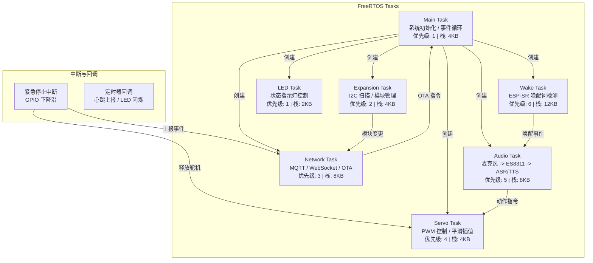
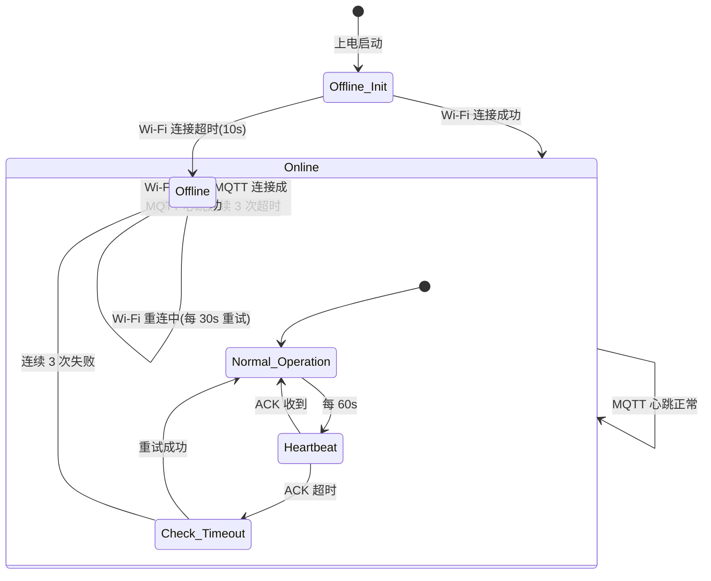
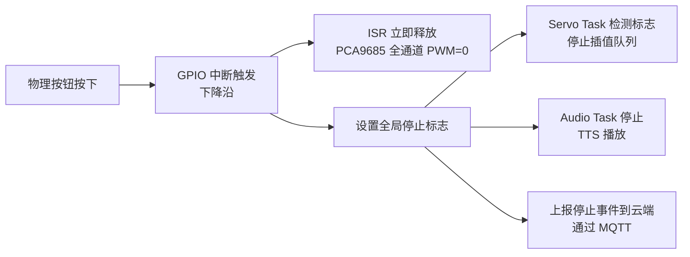
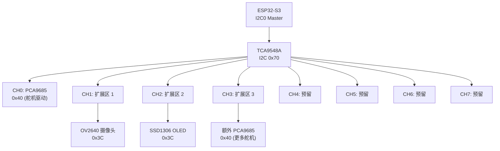
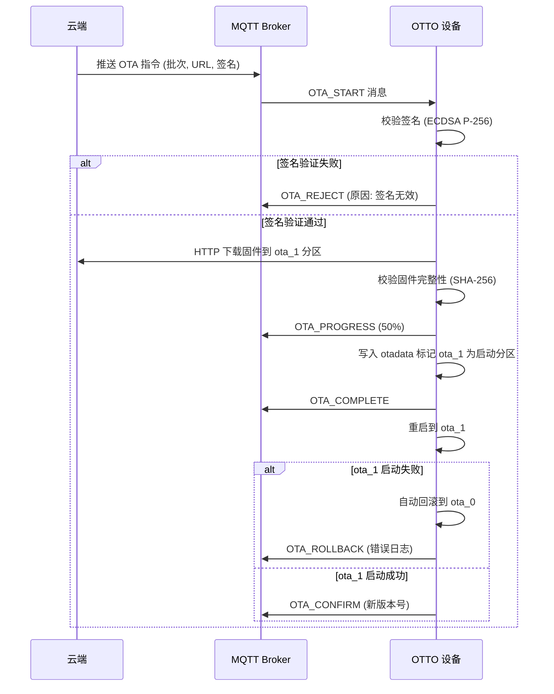

# 固件架构设计

> 本文档定义 OTTO 123 教育机器人的固件架构，基于 ESP-IDF + FreeRTOS 框架，覆盖硬件驱动、任务调度、内存管理、离线唤醒、舵机控制、I2C 扩展、OTA 升级和设备状态上报等核心模块。需求映射参见 [PRD 终稿](/_archive/prd/compound/2026-04-03-otto-robot-prd-final.md)。

---

## 1. 概述

### 1.1 固件范围

固件运行在 OTTO 123 机器人主板上，承担以下职责：

- **语音交互**：麦克风采集、音频编解码、离线唤醒词检测、音频流上传
- **动作执行**：舵机 PWM 控制、动作插值、堵转检测、紧急停止
- **网络通信**：MQTT 控制通道、WebSocket 媒体通道、OTA 固件升级
- **扩展管理**：I2C 模块自动扫描、多路复用器管理、地址冲突检测
- **设备管理**：心跳上报、错误码上报、固件版本管理

### 1.2 技术基线

| 项目 | 选型 |
|------|------|
| 开发框架 | ESP-IDF v5.x |
| 实时系统 | FreeRTOS（ESP-IDF 内置） |
| 编程语言 | C（核心驱动/任务），C++（应用层逻辑） |
| 音频框架 | ESP-ADF（Audio Development Framework） |
| 语音唤醒 | ESP-SR（Espressif Speech Recognition） |
| 舵机控制 | PCA9685 I2C PWM 驱动 |
| I2C 多路复用 | TCA9548A |

### 1.3 参考项目

固件设计参考以下开源项目的架构经验：

- **Otto DIY**：舵机控制库（Otto9.h/Otto9.cpp），步态算法，平滑插值
- **xiaozhi-esp32**：ESP-IDF OTA 双分区方案，音频管道（ASR/TTS），WebSocket 音频流

---

## 2. 硬件平台规格

### 2.1 核心组件

| 组件 | 型号 | 规格 | 用途 |
|------|------|------|------|
| 主控芯片 | ESP32-S3 | 双核 240MHz，Xtensa LX7，512KB SRAM | 系统控制、音频处理、网络通信 |
| 外扩 PSRAM | ESP-PSRAM64H | 8MB Octal SPI，80MHz 时钟 | 音频缓冲、网络缓冲、系统堆扩展 |
| 音频芯片 | ES8311 | I2S 接口，ADC + DAC，SNR > 100dB | 麦克风采集 + 扬声器播放 |
| 舵机驱动 | PCA9685 | 16 通道 12-bit PWM，I2C 接口 | 腿部/手臂舵机 PWM 信号生成 |
| I2C 多路复用 | TCA9548A | 8 通道 I2C Switch，400KHz | 扩展模块地址冲突管理 |
| 腿部舵机 | SG90/MG90S | 4x，90 度旋转范围 | 行走、转向 |
| 手臂舵机 | SG90/MG90S | 2x（可选），90 度旋转范围 | 手臂动作 |
| 紧急停止 | 按键开关 | 物理常开按钮，背部/底部 | 立即释放所有舵机力矩 |
| 状态指示 | LED | RGB LED x1 + 单色 LED x2 | 网络状态、充电状态、错误指示 |
| 可选显示 | SSD1306 | 128x64 I2C OLED | 状态信息、表情、离线提示 |
| 可选摄像头 | OV2640 | 2MP，SPI/I2C 接口 | 视觉识别扩展 |

### 2.2 接口定义

```
ESP32-S3 Pin Map
================
I2C0 (SDA/SCL)     -> PCA9685 (舵机驱动)
I2C0 (SDA/SCL)     -> TCA9548A (多路复用器)
I2S0 (BCLK/WS/DOUT)-> ES8311 (音频输出 - 扬声器)
I2S0 (BCLK/WS/DIN) -> ES8311 (音频输入 - 麦克风)
UART0              -> USB 调试串口
GPIO (input)       -> 紧急停止按钮 (中断触发，下降沿)
GPIO (output)      -> 状态 LED
SPI                -> PSRAM (Octal SPI, 内置)
```

### 2.3 成本约束

基础版 BOM 目标 <= 250 元/台，核心成本分布：

| 组件 | 预估成本（元） | 备注 |
|------|---------------|------|
| ESP32-S3 + 8MB PSRAM 模组 | 35-45 | 合封模组 |
| ES8311 音频芯片 + 麦克风 | 15-20 | 含驻极体麦克风 |
| PCA9685 + 6x 舵机 | 30-40 | SG90/MG90S |
| PCB + 电源管理 + 外壳 | 30-50 | 含电池管理 |
| 其他（按钮、LED、连接器） | 10-15 | -- |
| **合计（基础版）** | **120-170** | 不含扩展模块 |

扩展模块（摄像头、OLED、额外舵机）作为独立配件销售，不计入基础版成本。

---

## 3. FreeRTOS 任务模型

### 3.1 任务架构图



### 3.2 优先级与栈大小

| 任务 | 优先级 | 栈大小 | 说明 |
|------|--------|--------|------|
| Wake Task | 6（最高） | 12KB | ESP-SR 模型加载后驻留内存，需较大栈空间 |
| Audio Task | 5 | 8KB | 音频编解码和缓冲区操作，需较大栈空间 |
| Servo Task | 4 | 4KB | PWM 时序控制，实时性要求高 |
| Network Task | 3 | 8KB | MQTT/WebSocket 收发，TLS 握手时栈需求较大 |
| Expansion Task | 2 | 4KB | I2C 扫描频率低，优先级可低 |
| LED Task | 1（最低） | 2KB | 简单 GPIO 操作，栈需求最小 |
| Main Task | 1（最低） | 4KB | 初始化完成后进入事件循环，负载低 |

### 3.3 任务间通信

| 通信机制 | 用途 | 参与任务 |
|----------|------|----------|
| FreeRTOS Queue | 唤醒事件、动作指令、模块事件 | Wake -> Audio, Audio -> Servo, Expansion -> Network |
| FreeRTOS Semaphore | I2C 总线互斥、PSRAM 缓冲区互斥 | Servo, Audio, Expansion, Network |
| FreeRTOS Event Group | 网络就绪、OTA 状态标志 | Main, Network |
| ESP Event Loop | Wi-Fi 事件、系统事件 | Main, Network |

---

## 4. 内存管理策略

### 4.1 PSRAM 分配计划

8MB PSRAM 的分配方案，使用 ESP-IDF 的 `heap_caps_malloc(size, MALLOC_CAP_SPIRAM)` 分配：

| 用途 | 大小 | 说明 |
|------|------|------|
| ESP-SR 唤醒模型 | ~1MB | 唤醒词检测模型常驻内存 |
| 音频缓冲（ASR 输入） | ~1MB | 16kHz 16-bit 单声道，约 32 秒录音缓冲 |
| 音频缓冲（TTS 输出） | ~1MB | 流式 TTS 播放缓冲 |
| 舵机插值缓冲 | ~256KB | 最多 64 个动作帧 x 6 舵机 x float |
| 网络缓冲（MQTT） | ~512KB | 消息收发缓冲 + TLS 上下文 |
| 网络缓冲（WebSocket） | ~1MB | 音频流上行/下行缓冲 |
| 系统堆扩展 | ~3.2MB | FreeRTOS heap_caps_malloc 使用 |

### 4.2 内部 SRAM 分配

ESP32-S3 内置 512KB SRAM 主要用于：

| 用途 | 说明 |
|------|------|
| FreeRTOS 任务栈 | 所有任务栈分配在内部 SRAM |
| DMA 缓冲区 | I2S DMA 描述符和缓冲（ES8311 要求 DMA 在内部 RAM） |
| Wi-Fi/BLE 协议栈 | ESP-IDF 自动分配 |
| 中断处理 | ISR 栈和中断上下文数据 |

### 4.3 内存安全策略

- **静态分配优先**：唤醒模型和固定大小缓冲在启动时一次性分配，避免运行时碎片
- **缓冲池模式**：音频和网络缓冲使用固定大小内存池，避免频繁 malloc/free
- **内存监控**：通过 `esp_get_free_heap_size()` 和 `heap_caps_get_free_size(MALLOC_CAP_SPIRAM)` 定期上报可用内存
- **OOM 降级**：PSRAM 不足时关闭 TTS 流式缓冲降级为短句播放模式，上报警告

---

## 5. 离线唤醒与降级策略（R5）

### 5.1 ESP-SR 唤醒引擎

ESP-SR 是 Espressif 官方的本地语音识别框架，运行在 ESP32-S3 的 DSP 指令加速上：

```
唤醒流程
========
麦克风 -> I2S DMA -> ESP-SR WakeNet -> 匹配 "小奥"
                                        |
                                        v
                                   唤醒回调
                                        |
                                  +-----+-----+
                                  |           |
                              在线模式     离线模式
                                  |           |
                          音频流上传     本地命令解析
                          云端 ASR     预设动作执行
```

- **唤醒词**：默认 "小奥"（Xiao Ao），支持通过管理后台自定义替换
- **唤醒模型**：WakeNet5，模型大小约 500KB，常驻 PSRAM
- **响应时间**：< 500ms（从唤醒词结束到系统响应）
- **误唤醒率**：< 1 次/24 小时

### 5.2 离线模式降级

当 Wi-Fi 断开或云端不可达时，固件自动切换到离线模式：

| 功能 | 在线模式 | 离线模式 |
|------|----------|----------|
| 语音唤醒 | 正常 | 正常（ESP-SR 本地运行） |
| AI 对话 | 云端 LLM + TTS | 不可用 |
| 动作指令 | 云端 ASR 识别 | 本地预设命令匹配（"前进"、"跳舞"等） |
| 外壳 | 正常显示 | 显示 "离线模式" 文字提示 |
| LED 指示 | 常亮 | 慢闪橙色 |
| 心跳上报 | MQTT 心跳 | 本地缓存，联网后补传 |

### 5.3 在线/离线自动检测



---

## 6. 舵机控制系统

### 6.1 PCA9685 驱动架构

```
PCA9685 (I2C 地址: 0x40)
=========================
Channel 0-3  -> 腿部舵机 (左前、右前、左后、右后)
Channel 4-5  -> 手臂舵机 (左臂、右臂，可选)
Channel 6-15 -> 预留给扩展舵机

PWM 频率: 50Hz (舵机标准)
PWM 分辨率: 12-bit (0-4095)
脉冲范围: 500us - 2500us (映射到 0-180 度)
```

### 6.2 平滑插值算法

动作切换时使用插值避免舵机突变：

```c
// 线性插值 + ease-in-out 缓动
// duration: 插值总时长(ms)
// steps: 插值步数 (默认 20)
float ease_in_out(float t) {
    return t < 0.5f ? 2.0f * t * t : -1.0f + (4.0f - 2.0f * t) * t;
}

// 插值帧: [leg_lf, leg_rf, leg_lr, leg_rr, arm_l, arm_r]
// 每帧 6 个 float 角度值，Servo Task 按 50Hz 逐帧下发
```

- **默认插值时长**：200ms（快速动作）到 1000ms（慢速动作）
- **插值步长**：每 20ms（50Hz）下发一次目标角度
- **安全范围**：每台舵机定义最小/最大角度限制，超出范围自动钳位

### 6.3 紧急停止机制（R30）



关键设计：
- **中断优先级最高**：GPIO 中断直接操作 PCA9685 寄存器，不经过任务调度
- **双重保障**：ISR 层面释放 PWM + 任务层面停止插值队列
- **远程停止**：MQTT 接收到停止指令后走相同的停止流程

### 6.4 堵转检测与外壳保护（R10）

- **检测方式**：PCA9685 无法直接检测堵转，通过 INA219 电流传感器监测舵机电流
- **堵转判定**：单舵机电流持续 > 阈值（如 800mA）超过 500ms 判定为堵转
- **处理策略**：
  1. 立即停止当前动作
  2. LED 闪烁红色 + 蜂鸣器短鸣（如有）
  3. 上报堵转事件到云端（包含舵机编号和电流值）
  4. 外壳安装场景：提示 "请检查外壳是否阻碍舵机运动"

---

## 7. I2C 扩展体系（R12, R13）

### 7.1 TCA9548A 多路复用器架构



### 7.2 即插即用检测流程

```
开机扫描
========
1. Expansion Task 启动后，依次打开 TCA9548A 的 CH0-CH7
2. 每个通道上执行 I2C 扫描 (0x08 - 0x77)
3. 根据扫描到的设备地址，匹配已知模块表：
   - 0x40 -> PCA9685 (舵机驱动)
   - 0x3C -> SSD1306 (OLED 显示)
   - 0x3D -> SSD1306 (备用地址)
   - 0x30 -> OV2640 (摄像头 SCCB)
4. 生成模块拓扑表，上报云端
```

### 7.3 地址冲突检测（R13）

| 场景 | 处理方式 |
|------|----------|
| 两个模块使用相同 I2C 地址 | 通过 TCA9548A 分配到不同通道，物理隔离 |
| 同一通道内地址冲突 | 上报冲突错误码，LED 闪烁提示，管理后台显示冲突详情 |
| 未知设备接入 | 上报设备地址和通道，标记为"未识别模块"，管理后台提示确认 |

### 7.4 支持的扩展模块

| 模块 | I2C 地址 | 通道 | 功能 |
|------|----------|------|------|
| PCA9685（额外舵机驱动） | 0x40 | CH3 | 扩展 16 通道 PWM，支持更多关节 |
| SSD1306 OLED | 0x3C | CH2 | 128x64 显示屏，状态信息和表情 |
| OV2640 摄像头 | 0x30 (SCCB) | CH1 | 2MP 摄像头，视觉识别 |
| BME280 传感器 | 0x76/0x77 | CH4-7 | 温湿度气压（教学扩展） |
| APDS-9960 手势 | 0x39 | CH4-7 | 手势识别（教学扩展） |

---

## 8. OTA 升级流程（R8）

### 8.1 双分区方案

```
Flash 分区表
============
| 名称           | 类型     | 子类型   | 偏移      | 大小    |
|----------------|----------|----------|-----------|---------|
| nvs            | data     | nvs      | 0x9000    | 24KB    |
| otadata        | data     | ota      | 0xF000    | 8KB     |
| phy_init       | data     | phy      | 0x10000   | 4KB     |
| ota_0          | app      | ota_0    | 0x20000   | 2MB     |
| ota_1          | app      | ota_1    | 0x220000  | 2MB     |
| storage        | spiffs   | spiffs   | 0x420000  | 1MB     |
```

### 8.2 OTA 升级流程



### 8.3 安全机制

- **签名验证**：固件包使用 ECDSA P-256 签名，公钥烧录在 NVS 分区中
- **完整性校验**：下载完成后计算 SHA-256，与签名中包含的哈希比对
- **自动回滚**：启动失败（bootloader 检测到连续 2 次启动超时）自动回滚到上一版本
- **分批推送**：管理后台控制每批 3-5 台设备，避免同时升级导致课堂瘫痪
- **升级锁**：升级过程中舵机动作暂停，LED 显示升级进度

---

## 9. 设备状态上报（R31, R32）

### 9.1 心跳机制

设备每 60 秒（可配置）通过 MQTT 上报一次心跳：

```json
{
  "device_id": "OTTO-20260405-001",
  "timestamp": 1743830400,
  "status": {
    "online": true,
    "battery_percent": 85,
    "battery_charging": false,
    "wifi_rssi": -45,
    "wifi_ssid": "OTTO-CLASSROOM-01",
    "firmware_version": "1.2.0",
    "uptime_seconds": 7200,
    "psram_free_kb": 2048,
    "sram_free_kb": 180
  },
  "expansion": {
    "modules": ["PCA9685@CH0", "SSD1306@CH2"],
    "conflicts": []
  },
  "errors": []
}
```

### 9.2 错误码定义

| 错误码 | 描述 | 建议处理 |
|--------|------|----------|
| E0010 | Wi-Fi 连接失败 | 检查路由器和密码配置 |
| E0011 | Wi-Fi 信号弱（RSSI < -75dBm） | 移近路由器或增加 AP |
| E0020 | MQTT 连接失败 | 检查网络和云端服务状态 |
| E0021 | MQTT 心跳超时 | 检查网络连接 |
| E0030 | 舵机堵转（通道 N） | 检查舵机和外壳安装 |
| E0031 | PCA9685 I2C 通信失败 | 检查接线 |
| E0040 | ES8311 初始化失败 | 检查音频芯片接线 |
| E0041 | 麦克风无信号 | 检查麦克风连接 |
| E0050 | TCA9548A 通信失败 | 检查 I2C 接线 |
| E0051 | I2C 地址冲突 | 检查扩展模块配置 |
| E0060 | OTA 下载失败 | 检查网络，重试 |
| E0061 | OTA 签名验证失败 | 联系管理员 |
| E0062 | OTA 回滚 | 检查固件兼容性 |
| E0070 | PSRAM 初始化失败 | 硬件故障，需更换 |
| E0071 | PSRAM 内存不足 | 重启设备 |

### 9.3 故障诊断流程（R32）

```mermaid
flowchart TB
    A[设备异常检测] --> B{异常类型?}

    B -->|舵机堵转| C[立即停止动作]
    C --> D[上报 E0030<br/>含舵机编号和电流值]
    D --> E[管理后台显示<br/>"请检查外壳安装"]

    B -->|网络断开| F[进入离线模式]
    F --> G[LED 慢闪橙色]
    G --> H[每 30s 尝试重连]
    H --> I{3 分钟内恢复?}
    I -->|是| J[上报恢复事件]
    I -->|否| K[上报 E0010/E0020]

    B -->|I2C 通信失败| L[尝试 3 次重新初始化]
    L --> M{恢复?}
    M -->|是| N[继续正常工作]
    M -->|否| O[上报对应错误码]
    O --> P[禁用故障模块<br/>其他模块继续工作]

    B -->|OTA 失败| Q[上报 E0060-E0062]
    Q --> R[保持当前版本运行]
```

---

## 10. PRD 需求映射表

| 需求编号 | 需求摘要 | 固件章节 | 覆盖状态 |
|----------|----------|----------|----------|
| R4 | Wi-Fi 5GHz + 4G 可选扩展 | 2.1 硬件平台规格 | 完整覆盖 |
| R5 | 离线语音唤醒 + 降级策略 | 5. 离线唤醒与降级策略 | 完整覆盖 |
| R8 | OTA 升级（签名、回滚、分批） | 8. OTA 升级流程 | 完整覆盖 |
| R10 | 可替换外壳 + 舵机受阻检测 | 6.4 堵转检测与外壳保护 | 完整覆盖 |
| R12 | 标准化扩展接口（I2C + GPIO） | 7. I2C 扩展体系 | 完整覆盖 |
| R13 | 即插即用 + TCA9548A + 地址冲突 | 7. I2C 扩展体系 | 完整覆盖 |
| R30 | 紧急停止按钮 + 远程中断 | 6.3 紧急停止机制 | 完整覆盖 |
| R31 | 设备状态监控 | 9.1 心跳机制 | 完整覆盖 |
| R32 | 故障诊断 + 自动上报 | 9.2 错误码定义, 9.3 故障诊断流程 | 完整覆盖 |

---

## 11. 参考借鉴

### 11.1 xiaozhi-esp32

| 借鉴内容 | 应用场景 |
|----------|----------|
| ESP-IDF OTA 双分区方案 | 8.1 Flash 分区表和 8.2 升级流程 |
| ESP-ADF 音频管道（microphone -> codec -> ASR/TTS） | 3.1 Audio Task 设计 |
| WebSocket 音频流传输 | Network Task 音频通道 |
| FreeRTOS 多任务架构 | 3. FreeRTOS 任务模型 |

### 11.2 Otto DIY

| 借鉴内容 | 应用场景 |
|----------|----------|
| Otto9 舵机控制库（步态算法） | 6.2 平滑插值算法基础 |
| 预设动作库（walk, turn, dance 等） | Servo Task 动作指令集 |
| 舵机安全角度限制 | 6.2 安全范围限制 |
| 硬件接线方案（PCA9685 + 舵机） | 2.2 接口定义 |

### 11.3 ESP-IDF 官方示例

| 借鉴内容 | 应用场景 |
|----------|----------|
| ESP-SR WakeNet 示例 | 5.1 唤醒引擎集成 |
| I2C 扫描示例 | 7.2 即插即用检测 |
| OTA 示例（esp_ota_ops） | 8. OTA 升级流程 |
| PSRAM heap_caps 示例 | 4. 内存管理策略 |
