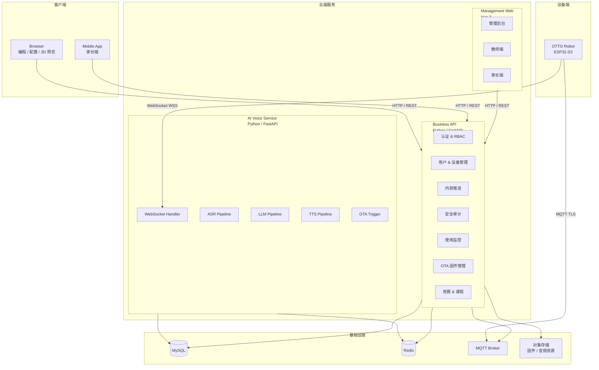
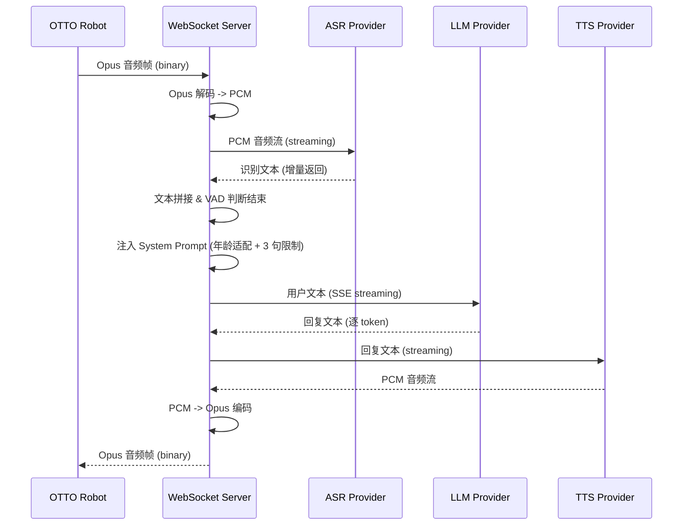
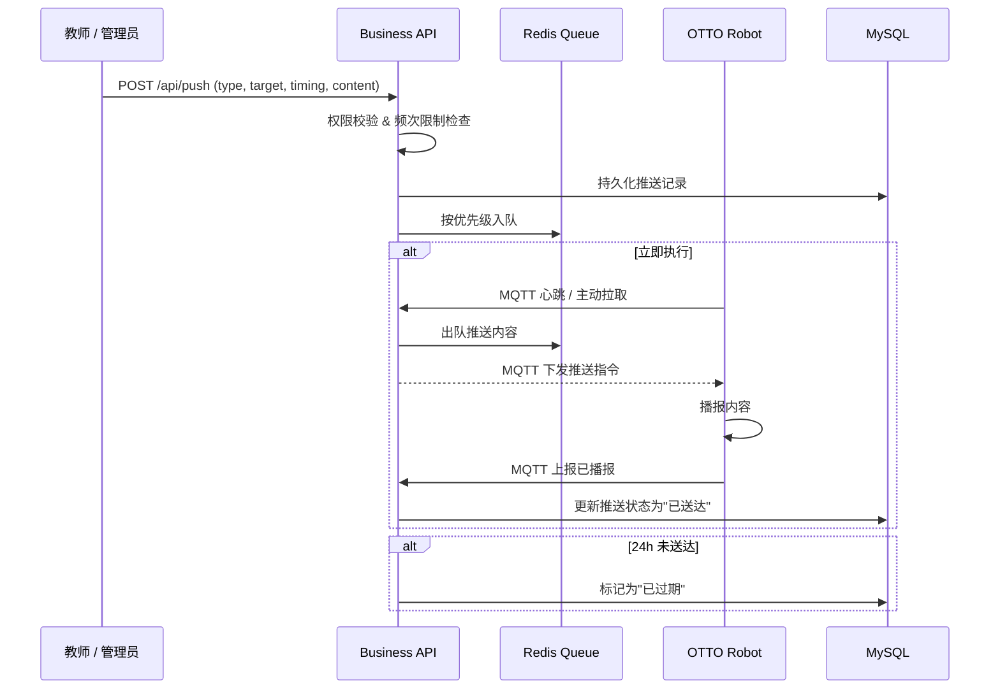
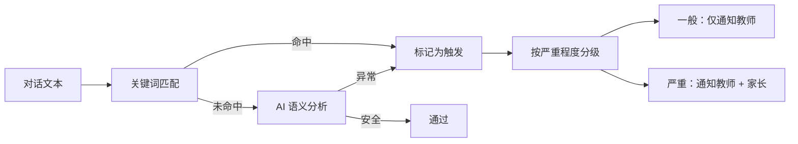
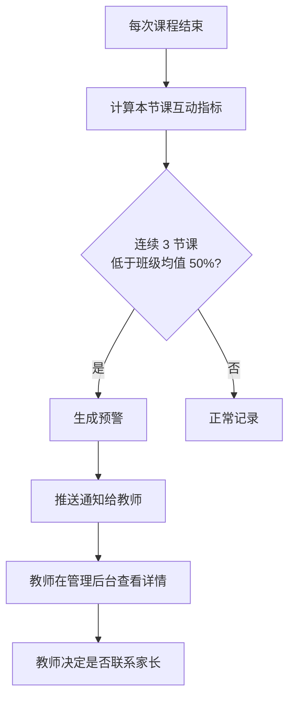

# 03. 后端服务架构

> 基于 [PRD 终稿](/_archive/prd/compound/2026-04-03-otto-robot-prd-final.md) 中 R1/R3/R6/R8/R18/R25/R26/R27 等需求，设计后端服务架构。参考 [xiaozhi-esp32-server](https://github.com/xinnan-tech/xiaozhi-esp32-server) 的音频流管道和 [aipen](https://github.com/flybear16/aipen) 的 AI 提供商抽象层、标准响应格式。

---

## 1. 概述

后端服务承载 OTTO 123 平台的核心业务逻辑，包括 AI 语音对话、设备管理、内容推送、安全审计和使用监控。架构设计采用**双参考项目混合**策略：

| 参考项目 | 借鉴内容 | 适用场景 |
|----------|----------|----------|
| **xiaozhi-esp32-server** | WebSocket 音频管道（ASR-LLM-TTS 流式串联）、Docker Compose 部署、SenseVoiceSmall 本地 ASR | AI 语音服务 |
| **aipen** | AI 提供商抽象层（Base Class + 工厂模式）、标准响应格式、SlowAPI 限流、JWT 认证、MQTT 设备通信 | 业务 API、内容推送、安全审计 |

核心设计原则：

- **服务按职责拆分**：AI 语音服务与业务管理服务分离，独立部署和扩展
- **提供商可插拔**：ASR/LLM/TTS 均通过抽象层接入，切换供应商只需改配置
- **事后审计而非实时拦截**：平衡延迟与安全，对话结束后异步完成内容审核
- **MVP 阶段可合并**：初期可将 AI 语音服务与业务 API 合并为单个 Python 服务，降低运维复杂度

---

## 2. 服务拆分

### 2.1 三服务架构



### 2.2 各服务职责

| 服务 | 技术栈 | 职责 | 对应 PRD 需求 |
|------|--------|------|---------------|
| **AI Voice Service** | Python / FastAPI / WebSocket | 语音对话管道、设备绑定、OTA 触发 | R1, R3, R18 |
| **Business API** | Python / FastAPI | 用户管理、RBAC、内容推送、安全审计、使用监控、OTA 管理、竞赛 | R6, R8, R25, R26, R27 |
| **Management Web** | Vue 3 / Element Plus | 管理后台、教师端、家长端 | R6, R25, R27 |

### 2.3 合并策略

MVP 阶段建议将 AI Voice Service 与 Business API 合并为单个 Python FastAPI 服务，理由：

- 初期设备量少（<50 台），单服务可满足性能需求
- 减少容器数量，降低部署复杂度
- 共享数据库连接和 Redis 缓存，避免跨服务调用

拆分时机：当并发 WebSocket 连接超过 200 或音频管道需要独立扩缩容时，再将 AI Voice Service 拆出。

---

## 3. AI 语音引擎

参考 xiaozhi-esp32-server 的音频流管道设计，实现端到端语音对话。

### 3.1 WebSocket 音频管道



### 3.2 System Prompt 注入

每次对话自动注入以下规则，确保回复符合 R3 要求：

```
你是一个面向初中生的教育机器人助手。请遵循以下规则：
1. 使用初中生能理解的词汇，避免过于学术或幼稚的表达
2. 每次回答控制在 3 句话以内（追问时可适当展开）
3. 不涉及暴力、色情、政治等敏感话题
4. 鼓励学生思考和探索，必要时反问引导
5. 知识类问题优先给出准确答案，不确定时诚实告知
```

### 3.3 提供商选型

| 模块 | 主选 | 备选 | 说明 |
|------|------|------|------|
| **ASR** | SenseVoiceSmall (本地) | 阿里云 ASR、腾讯云 ASR | 本地部署降低延迟和成本 |
| **LLM** | Qwen | DeepSeek、GLM | 流式输出，首 token 延迟 <500ms |
| **TTS** | EdgeTTS (免费) | 阿里云 TTS、FishSpeech | EdgeTTS 零成本，音质可接受 |

### 3.4 首响应延迟目标

通过全链路流式处理，将首响应延迟控制在 2 秒以内：

- ASR 流式识别：说话过程中即返回部分文本，不等整句结束
- LLM 流式生成：首 token 到达后立即送入 TTS
- TTS 流式合成：逐句合成，合成完一句即发送，不等全文完成

---

## 4. AI 提供商抽象层

参考 aipen 项目的 AIProvider 基类模式，为 ASR/LLM/TTS 统一抽象接口。

### 4.1 基类设计

```python
class LLMProvider:
    """LLM 提供商基类"""

    async def generate_response(self, messages: list[dict]) -> str:
        """同步生成完整回复"""
        raise NotImplementedError

    async def generate_response_stream(self, messages: list[dict]) -> AsyncIterator[str]:
        """流式生成回复（逐 token）"""
        raise NotImplementedError


class ASRProvider:
    """ASR 提供商基类"""

    async def transcribe(self, audio: bytes, sample_rate: int) -> str:
        """音频转文本"""
        raise NotImplementedError

    async def transcribe_stream(self, audio_chunk: bytes, sample_rate: int) -> str | None:
        """流式音频转文本，返回增量识别结果或 None"""
        raise NotImplementedError


class TTSProvider:
    """TTS 提供商基类"""

    async def synthesize(self, text: str) -> bytes:
        """文本转 PCM 音频"""
        raise NotImplementedError

    async def synthesize_stream(self, text: str) -> AsyncIterator[bytes]:
        """流式合成，逐 chunk 返回 PCM 音频"""
        raise NotImplementedError
```

### 4.2 工厂模式

```python
def create_llm_provider() -> LLMProvider:
    provider = os.getenv("AI_PROVIDER", "qwen")
    match provider:
        case "qwen":
            return QwenProvider(
                api_key=os.getenv("AI_API_KEY"),
                base_url=os.getenv("AI_BASE_URL", "https://dashscope.aliyuncs.com/compatible-mode/v1"),
                model=os.getenv("AI_MODEL", "qwen-plus"),
            )
        case "deepseek":
            return DeepSeekProvider(...)
        case "glm":
            return GLMProvider(...)
        case _:
            raise ValueError(f"Unsupported LLM provider: {provider}")
```

### 4.3 配置方式

通过环境变量控制提供商选择，无需修改代码即可切换：

| 环境变量 | 说明 | 默认值 |
|----------|------|--------|
| `AI_PROVIDER` | LLM 提供商名称 | `qwen` |
| `AI_API_KEY` | API 密钥 | - |
| `AI_BASE_URL` | API 基础 URL | 各提供商默认 |
| `AI_MODEL` | 模型名称 | 各提供商默认 |
| `ASR_PROVIDER` | ASR 提供商名称 | `sensevoice` |
| `TTS_PROVIDER` | TTS 提供商名称 | `edgetts` |

---

## 5. 内容推送系统（R25）

### 5.1 推送类型与触发方式

| 推送类型 | 内容示例 | 适用场景 |
|----------|----------|----------|
| **文本消息** | "今天的挑战：用 3 个动作编一个故事" | 课程引导 |
| **语音消息** | 教师录制的鼓励语音 | 课后反馈 |
| **动作序列** | 预编排的舞蹈动作 | 课间活动、节日主题 |

### 5.2 三种定时模式

| 模式 | 行为 | 技术实现 |
|------|------|----------|
| **立即执行** | 下一次空闲时立即播报 | Redis 队列，设备心跳时拉取 |
| **下次对话时播报** | 等待学生主动触发对话后插入 | 存入待播报队列，对话开始时插入 |
| **课间播报** | 按机构课间时间表定时推送 | Celery 定时任务，到时批量下发 |

### 5.3 推送流程



### 5.4 优先级与频次控制

- **优先级**：教师推送 > 管理员推送 > 家长推送
- **频次限制**：每机构可配置每日最大推送数（默认 5 条/学生/天）
- **24 小时自动过期**：未送达的推送在 24 小时后自动标记为"已过期"
- **内容资源库**：预置课程包、节日主题、鼓励语录，教师可一键选用

---

## 6. 内容安全审计（R26）

### 6.1 审计策略：事后而非实时

为避免影响语音对话的实时性（目标 <2s 首响应），安全审计采用**事后异步**模式：

- 对话结束后 1 分钟内完成审计（SLA）
- 审计通过则无任何通知
- 审计触发则按严重程度分级通知

### 6.2 两阶段检测



- **第一阶段 - 关键词匹配**：基于敏感词库快速过滤，覆盖暴力、色情、政治等明确违规内容
- **第二阶段 - AI 语义分析**：对关键词未命中的对话进行语义分析，识别隐晦违规内容（如软色情、自伤倾向等）

### 6.3 通知规则

| 规则 | 说明 |
|------|------|
| 通知分级 | 一般违规：仅教师；严重违规：教师 + 家长 |
| 每日上限 | 每位家长每日最多收到 3 条通知，避免过度打扰 |
| 通知内容 | 仅包含触发关键词 + 前后各 1 轮上下文（不发送完整对话记录） |
| 主题白名单/黑名单 | 机构可配置允许或禁止讨论的话题范围 |

### 6.4 离线模式

- 网络中断时，对话文本缓存在设备本地（Flash 存储，最多 50 条）
- 网络恢复后自动上传至云端进行审计
- 本地缓存满时，按 FIFO 淘汰最早记录

### 6.5 数据保留

审计日志保留策略：仅保留触发关键词的前后各 1 轮对话上下文，不存储完整对话记录。日志保留 90 天后自动清理。

---

## 7. 使用监控系统（R27）

### 7.1 三级监控粒度

| 粒度 | 指标 | 查看权限 |
|------|------|----------|
| **学生级** | 互动频次、使用时长、作品完成度、互动内容摘要 | 教师、家长 |
| **班级级** | 平均互动频次、参与率、完成度分布、异常学生列表 | 教师 |
| **机构级** | 设备在线率、课程覆盖率、整体参与趋势、教师使用排名 | 管理员 |

### 7.2 参与度下降预警



预警触发条件：某学生连续 3 次课程的综合互动指标（互动频次 + 使用时长 + 作品完成度的加权分数）低于班级均值的 50%，系统自动向教师发送提醒。

---

## 8. OTA 升级服务（R8）

### 8.1 固件管理

| 功能 | 说明 |
|------|------|
| **固件上传** | 管理员上传固件包（.bin），系统自动计算 SHA256 并生成 ECDSA 签名 |
| **版本跟踪** | 每次上传记录版本号、变更说明、发布时间 |
| **签名验证** | 设备端升级前验证 ECDSA 签名，防止恶意固件注入 |

### 8.2 分批推送

- **批次大小**：每批 3-5 台设备（可配置），避免同时升级导致教室全部离线
- **进度追踪**：管理后台实时显示每台设备的升级状态（等待中/下载中/升级中/成功/失败）
- **失败处理**：单台失败不影响同批次其他设备；失败设备可单独重试

### 8.3 自动回滚

- 设备升级后启动失败（连续 3 次未在 60 秒内完成心跳上报）
- 自动回滚到升级前的固件版本（ESP32 的双分区 OTA 机制）
- 回滚事件上报云端，管理员收到通知

---

## 9. API 设计规范

参考 aipen 项目的标准响应格式和错误码体系。

### 9.1 标准响应格式

```json
{
  "code": 0,
  "data": {},
  "message": "success"
}
```

### 9.2 错误码

| 错误码 | 含义 | 说明 |
|--------|------|------|
| 0 | 成功 | - |
| 400 | 请求参数错误 | 参数校验失败 |
| 401 | 未认证 | Token 缺失或过期 |
| 403 | 无权限 | RBAC 权限不足 |
| 404 | 资源不存在 | - |
| 429 | 请求过于频繁 | 触发限流 |
| 500 | 服务器内部错误 | - |

### 9.3 分页响应

```json
{
  "code": 0,
  "data": {
    "items": [],
    "total": 100,
    "page": 1,
    "limit": 20
  },
  "message": "success"
}
```

### 9.4 限流策略

使用 SlowAPI 中间件实现两级限流：

| 级别 | 规则 | 适用接口 |
|------|------|----------|
| **IP 级别** | 60 次/分钟 | 所有接口 |
| **用户级别** | 120 次/分钟 | 认证后的业务接口 |
| **WebSocket** | 单 IP 最大 5 个并发连接 | 语音对话接口 |

---

## 10. PRD 需求映射表

| 需求编号 | 需求摘要 | 后端服务 | 关键设计 |
|----------|----------|----------|----------|
| R1 | LLM 语音对话 | AI Voice Service | WebSocket 全链路流式管道 |
| R3 | 知识问答（年龄适配） | AI Voice Service | System Prompt 注入 + 内容过滤 |
| R6 | 可视化配置 | Business API | 舵机角度/步速配置 REST API |
| R8 | OTA 升级 | Business API | 分批推送 + 进度追踪 + 自动回滚 |
| R18 | AI 动作生成 | AI Voice Service | LLM 生成舵机序列 + 动作库匹配 |
| R25 | 内容推送 | Business API | 三种定时模式 + 优先级队列 + 频次限制 |
| R26 | 安全审计 | Business API | 事后审计 + 关键词 + AI 语义 + 分级通知 |
| R27 | 使用监控 | Business API | 三级粒度 + 参与度下降预警 |

---

## 11. 参考借鉴

### xiaozhi-esp32-server

- **音频流管道**：WebSocket 接收 Opus 音频 -> ASR -> LLM -> TTS -> Opus 编码回传，全链路流式处理
- **Docker Compose 部署**：MySQL + Redis + MQTT Broker + Python 服务 + Java 管理服务，一键启动
- **本地 ASR**：SenseVoiceSmall 部署在服务端，降低对外部 ASR 服务的依赖

### aipen

- **AI 提供商抽象**：`AIProvider` 基类 + 工厂模式，OpenAI/Anthropic/Azure 多提供商切换
- **标准响应格式**：`{ code, data, message }` 统一信封，前端处理逻辑一致
- **SlowAPI 限流**：IP 级别 + 用户级别的两级限流，防止接口滥用
- **JWT 认证 + SM2 加密**：认证令牌 + 国密加密，适合国内教育场景的安全合规要求
- **MQTT 设备通信**：设备状态上报、指令下发、离线消息缓存
