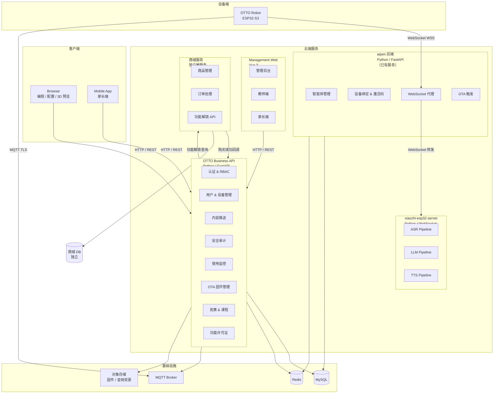
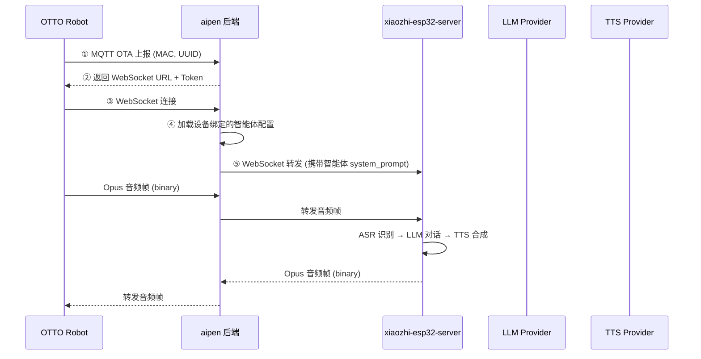
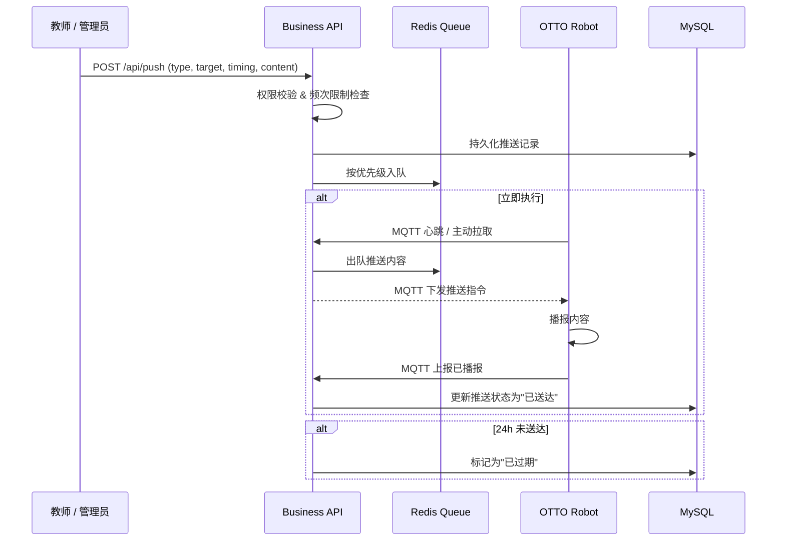
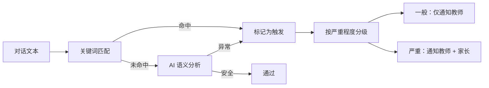
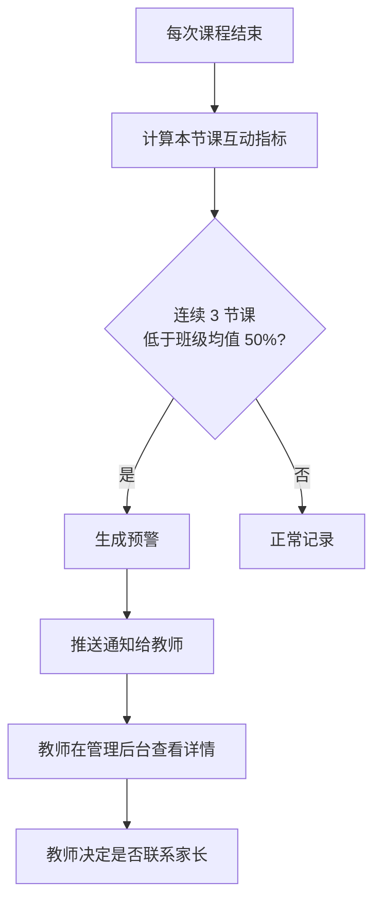

# 03. 后端服务架构

> 基于 [PRD 终稿](/_archive/prd/compound/2026-04-03-otto-robot-prd-final.md) 中 R1/R3/R6/R8/R18/R25/R26/R27 等需求，设计后端服务架构。AI 语音能力通过 [aipen](https://github.com/flybear16/aipen) 后端调用 [xiaozhi-esp32-server](https://github.com/xinnan-tech/xiaozhi-esp32-server) 实现，不自建 AI 语音服务。

***

## 1. 概述

后端服务承载 OTTO 123 平台的核心业务逻辑，包括设备管理、内容推送、安全审计和使用监控。**AI 语音对话能力复用已有架构**，不自建：

| 组件                       | 角色      | 说明                                                             |
| ------------------------ | ------- | -------------------------------------------------------------- |
| **aipen 后端**             | AI 语音网关 | FastAPI 服务，管理设备绑定、智能体配置，代理 WebSocket 音频流到 xiaozhi-esp32-server |
| **xiaozhi-esp32-server** | AI 语音引擎 | 成熟开源方案，提供 ASR→LLM→TTS 全链路流式管道                                  |
| **OTTO Business API**    | 业务服务    | OTTO 专属的设备管理、编程作品、竞赛、权限、内容推送等业务逻辑                              |
| **商城服务**                 | 独立微服务   | 硬件组件商城，购买后自动解锁系统功能，使用第三方开源方案，与核心系统解耦                           |

核心设计原则：

* **复用而非重造**：AI 语音能力通过 aipen 调用 xiaozhi-esp32-server，不重复建设音频管道
* **模块化扩展**：舵机引擎、硬件功能等通过模块化扩展机制实现，非固件内置
* **商城解耦**：商城作为独立微服务，通过 API 与核心系统交互，可替换为第三方方案
* **事后审计而非实时拦截**：平衡延迟与安全，对话结束后异步完成内容审核

***

## 2. 服务拆分

### 2.1 四服务架构



### 2.2 各服务职责

| 服务                       | 技术栈                  | 来源 | 职责                                             | 对应 PRD 需求             |
| ------------------------ | -------------------- | -- | ---------------------------------------------- | --------------------- |
| **aipen 后端**             | Python / FastAPI     | 已有 | 智能体管理、设备绑定（激活码）、WebSocket 音频代理到 xiaozhi、OTA 触发 | R1, R3                |
| **xiaozhi-esp32-server** | Python / WebSocket   | 已有 | ASR→LLM→TTS 全链路流式管道、多 AI 提供商切换                 | R1, R3                |
| **OTTO Business API**    | Python / FastAPI     | 新建 | 用户管理、RBAC、内容推送、安全审计、使用监控、OTA 管理、竞赛、功能许可证       | R6, R8, R25, R26, R27 |
| **Management Web**       | Vue 3 / Element Plus | 新建 | 管理后台、教师端、家长端                                   | R6, R25, R27          |
| **商城服务**                 | 第三方开源                | 独立 | 商品管理、订单处理、购买后功能解锁                              | R10, R12              |

### 2.3 AI 语音调用链路

OTTO 机器人的 AI 语音对话不直接连接 OTTO Business API，而是通过 aipen 后端代理到 xiaozhi-esp32-server：

```
OTTO Robot → WebSocket → aipen 后端 → WebSocket 转发 → xiaozhi-esp32-server
                                         ↓
                                    智能体配置（system_prompt、TTS 选项等）
```

**复用理由**：

* aipen 后端已实现完整的设备绑定流程（激活码 → MQTT 上报 → WebSocket 配置下发）
* aipen 后端已实现智能体管理（系统预置 + 用户自定义，system\_prompt 注入）
* aipen 后端已集成多种 AI 提供商（OpenAI/Anthropic/Azure），xiaozhi-esp32-server 可直接使用
* 避免重复建设 WebSocket 音频管道、Opus 编解码、流式 ASR/LLM/TTS 编排

### 2.4 商城服务解耦策略

商城服务作为**独立微服务**，与核心系统通过 API 交互：

| 接口                                   | 方向                | 说明            |
| ------------------------------------ | ----------------- | ------------- |
| `GET /api/shop/products`             | 商城 → 前端           | 获取可用硬件组件列表    |
| `POST /api/shop/orders`              | 前端 → 商城           | 创建购买订单        |
| `POST /api/webhooks/order-confirmed` | 商城 → Business API | 订单确认回调，触发功能解锁 |
| `GET /api/licenses/{device_id}`      | Business API → 商城 | 查询设备已解锁的功能列表  |

**功能解锁机制**：用户在商城购买硬件组件（如摄像头模块）后，商城服务回调 Business API，Business API 更新设备的功能许可证，固件下次 OTA 心跳时获取新许可证并启用对应功能模块。

**第三方方案选择**：商城服务可使用开源电商方案（如 Mall4j、yudao-cloud 等），仅需实现订单确认回调接口和功能解锁 API 即可与核心系统对接。

***

## 3. AI 语音引擎（复用 aipen + xiaozhi-esp32-server）

AI 语音能力**不自建**，通过 aipen 后端代理到 xiaozhi-esp32-server 实现。

### 3.1 调用链路



### 3.2 智能体管理（aipen 已有能力）

aipen 后端已实现完整的智能体系统，OTTO 直接复用：

| 能力                | aipen 实现                          | OTTO 使用方式                   |
| ----------------- | --------------------------------- | --------------------------- |
| 系统预置智能体           | 6 个预置智能体（商务/学习/创意/生活/技术/健康）       | 扩展为教育场景智能体（编程导师、知识问答、竞赛助手等） |
| 自定义智能体            | 用户创建自定义智能体（名称、system\_prompt、欢迎语） | 教师可创建课程专用智能体                |
| 设备绑定智能体           | 设备通过激活码绑定到指定智能体                   | OTTO 机器人绑定到教育智能体            |
| system\_prompt 注入 | 对话时自动注入智能体的 system\_prompt        | 注入 OTTO 专属教育规则（R3 年龄适配）     |

### 3.3 OTTO 专属 System Prompt

在 aipen 智能体的 system\_prompt 基础上，OTTO 追加教育场景规则：

```
你是一个面向初中生的教育机器人助手。请遵循以下规则：
1. 使用初中生能理解的词汇，避免过于学术或幼稚的表达
2. 每次回答控制在 3 句话以内（追问时可适当展开）
3. 不涉及暴力、色情、政治等敏感话题
4. 鼓励学生思考和探索，必要时反问引导
5. 知识类问题优先给出准确答案，不确定时诚实告知
```

### 3.4 提供商配置（xiaozhi-esp32-server 已有能力）

| 模块      | 主选                   | 备选                 | 配置位置                      |
| ------- | -------------------- | ------------------ | ------------------------- |
| **ASR** | SenseVoiceSmall (本地) | 阿里云 ASR、腾讯云 ASR    | xiaozhi-esp32-server 配置文件 |
| **LLM** | Qwen                 | DeepSeek、GLM       | xiaozhi-esp32-server 配置文件 |
| **TTS** | EdgeTTS (免费)         | 阿里云 TTS、FishSpeech | xiaozhi-esp32-server 配置文件 |

***

## 4. AI 提供商管理（复用已有能力）

AI 提供商的抽象和切换由 aipen 后端和 xiaozhi-esp32-server 已有能力承担，OTTO Business API 不需要重复实现。

### 4.1 aipen AIProvider 模式

aipen 后端已实现 `AIProvider` 基类 + 工厂模式，支持多提供商切换：

* **LLM**：OpenAI / Anthropic / Azure OpenAI，通过环境变量 `AI_PROVIDER` 切换
* **ASR**：OpenAI Whisper / Azure Speech / 阿里云 ASR
* **TTS**：多种 TTS 引擎

OTTO 侧只需在 aipen 的智能体配置中指定使用的提供商和模型，无需修改代码。

### 4.2 xiaozhi-esp32-server 提供商配置

xiaozhi-esp32-server 自身也支持多提供商配置（ASR/LLM/TTS 独立配置），在服务端配置文件中即可切换。

***

## 5. 内容推送系统（R25）

### 5.1 推送类型与触发方式

| 推送类型     | 内容示例                 | 适用场景      |
| -------- | -------------------- | --------- |
| **文本消息** | "今天的挑战：用 3 个动作编一个故事" | 课程引导      |
| **语音消息** | 教师录制的鼓励语音            | 课后反馈      |
| **动作序列** | 预编排的舞蹈动作             | 课间活动、节日主题 |

### 5.2 三种定时模式

| 模式          | 行为            | 技术实现               |
| ----------- | ------------- | ------------------ |
| **立即执行**    | 下一次空闲时立即播报    | Redis 队列，设备心跳时拉取   |
| **下次对话时播报** | 等待学生主动触发对话后插入 | 存入待播报队列，对话开始时插入    |
| **课间播报**    | 按机构课间时间表定时推送  | Celery 定时任务，到时批量下发 |

### 5.3 推送流程



### 5.4 优先级与频次控制

* **优先级**：教师推送 > 管理员推送 > 家长推送
* **频次限制**：每机构可配置每日最大推送数（默认 5 条/学生/天）
* **24 小时自动过期**：未送达的推送在 24 小时后自动标记为"已过期"
* **内容资源库**：预置课程包、节日主题、鼓励语录，教师可一键选用

***

## 6. 内容安全审计（R26）

### 6.1 审计策略：事后而非实时

为避免影响语音对话的实时性（目标 <2s 首响应），安全审计采用**事后异步**模式：

* 对话结束后 1 分钟内完成审计（SLA）
* 审计通过则无任何通知
* 审计触发则按严重程度分级通知

### 6.2 两阶段检测



* **第一阶段 - 关键词匹配**：基于敏感词库快速过滤，覆盖暴力、色情、政治等明确违规内容
* **第二阶段 - AI 语义分析**：对关键词未命中的对话进行语义分析，识别隐晦违规内容（如软色情、自伤倾向等）

### 6.3 通知规则

| 规则        | 说明                               |
| --------- | -------------------------------- |
| 通知分级      | 一般违规：仅教师；严重违规：教师 + 家长            |
| 每日上限      | 每位家长每日最多收到 3 条通知，避免过度打扰          |
| 通知内容      | 仅包含触发关键词 + 前后各 1 轮上下文（不发送完整对话记录） |
| 主题白名单/黑名单 | 机构可配置允许或禁止讨论的话题范围                |

### 6.4 离线模式

* 网络中断时，对话文本缓存在设备本地（Flash 存储，最多 50 条）
* 网络恢复后自动上传至云端进行审计
* 本地缓存满时，按 FIFO 淘汰最早记录

### 6.5 数据保留

审计日志保留策略：仅保留触发关键词的前后各 1 轮对话上下文，不存储完整对话记录。日志保留 90 天后自动清理。

***

## 7. 使用监控系统（R27）

### 7.1 三级监控粒度

| 粒度      | 指标                        | 查看权限  |
| ------- | ------------------------- | ----- |
| **学生级** | 互动频次、使用时长、作品完成度、互动内容摘要    | 教师、家长 |
| **班级级** | 平均互动频次、参与率、完成度分布、异常学生列表   | 教师    |
| **机构级** | 设备在线率、课程覆盖率、整体参与趋势、教师使用排名 | 管理员   |

### 7.2 参与度下降预警



预警触发条件：某学生连续 3 次课程的综合互动指标（互动频次 + 使用时长 + 作品完成度的加权分数）低于班级均值的 50%，系统自动向教师发送提醒。

***

## 8. OTA 升级服务（R8）

### 8.1 固件管理

| 功能       | 说明                                        |
| -------- | ----------------------------------------- |
| **固件上传** | 管理员上传固件包（.bin），系统自动计算 SHA256 并生成 ECDSA 签名 |
| **版本跟踪** | 每次上传记录版本号、变更说明、发布时间                       |
| **签名验证** | 设备端升级前验证 ECDSA 签名，防止恶意固件注入                |

### 8.2 分批推送

* **批次大小**：每批 3-5 台设备（可配置），避免同时升级导致教室全部离线
* **进度追踪**：管理后台实时显示每台设备的升级状态（等待中/下载中/升级中/成功/失败）
* **失败处理**：单台失败不影响同批次其他设备；失败设备可单独重试

### 8.3 自动回滚

* 设备升级后启动失败（连续 3 次未在 60 秒内完成心跳上报）
* 自动回滚到升级前的固件版本（ESP32 的双分区 OTA 机制）
* 回滚事件上报云端，管理员收到通知

***

## 9. API 设计规范

参考 aipen 项目的标准响应格式和错误码体系。

### 9.1 标准响应格式

```json
{
  "code": 0,
  "data": {},
  "message": "success"
}
```

### 9.2 错误码

| 错误码 | 含义      | 说明          |
| --- | ------- | ----------- |
| 0   | 成功      | -           |
| 400 | 请求参数错误  | 参数校验失败      |
| 401 | 未认证     | Token 缺失或过期 |
| 403 | 无权限     | RBAC 权限不足   |
| 404 | 资源不存在   | -           |
| 429 | 请求过于频繁  | 触发限流        |
| 500 | 服务器内部错误 | -           |

### 9.3 分页响应

```json
{
  "code": 0,
  "data": {
    "items": [],
    "total": 100,
    "page": 1,
    "limit": 20
  },
  "message": "success"
}
```

### 9.4 限流策略

使用 SlowAPI 中间件实现两级限流：

| 级别            | 规则              | 适用接口     |
| ------------- | --------------- | -------- |
| **IP 级别**     | 60 次/分钟         | 所有接口     |
| **用户级别**      | 120 次/分钟        | 认证后的业务接口 |
| **WebSocket** | 单 IP 最大 5 个并发连接 | 语音对话接口   |

***

## 10. PRD 需求映射表

| 需求编号 | 需求摘要       | 服务                           | 关键设计                                  |
| ---- | ---------- | ---------------------------- | ------------------------------------- |
| R1   | LLM 语音对话   | aipen + xiaozhi-esp32-server | WebSocket 全链路流式管道（已有）                 |
| R3   | 知识问答（年龄适配） | aipen                        | 智能体 system\_prompt 注入 OTTO 教育规则       |
| R6   | 可视化配置      | OTTO Business API            | 舵机角度/步速配置 REST API                    |
| R8   | OTA 升级     | aipen + OTTO Business API    | aipen 触发 OTA，Business API 管理固件版本和分批推送 |
| R18  | AI 动作生成    | aipen + xiaozhi-esp32-server | LLM 生成舵机序列 + 动作库匹配                    |
| R25  | 内容推送       | OTTO Business API            | 三种定时模式 + 优先级队列 + 频次限制                 |
| R26  | 安全审计       | OTTO Business API            | 事后审计 + 关键词 + AI 语义 + 分级通知             |
| R27  | 使用监控       | OTTO Business API            | 三级粒度 + 参与度下降预警                        |

***

## 11. 参考借鉴

### aipen 后端（核心复用）

* **AI 语音网关**：WebSocket 接收设备音频 → 转发到 xiaozhi-esp32-server → 回传 TTS 音频，全链路透明代理
* **智能体管理**：系统预置 + 自定义智能体，system\_prompt 注入，设备绑定到指定智能体
* **设备绑定流程**：6 位激活码 → MQTT OTA 上报 → WebSocket 配置下发，完整设备生命周期管理
* **AI 提供商抽象**：`AIProvider` 基类 + 工厂模式，OpenAI/Anthropic/Azure 多提供商切换
* **标准响应格式**：`{ code, data, message }` 统一信封
* **JWT 认证 + SM2 加密**：认证令牌 + 国密加密
* **MQTT 设备通信**：设备状态上报、指令下发、离线消息缓存

### xiaozhi-esp32-server（AI 语音引擎）

* **音频流管道**：WebSocket 接收 Opus 音频 → ASR → LLM → TTS → Opus 编码回传，全链路流式处理
* **本地 ASR**：SenseVoiceSmall 部署在服务端，降低对外部 ASR 服务的依赖
* **多提供商支持**：ASR/LLM/TTS 独立配置，支持 Qwen/DeepSeek/GLM 等

### 商城服务（独立解耦）

* 使用第三方开源电商方案（如 Mall4j、yudao-cloud 等）
* 仅需实现订单确认回调和功能解锁 API 两个接口与核心系统对接
