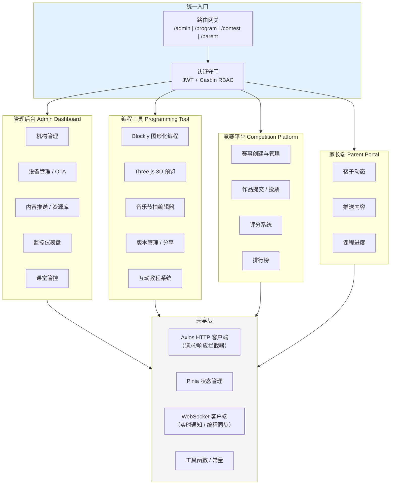
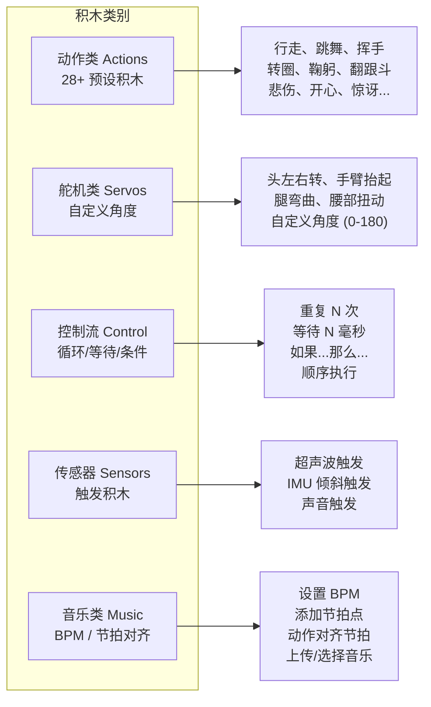
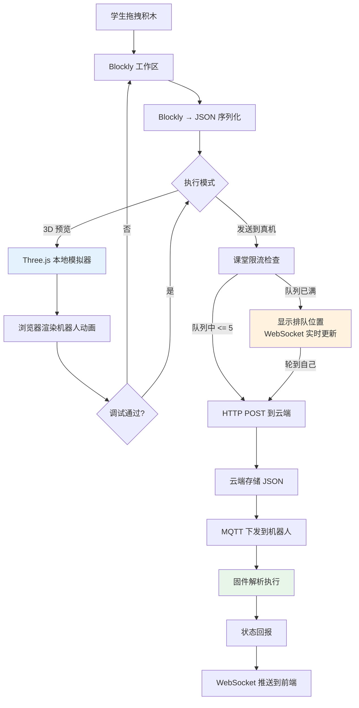
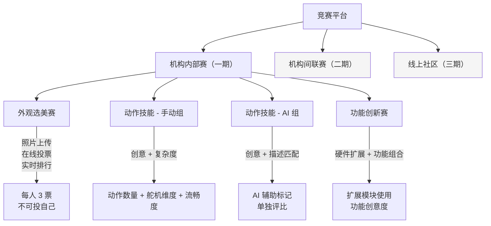
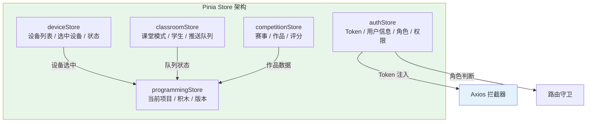

# 04. 前端与客户端架构

> 基于 [PRD 终稿](/_archive/prd/compound/2026-04-03-otto-robot-prd-final.md) 中 R6、R9、R14-R17、R19-R23 等前端相关需求，设计 OTTO 123 教育平台的前端应用架构。参考 [Otto Blockly](https://github.com/OttoDIY/blockly) 的积木定义模式和 [xiaozhi-esp32-server](https://github.com/xinnan-tech/xiaozhi-esp32-server) 的 Vue.js 管理面板。

---

## 1. 概述

OTTO 123 前端是一个多角色、多终端的 Web 应用，需要同时服务四类用户：

| 角色 | 主要功能 | 访问设备 |
|------|----------|----------|
| 管理员 | 机构管理、设备管理、全局监控、安全策略 | PC |
| 教师 | 课堂管控、课程管理、内容推送、班级竞赛 | PC / 平板 |
| 学生 | 图形化编程、3D 预览、课程学习、竞赛参与 | PC / 平板 |
| 家长 | 查看孩子动态、推送家庭内容 | 手机（精简版） |

核心设计约束：

- **浏览器兼容**：Chrome >= 90、Safari >= 15、Edge >= 90（R6）
- **多端适配**：PC（>= 1280px）、平板（>= 768px）、手机（精简版，家长视图）（R9）
- **课堂限流**：同一时间最多 5 台设备真机预览，其余排队（R15）
- **离线降级**：网络中断时编程工具仍可本地编辑和 3D 模拟

---

## 2. 应用架构

前端分为四个独立子应用，共享统一的认证和 API 层，通过路由网关入口分发。



### 子应用职责

| 子应用 | 技术重点 | 主要 PRD 需求 |
|--------|----------|---------------|
| 管理后台 | 数据表格、表单、图表仪表盘 | R6, R7, R8, R24, R25, R27, R29, R31, R32, R33 |
| 编程工具 | Blockly 积木、Three.js 3D、WebSocket 同步 | R14, R15, R16, R17, R19 |
| 竞赛平台 | 投票、评分、排行榜 | R20, R21, R22, R23 |
| 家长端 | 卡片式 UI、推送通知 | R9（手机端）, R25, R27 |

---

## 3. 技术栈

| 分类 | 技术选型 | 版本 | 说明 |
|------|----------|------|------|
| **框架** | Vue 3 + Composition API | 3.4+ | 全部子应用统一使用 Vue 3，组合式 API 提升逻辑复用 |
| **构建工具** | Vite | 5.x | 快速 HMR，原生 ESM 支持 |
| **状态管理** | Pinia | 2.x | Vue 3 官方推荐，TypeScript 友好 |
| **路由** | Vue Router | 4.x | 支持嵌套路由、路由守卫、懒加载 |
| **PC 端 UI** | Element Plus | 2.x | 管理后台和编程工具的 PC 端界面 |
| **移动端 UI** | Vant | 4.x | 家长端精简版界面 |
| **3D 渲染** | Three.js | r160+ | 机器人 3D 模型渲染和动作模拟预览 |
| **图形化编程** | Google Blockly | 10.x | 自定义 Otto 机器人积木块 |
| **图表库** | ECharts | 5.x | 监控仪表盘数据可视化 |
| **HTTP 客户端** | Axios | 1.x | 统一请求拦截、Token 刷新、错误处理 |
| **CSS 预处理** | SCSS | -- | 变量、混入、响应式断点管理 |
| **WebSocket** | 原生 WebSocket + 重连库 | -- | 实时通知、编程数据同步、课堂限流队列 |

### 浏览器兼容策略

| 浏览器 | 最低版本 | 注意事项 |
|--------|----------|----------|
| Chrome | >= 90 | 主要开发目标，完整功能支持 |
| Safari | >= 15 | Three.js WebGL 2.0 支持，需测试音频 API |
| Edge | >= 90 | Chromium 内核，与 Chrome 行为一致 |
| Firefox | -- | 不在 R6 要求内，按需兼容 |

---

## 4. Blockly 编程工具（R14, R15, R16, R19）

### 4.1 积木块分类

编程工具的核心是自定义 Blockly 积木块，分为五大类别：



**积木块数量目标**：

| 类别 | 积木数量 | 说明 |
|------|----------|------|
| 动作类 | >= 28 | 覆盖行走、舞蹈、表情、体操等全部预设动作 |
| 舵机类 | >= 8 | 头部、双臂、双腿、腰部等关节独立控制 |
| 控制流 | >= 6 | 重复、等待、条件、并行、序列、中断 |
| 传感器 | >= 4 | 超声波距离、IMU 倾斜、声音强度、触摸 |
| 音乐 | >= 5 | BPM 设置、节拍点、音乐选择、对齐、播放控制 |

### 4.2 代码生成与执行流程

Blockly 积木编排后生成标准 JSON 动作序列，通过 HTTP 发送到云端，再经 MQTT 下发到机器人执行。



### 4.3 3D 预览模块

Three.js 模块提供浏览器端的机器人动作模拟，学生无需真机即可调试。

| 功能 | 说明 |
|------|------|
| 3D 模型 | 基于 OTTO 机器人几何参数构建的 Three.js 骨骼动画模型 |
| 动作播放 | 解析 JSON 动作序列，逐帧驱动 3D 模型关节旋转 |
| 视角控制 | 支持鼠标拖拽旋转、缩放，方便从不同角度观察 |
| 性能要求 | 60fps 渲染，动作序列 < 500ms 启动延迟 |
| 离线可用 | 3D 模型和积木定义本地缓存，断网时仍可编辑和模拟 |

### 4.4 课堂限流

同一课堂内真机预览并发上限为 5 台，通过 WebSocket 实时展示排队状态。

```javascript
// 伪代码：课堂限流队列交互
const classroomQueue = useClassroomStore()

// 请求真机预览
async function requestLivePreview(actionJson) {
  const position = await classroomQueue.enqueue(actionJson)
  if (position <= 5) {
    // 立即执行
    await sendToRobot(actionJson)
  } else {
    // 显示排队位置，WebSocket 监听队列变化
    classroomQueue.watchQueue((newPosition) => {
      if (newPosition <= 5) {
        sendToRobot(actionJson)
      }
    })
  }
}
```

### 4.5 版本管理与分享

| 功能 | 规则 | 存储 |
|------|------|------|
| 自动保存 | 编辑时每 30 秒自动保存草稿 | 本地 IndexedDB + 云端 |
| 版本历史 | 保留最近 10 个版本，支持查看差异 | 云端 MySQL |
| 回收站 | 误删作品保留 30 天，支持恢复 | 云端 MySQL（soft delete） |
| 课内分享 | 同课堂学生可查看和克隆 | 云端，权限范围 = 课堂 |
| 机构内分享 | 同机构教师和学生可查看和克隆 | 云端，权限范围 = 机构 |
| 导入导出 | 下载/上传 JSON 文件 | 本地文件 |

---

## 5. 课程系统（R17）

### 5.1 教程框架

12 节互动教程遵循统一的四步教学法结构：

```
目标（Objective）→ 引导（Guide）→ 实操（Practice）→ 挑战（Challenge）
```

| 阶段 | 说明 | 交互方式 |
|------|------|----------|
| 目标 | 展示本节课要完成的最终效果 | 3D 动画演示 + 文字描述 |
| 引导 | 分步骤教学，高亮目标积木 | 积木区引导提示 + 示例代码 |
| 实操 | 学生独立完成指定任务 | Blockly 自由编辑，实时验证 |
| 挑战 | 开放式创作任务，超出课堂要求 | 自由创作，教师评分 |

### 5.2 课程分级

| 级别 | 课时 | 核心内容 | 积木复杂度 |
|------|------|----------|------------|
| 入门级 | 4 节 | 预设动作组合、简单序列 | 3-5 个积木，仅动作 + 顺序 |
| 进阶级 | 4 节 | 自定义舵机角度、循环、条件 | 5-10 个积木，含控制流 |
| 高级 | 4 节 | 传感器触发、AI 辅助、音乐配合 | 10+ 个积木，含传感器和音乐 |

### 5.3 进度跟踪

- 学生进度实时保存到云端，切换设备后自动恢复
- 教师可查看全班进度分布，识别落后学生
- 课程完成后生成学习报告（完成课时、挑战得分、技能雷达图）

---

## 6. 竞赛平台（R20-R23）

### 6.1 赛事类型



### 6.2 评分系统

竞赛评分采用可自定义的多维度加权模型：

| 维度 | 默认权重 | 说明 |
|------|----------|------|
| 创意性 | 30% | 动作/外观的原创性和想象力 |
| 技术难度 | 30% | 积木数量、舵机维度、控制流复杂度 |
| 完成度 | 20% | 是否完整实现预期效果，无错误中断 |
| 展示效果 | 20% | 整体表现力、流畅度、观赏性 |

教师可自定义评分维度和权重，平台保存评分模板供复用。外观选美赛采用投票制替代评分制。

### 6.3 二期/三期架构预留

- **机构间联赛**（二期）：排行榜服务、积分体系、跨机构赛事协调 API
- **线上社区**（三期）：作品 Feed 流、点赞/评论、关注系统、作品推荐算法

---

## 7. 多端适配策略（R9）

### 7.1 断点与布局

| 断点 | 宽度范围 | 目标设备 | 布局策略 |
|------|----------|----------|----------|
| `lg` | >= 1280px | PC / 笔记本 | 多列布局，完整功能 |
| `md` | >= 768px | 平板 | 双列布局，功能精简 |
| `sm` | < 768px | 手机 | 单列布局，仅家长端核心功能 |

### 7.2 各端功能矩阵

| 功能模块 | PC（>= 1280px） | 平板（>= 768px） | 手机（< 768px） |
|----------|:---:|:---:|:---:|
| 管理后台全功能 | 完整 | 精简 | -- |
| Blockly 编程工具 | 完整（双栏） | 精简（积木区缩小） | -- |
| 3D 预览 | 完整 | 完整 | -- |
| 竞赛投票 | 完整 | 完整 | 完整 |
| 课堂管控 | 完整 | 简化版 | -- |
| 设备监控仪表盘 | 完整 | 简化版 | -- |
| 家长查看动态 | 完整 | 完整 | 精简版（卡片式） |
| 内容推送 | 完整 | 完整 | 精简版 |

### 7.3 响应式实现方案

```
CSS Grid + Flexbox 混合布局
├── PC 端：CSS Grid 多列布局，侧边栏 + 主内容区
├── 平板端：Grid 降为双列，侧边栏可折叠
└── 手机端：Flexbox 单列，底部 Tab 导航，卡片式 UI
```

**手机端特殊处理**（家长视图）：

- 底部 Tab 导航：动态 / 课程 / 推送 / 设置
- 卡片式信息流：孩子动态、互动摘要、课程进度
- 简化推送创建：预设模板 + 快速发送，无需复杂表单

---

## 8. 状态管理设计（Pinia Stores）



### Store 定义

| Store | 核心状态 | 主要 Actions | 持久化 |
|-------|----------|-------------|--------|
| `authStore` | `token`, `userInfo`, `role`, `permissions` | `login()`, `logout()`, `refreshToken()`, `checkPermission()` | `token` 写入 localStorage |
| `deviceStore` | `deviceList`, `selectedDevice`, `deviceStatusMap` | `fetchDevices()`, `selectDevice()`, `subscribeStatus()` | 否（每次登录拉取） |
| `programmingStore` | `currentProject`, `blockXml`, `savedVersions`, `recycleBin` | `saveProject()`, `loadVersion()`, `deleteProject()`, `shareProject()` | `blockXml` 写入 IndexedDB（草稿） |
| `competitionStore` | `contests`, `submissions`, `scores`, `leaderboard` | `createContest()`, `submitWork()`, `vote()`, `score()` | 否 |
| `classroomStore` | `classMode`, `studentList`, `pushQueue`, `executionQueue` | `startClass()`, `endClass()`, `enqueuePreview()`, `pushContent()` | 否 |

### HTTP 请求拦截器设计

参考 aipen 项目的 request.js 模式，统一处理认证、错误和刷新逻辑：

```typescript
// 伪代码：Axios 拦截器核心逻辑
const request = axios.create({ baseURL: '/api/v1' })

// 请求拦截：注入 Token
request.interceptors.request.use((config) => {
  const token = authStore.token
  if (token) config.headers.Authorization = `Bearer ${token}`
  return config
})

// 响应拦截：统一错误处理 + Token 刷新
request.interceptors.response.use(
  (response) => response.data,
  async (error) => {
    if (error.response?.status === 401) {
      const refreshed = await authStore.refreshToken()
      if (refreshed) return request(error.config) // 重试原请求
      authStore.logout()
      router.push('/login')
    }
    ElMessage.error(error.response?.data?.message || '请求失败')
    return Promise.reject(error)
  }
)
```

---

## 9. PRD 需求映射表

| 需求编号 | 需求摘要 | 前端模块 | 关键技术 |
|----------|----------|----------|----------|
| R6 | 浏览器端可视化配置 | 管理后台 | Vue 3 + Element Plus 表单 |
| R7 | 在线舵机校准 | 管理后台 | WebSocket 实时角度反馈 |
| R8 | 固件 OTA 升级 | 管理后台 | 进度条 + 批量操作 |
| R9 | 多端适配（PC/平板/手机） | 全部子应用 | SCSS 响应式 + Vant（移动端） |
| R14 | Blockly 图形化编程（28+ 积木） | 编程工具 | Google Blockly 自定义积木 |
| R15 | 3D 预览 + 真机执行 + 课堂限流 | 编程工具 | Three.js + WebSocket 队列 |
| R16 | 动作保存/分享/版本/回收站 | 编程工具 | Pinia + IndexedDB + 云端 API |
| R17 | 12 节互动教程课程体系 | 编程工具 | 教程框架 + 进度跟踪 |
| R19 | 动作与音乐节拍配合 | 编程工具 | 音频编辑器 + BPM 节拍点 |
| R20 | 机构内部赛（外观/动作/创新） | 竞赛平台 | 投票系统 + 评分系统 |
| R21 | 机构间联赛（二期） | 竞赛平台 | 排行榜 + 积分（架构预留） |
| R22 | 线上社区（三期） | 竞赛平台 | Feed 流 + 社交（架构预留） |
| R23 | 竞赛评分模板 | 竞赛平台 | 可配置评分维度 + 权重 |
| R24 | 三级权限体系 | 全部子应用 | 路由守卫 + 按钮级权限 |
| R25 | 内容推送（资源库 + 定时） | 管理后台 / 家长端 | 推送表单 + 资源库组件 |
| R27 | 使用监控（互动记录/参与度） | 管理后台 / 家长端 | ECharts 图表 |
| R29 | 课堂模式（时段/轮换/推送切换） | 管理后台 | 课堂管控面板 |
| R30 | 紧急停止按钮 | 编程工具 | 远程中断按钮 + WebSocket |
| R31 | 设备状态监控仪表盘 | 管理后台 | ECharts + WebSocket 实时数据 |

---

## 10. 参考借鉴

### 10.1 Otto Blockly（github.com/OttoDIY/blockly）

| 借鉴内容 | 在本系统中的应用 |
|----------|------------------|
| Blockly 自定义积木定义 | OTTO 机器人动作积木块（28+ 预设 + 舵机 + 传感器 + 音乐） |
| 积木块分类和颜色方案 | 五大类别（动作/舵机/控制/传感器/音乐）的视觉分区 |
| Blockly → 代码生成器模式 | Blockly → JSON 动作序列生成器 |
| 工作区配置（网格/缩放/分类栏） | 课堂场景优化的 Blockly 工作区布局 |

### 10.2 xiaozhi-esp32-server Vue.js 管理面板

| 借鉴内容 | 在本系统中的应用 |
|----------|------------------|
| Vue 3 + Vite 项目结构 | 子应用脚手架和目录组织 |
| 设备管理页面设计 | 设备列表、状态展示、OTA 升级界面 |
| 实时状态 WebSocket 推送 | 设备状态、课堂队列的实时更新 |
| 管理后台布局 | 侧边栏导航 + 顶部用户信息 + 主内容区 |

### 10.3 aipen UniApp 前端

| 借鉴内容 | 在本系统中的应用 |
|----------|------------------|
| Pinia Store 分层模式 | authStore / deviceStore / programmingStore 等多 Store 设计 |
| Axios 请求拦截器 | Token 注入、401 自动刷新、统一错误处理 |
| 标准响应格式封装 | `{ code, message, data }` 统一处理 |
| 权限路由守卫 | 基于 Casbin RBAC 的路由级和按钮级权限控制 |

---

> 上一篇：[03-后端服务架构](/system/03-后端服务架构.md)
> 下一篇：[05-通信协议设计](/system/05-通信协议设计.md)
