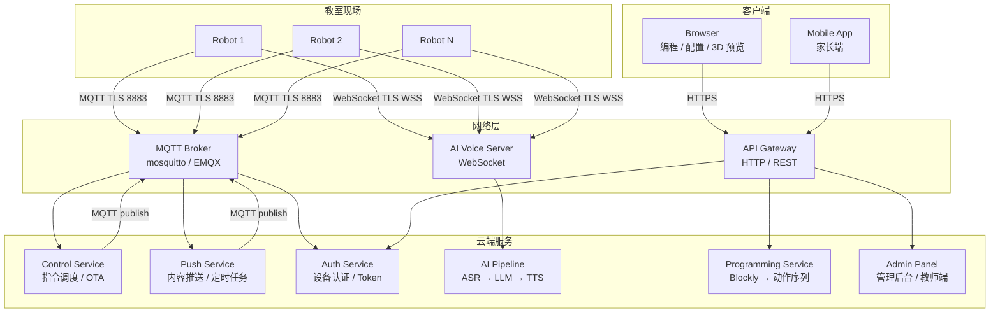
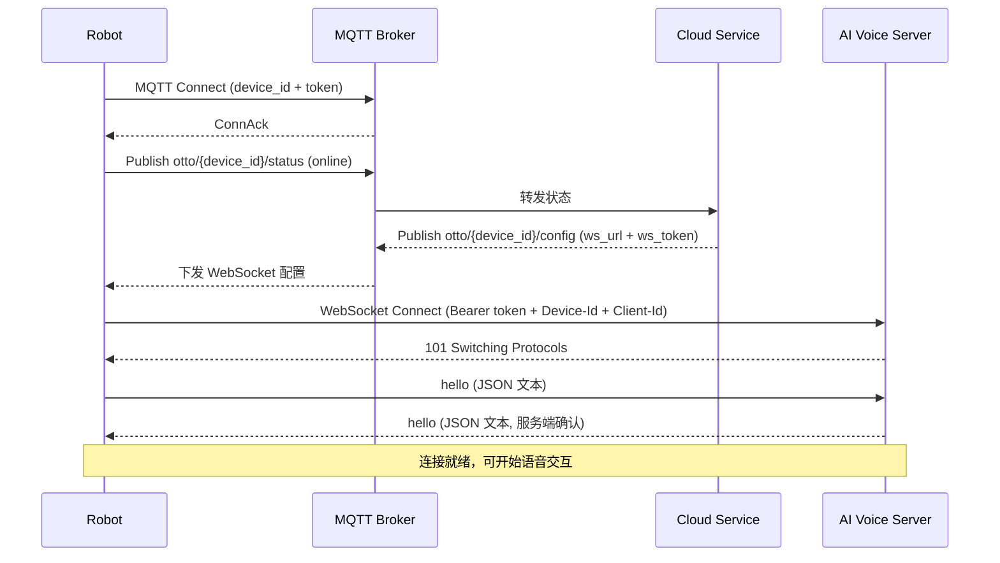
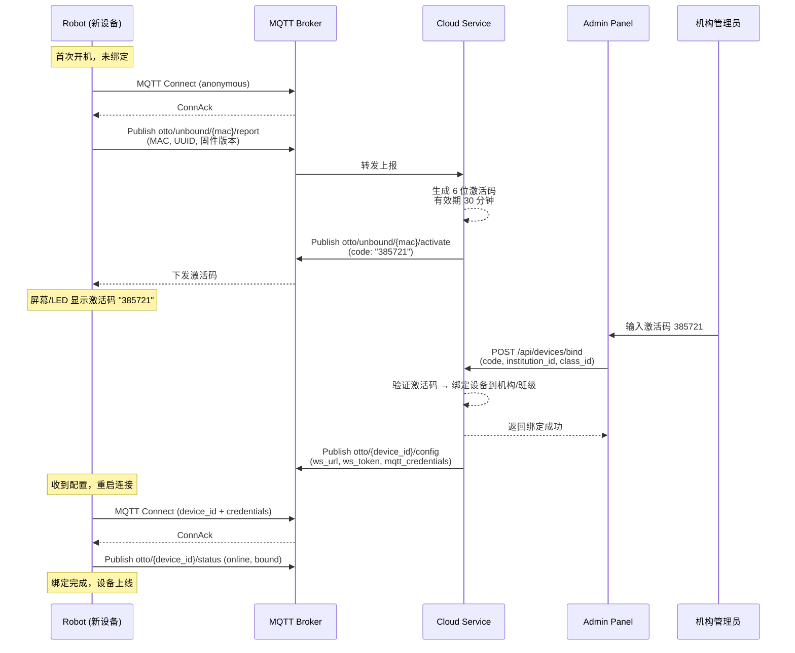
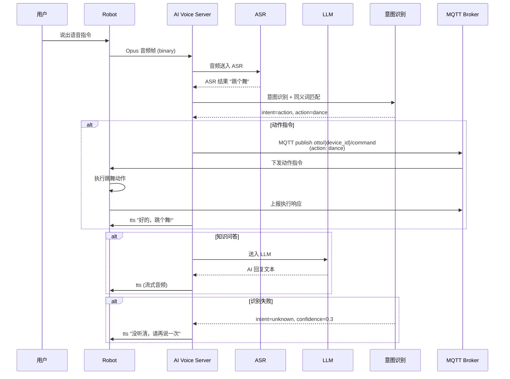
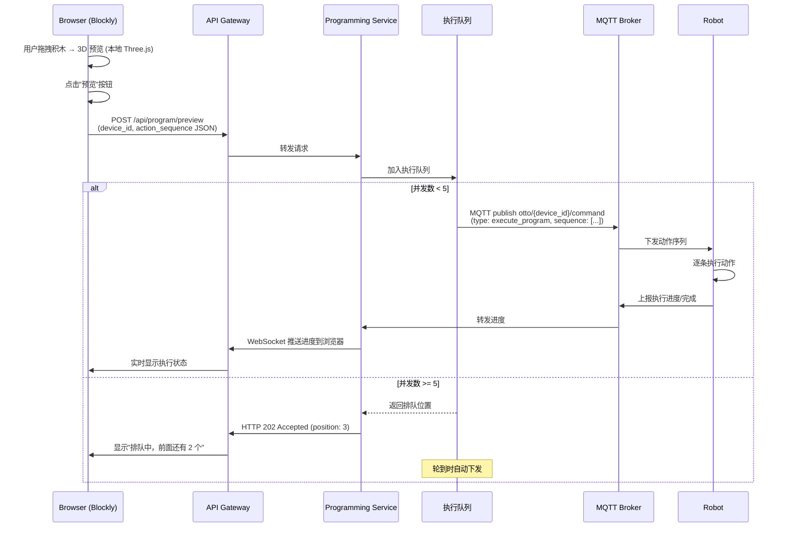
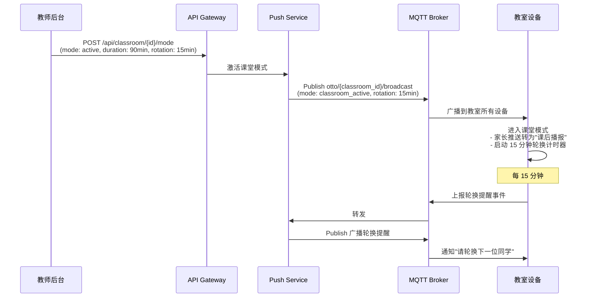

# 通信协议设计

> 基于 [PRD 终稿](/_archive/prd/compound/2026-04-03-otto-robot-prd-final.md) 4.4 节通信架构要求，设计双通道通信协议。参考 [xiaozhi-esp32-server](https://github.com/xinnan-tech/xiaozhi-esp32-server) 的 WebSocket 媒体通道和 [aipen](https://github.com/flybear16/aipen) 的 MQTT 设备通信方案。

## 1. 概述

OTTO 机器人采用**双通道分离**架构，将控制信令与媒体流分到不同协议，各自优化：

| 通道 | 协议 | 适用场景 | 特点 |
|------|------|----------|------|
| **控制通道** | MQTT | 动作指令、状态上报、OTA、配置下发 | 低频、轻量、QoS 可控、离线消息 |
| **媒体通道** | WebSocket | 语音流（ASR/LLM/TTS）、编程同步 | 高频、双向实时、低延迟 |

**选型理由**：

- MQTT 天然支持 QoS 级别和离线消息缓存，适合指令和状态等可靠性要求高的低频通信，且在弱网环境下表现优于 WebSocket。
- WebSocket 全双工长连接，适合音频流和编程数据等高频双向实时通信，延迟低于 HTTP 轮询。
- 参考 xiaozhi-esp32 的 WebSocket 文本 + 二进制混合消息格式，已在实际项目中验证可行。
- 参考 aipen 的 MQTT 设备管理方案和激活码绑定流程，简化设备入网流程。

## 2. 协议架构总览



**数据流说明**：

- 机器人通过 MQTT 上报状态、接收指令，通过 WebSocket 进行实时语音交互。
- 浏览器通过 HTTPS 与 API Gateway 通信，编程动作序列由云端中转下发到机器人。
- MQTT Broker 是控制通道的核心枢纽，所有设备指令和状态都经过 Broker 转发。

## 3. MQTT 控制通道

### 3.1 Broker 选型

| 阶段 | Broker | 说明 |
|------|--------|------|
| MVP / 单机构 | mosquitto | 轻量、成熟、资源占用低，单机可支撑 200+ 设备 |
| 多机构 / 扩展 | EMQX | 分布式集群、ACL 细粒度管控、WebSocket 内置支持 |

### 3.2 Topic 层级设计

```
otto/{device_id}/status       -- 设备状态上报（在线/离线/电量/信号）
otto/{device_id}/command       -- 云端→设备 指令下发
otto/{device_id}/command/resp  -- 设备→云端 指令执行响应
otto/{device_id}/ota           -- OTA 升级通知与进度
otto/{device_id}/config        -- 配置下发（音量/灵敏度/课堂参数）
otto/{device_id}/error         -- 设备异常上报
otto/{device_id}/push          -- 内容推送（家长消息/教师消息）
otto/{classroom_id}/broadcast  -- 教室广播（课堂模式/紧急通知）
```

### 3.3 消息格式

所有 MQTT payload 采用 JSON 格式：

```json
{
  "msg_type": "command",
  "timestamp": "2026-04-05T10:30:00.000Z",
  "seq": 12345,
  "payload": {
    "action": "dance",
    "params": { "style": "default", "duration": 10 }
  }
}
```

| 字段 | 类型 | 必填 | 说明 |
|------|------|------|------|
| `msg_type` | string | 是 | 消息类型：`status` / `command` / `ota` / `config` / `error` / `push` |
| `timestamp` | ISO 8601 | 是 | 消息生成时间（UTC） |
| `seq` | integer | 是 | 消息序号，递增，用于去重和排序 |
| `payload` | object | 是 | 消息体，结构随 `msg_type` 不同而不同 |

### 3.4 QoS 策略

| 消息类型 | 方向 | QoS | 说明 |
|----------|------|-----|------|
| 设备状态上报 | 设备→云端 | 0 | 高频低优先，丢失可容忍 |
| 动作指令 | 云端→设备 | 1 | 至少送达一次，避免丢失 |
| OTA 通知 | 云端→设备 | 2 | 必须且仅送达一次 |
| 配置下发 | 云端→设备 | 1 | 至少送达一次 |
| 异常上报 | 设备→云端 | 1 | 至少送达一次，不丢失故障信息 |
| 内容推送 | 云端→设备 | 1 | 至少送达一次 |
| 教室广播 | 云端→设备 | 1 | 至少送达一次 |

### 3.5 设备心跳

```
设备 → otto/{device_id}/status (msg_type: "heartbeat")
```

| 场景 | 心跳间隔 | 说明 |
|------|----------|------|
| 活跃（正在使用） | 30 秒 | 正常交互中 |
| 空闲（在线但未使用） | 120 秒 | 节省带宽和电量 |
| 课堂模式 | 60 秒 | 教室广播期间提高上报频率 |

服务端 3 倍心跳周期未收到则标记设备为离线。心跳间隔通过 `otto/{device_id}/config` 动态下发。

### 3.6 课堂优化

在单教室 15-20 台设备的场景下，为避免 MQTT Broker 压力过大，采取以下优化：

- **批量状态上报**：设备状态不逐条发布，而是每 30 秒聚合为一条批量消息。
- **教室广播**：使用 `otto/{classroom_id}/broadcast` 单条消息覆盖全教室，替代逐设备下发。
- **遗嘱消息（LWT）**：设备连接时设置 LWT topic，异常断开时 Broker 自动发布离线状态，无需等待心跳超时。

## 4. WebSocket 媒体通道

参考 xiaozhi-esp32 的 WebSocket 协议设计，支持 JSON 文本消息和二进制音频帧混合传输。

### 4.1 连接建立流程



### 4.2 认证方式

WebSocket 连接时通过 HTTP Header 认证：

| Header | 说明 |
|--------|------|
| `Authorization` | `Bearer {ws_token}`，由 MQTT config 下发时签发 |
| `X-Device-Id` | 设备唯一标识（UUID） |
| `X-Client-Id` | 当前用户标识（多用户场景下切换） |

Token 有效期 24 小时，过期后通过 MQTT 重新获取。

### 4.3 文本消息（JSON）

| msg_type | 方向 | 说明 |
|----------|------|------|
| `hello` | 双向 | 连接握手，交换设备信息和服务端能力 |
| `listen` | 服务端→设备 | 通知设备开始录音 |
| `stt` | 设备→服务端 | 语音识别结果文本 |
| `tts` | 服务端→设备 | 语音合成开始/结束通知（含文本内容） |
| `llm` | 服务端→设备 | AI 大模型回复文本（流式或完整） |
| `mcp` | 双向 | MCP JSON-RPC 2.0 能力扩展调用 |
| `system` | 双向 | 连接状态、错误提示、模式切换 |

**hello 消息示例**：

```json
{
  "type": "hello",
  "device_id": "uuid-xxxx",
  "client_id": "student_zhangsan",
  "firmware_version": "1.2.0",
  "capabilities": ["opus_audio", "mcp", "emergency_stop"]
}
```

**llm 消息示例（流式）**：

```json
{
  "type": "llm",
  "text": "机器人",
  "is_final": false,
  "msg_id": "msg-67890"
}
```

### 4.4 二进制消息（音频帧）

| 方向 | 格式 | 说明 |
|------|------|------|
| 设备→服务端 | Opus 16kHz mono | 用户录音帧 |
| 服务端→设备 | Opus 16kHz mono | TTS 合成音频帧 |

**音频参数**：

| 参数 | 值 |
|------|-----|
| 编码格式 | Opus |
| 采样率 | 16000 Hz |
| 声道 | 单声道（mono） |
| 帧长 | 20 ms（640 bytes @ 16kHz/16bit） |
| 比特率 | 32 kbps（语音模式） |

二进制帧协议头（4 bytes）：

```
[0-1] frame_length (uint16, big-endian)
[2]   frame_type  (0x01=audio, 0x02=mark)
[3]   flags       (bit0=end_of_stream)
```

### 4.5 断线重连

WebSocket 断开后，设备按指数退避策略重连（1s → 2s → 4s → 8s → 最大 30s），连续 5 次失败后回退到离线模式并通过 MQTT 上报异常。

## 5. 设备绑定协议

参考 aipen 的 6 位激活码绑定流程，简化设备入网步骤。



**激活码规则**：

- 6 位数字，有效期 30 分钟
- 每次开机/重置生成新码，旧码失效
- 同一激活码只能绑定一次
- 绑定后设备获得 `device_id`（UUID）和长期 MQTT 凭证

## 6. 语音指令协议

对应 PRD R2（语音指令控制 + 同义词识别 + 失败引导）。



### 6.1 指令分类

| 分类 | 示例 | 处理方式 |
|------|------|----------|
| **动作指令** | "跳个舞"、"向前走 3 步"、"做个太空步" | 意图识别 → MQTT command 下发 |
| **知识问答** | "什么是光合作用"、"地球有多大" | ASR → LLM → TTS 管道 |
| **系统指令** | "切换到张三"、"停止" | 意图识别 → 特殊处理（用户切换/停止） |

### 6.2 同义词处理

服务端维护同义词表，支持模糊匹配：

| 标准意图 | 同义词集合 |
|----------|------------|
| `dance` | 跳舞、跳个舞、表演舞蹈、来一段舞蹈 |
| `walk_forward` | 向前走、往前走、走 3 步 |
| `stop` | 停止、停下、别动了、暂停 |

同义词表支持热更新，通过 MQTT config 下发到设备侧（离线场景使用本地缓存）。

### 6.3 失败引导策略

| 场景 | 置信度 | 响应 |
|------|--------|------|
| 意图不明确 | < 0.4 | "没听清，请再说一次" |
| 多个候选意图 | 0.4-0.7 | "你是想让我 [意图A] 还是 [意图B]？" |
| 动作执行失败 | - | "抱歉，执行失败了，请检查机器人状态" |

## 7. 编程预览协议

对应 PRD R15（Blockly 预览 + 课堂限流）。

### 7.1 预览下发流程



### 7.2 动作序列格式

```json
{
  "program_id": "prog-abc123",
  "name": "跳舞机器人",
  "version": 3,
  "total_steps": 12,
  "estimated_duration": 15,
  "steps": [
    {
      "index": 0,
      "type": "action",
      "name": "wave_hand",
      "params": { "side": "left", "repeat": 2 },
      "duration": 1000
    },
    {
      "index": 1,
      "type": "wait",
      "params": { "ms": 500 }
    },
    {
      "index": 2,
      "type": "servo",
      "params": { "servo_id": 3, "angle": 90, "speed": 50 }
    }
  ]
}
```

### 7.3 课堂限流机制

- **信号量模式**：每间教室最大并发执行数 5 台，由 Programming Service 维护。
- 排队超时（60 秒未开始执行）自动取消并通知用户。
- 教师可通过管理后台调整并发上限（1-10 可配）。

### 7.4 3D 预览

浏览器端 Three.js 渲染，无需网络通信：

- Blockly 积木变化时实时触发 3D 动画预览。
- 3D 预览与真机执行使用相同的动作序列 JSON 格式。
- 预览仅用于视觉调试，不涉及网络延迟。

### 7.5 远程停止

```
Browser → API → MQTT publish otto/{device_id}/command
{
  "msg_type": "command",
  "seq": 99999,
  "payload": {
    "action": "stop_program",
    "reason": "user_cancel"
  }
}
```

设备收到后立即中断当前动作序列，释放舵机力矩。

## 8. 多人切换协议

对应 PRD R28（语音/按键切换用户）。

### 8.1 语音切换

```
用户: "切换到张三"
→ ASR 识别 → 意图识别 (intent=user_switch, target="张三")
→ Cloud 查询班级学生名单 → 验证张三存在
→ MQTT publish otto/{device_id}/command (action: switch_user, user_id: "zhangsan")
→ 设备加载张三的上下文（编程作品、对话历史、个人设置）
→ TTS 播报 "已切换到张三"
```

### 8.2 按键切换

```
物理按钮长按 2 秒
→ 设备 MQTT publish otto/{device_id}/status (action: cycle_user)
→ Cloud 返回班级下一个用户信息
→ 设备 MQTT publish otto/{device_id}/command/resp (ack)
→ 切换完成
```

### 8.3 用户上下文

切换用户时，设备需加载以下上下文：

| 数据 | 来源 | 说明 |
|------|------|------|
| 编程作品列表 | Cloud → HTTP | 该用户的已保存动作序列 |
| 对话历史（最近 10 轮） | Cloud → MQTT | 用于多轮对话上下文 |
| 个人设置（音量、灵敏度） | Cloud → MQTT config | 个性化偏好 |
| 当前竞赛作品 | Cloud → HTTP | 竞赛模式下的参赛作品 |

## 9. 课堂模式协议

对应 PRD R29（教师设置课堂时段 + 定时轮换）。

### 9.1 课堂模式激活



### 9.2 推送策略

| 课堂状态 | 教师推送 | 家长推送 |
|----------|----------|----------|
| 课堂模式激活 | 立即送达 | 缓存为"课后播报"，课堂结束后统一推送 |
| 课堂模式结束 | 立即送达 | 立即送达 |
| 非课堂模式 | 立即送达 | 立即送达 |

## 10. 音乐同步协议

对应 PRD R19（动作与音乐配合）。

### 10.1 设计原则

音乐同步的关键要求是**零网络延迟**，因此采用"下载 + 本地执行"架构：

1. 音乐文件通过 HTTP 预先下载到机器人本地存储（SD 卡或 Flash）。
2. 动作序列（含 BPM 和节拍标记）通过 MQTT/HTTP 下发并缓存到本地。
3. 播放时，机器人本地播放音乐 + 同步执行动作序列，不依赖网络。

### 10.2 动作序列中的节拍标记

```json
{
  "program_id": "prog-music-001",
  "type": "music_sync",
  "music_file": "dance_track_01.mp3",
  "bpm": 120,
  "total_beats": 64,
  "steps": [
    {
      "beat": 1,
      "type": "action",
      "name": "raise_arms",
      "params": { "speed": 80 }
    },
    {
      "beat": 3,
      "type": "action",
      "name": "turn_left",
      "params": { "angle": 45 }
    },
    {
      "beat": 5,
      "type": "action",
      "name": "wave_hand",
      "params": { "repeat": 2 }
    }
  ]
}
```

### 10.3 本地同步执行

设备固件使用 FreeRTOS 定时器驱动音乐播放和动作执行：

- 以 BPM 计算每拍间隔（120 BPM = 500ms/拍）。
- 每拍触发时检查是否有对应动作，有则执行。
- 动作执行与音乐播放在同一任务中调度，保证时序同步。

## 11. 紧急停止协议

对应 PRD R30（物理按钮 + 远程中断）。

### 11.1 三级停止机制

| 级别 | 触发方式 | 响应时间 | 作用范围 |
|------|----------|----------|----------|
| **L1 - 硬件级** | 物理紧急停止按钮 | < 10ms | 固件直接释放所有舵机力矩，断开电机驱动电源 |
| **L2 - 协议级** | MQTT emergency 命令 | < 500ms | 中断当前动作序列，释放舵机力矩 |
| **L3 - 应用级** | WebSocket 停止命令 | < 1s | 中断当前编程预览执行 |

### 11.2 L1 硬件级停止

- 紧急停止按钮连接到 ESP32-S3 的 GPIO 中断引脚。
- 触发后固件 ISR（中断服务程序）立即执行：关闭所有 PWM 输出 → 释放舵机力矩 → LED 闪烁提示。
- 无需网络通信，即使离线也可触发。
- 需物理复位（再次按下或重启）才能恢复。

### 11.3 L2 MQTT 停止命令

```
MQTT publish otto/{device_id}/command
{
  "msg_type": "command",
  "timestamp": "2026-04-05T10:30:00.000Z",
  "seq": 99999,
  "payload": {
    "action": "emergency_stop",
    "source": "teacher_panel",
    "reason": "student_safety"
  }
}
```

设备收到后立即中断所有正在执行的动作，释放舵机力矩，上报停止确认。

### 11.4 L3 WebSocket 停止命令

```json
{
  "type": "system",
  "action": "stop_execution",
  "reason": "user_cancel"
}
```

AI Voice Server 收到后通知设备停止当前语音交互流程（如正在播放 TTS 或等待录音）。

## 12. PRD 需求映射表

| 需求编号 | 需求摘要 | 涉及协议 | 对应章节 |
|----------|----------|----------|----------|
| R2 | 语音指令控制 + 同义词 + 失败引导 | WebSocket + MQTT | [第 6 节](#6-语音指令协议) |
| R4 | Wi-Fi 5GHz / 4G 可选 | MQTT + WebSocket | [第 3 节](#3-mqtt-控制通道)、[第 4 节](#4-websocket-媒体通道) |
| R8 | OTA 分批升级 | MQTT (QoS 2) | [第 3 节](#3-mqtt-控制通道) |
| R15 | Blockly 预览 + 课堂限流 | HTTP + MQTT | [第 7 节](#7-编程预览协议) |
| R19 | 音乐同步 | MQTT/HTTP (下载) + 本地执行 | [第 10 节](#10-音乐同步协议) |
| R25 | 内容推送 | MQTT push topic | [第 9 节](#9-课堂模式协议) |
| R28 | 多用户切换 | 语音(WebSocket) + MQTT | [第 8 节](#8-多人切换协议) |
| R29 | 课堂模式 + 定时轮换 | MQTT broadcast | [第 9 节](#9-课堂模式协议) |
| R30 | 紧急停止 | 物理(GPIO) + MQTT + WebSocket | [第 11 节](#11-紧急停止协议) |
| R31 | 设备状态监控 | MQTT status topic | [第 3 节](#3-mqtt-控制通道) |
| R32 | 设备故障上报 | MQTT error topic | [第 3 节](#3-mqtt-控制通道) |

## 13. 参考借鉴

### xiaozhi-esp32

| 借鉴内容 | 说明 |
|----------|------|
| WebSocket 混合消息 | JSON 文本 + Opus 二进制音频帧的混合传输模式 |
| Opus 音频参数 | 16kHz mono、20ms 帧长、32kbps 比特率 |
| MCP JSON-RPC 2.0 | 能力扩展协议，用于插件式功能扩展 |
| 音频管道 | ASR → LLM → TTS 的流式处理管道 |

### aipen (小橙AI)

| 借鉴内容 | 说明 |
|----------|------|
| MQTT 设备通信 | 基于 Topic 层级的设备状态上报和指令下发 |
| 6 位激活码绑定 | 新设备入网的简化流程 |
| JWT 认证 | 设备和用户身份验证方案 |
