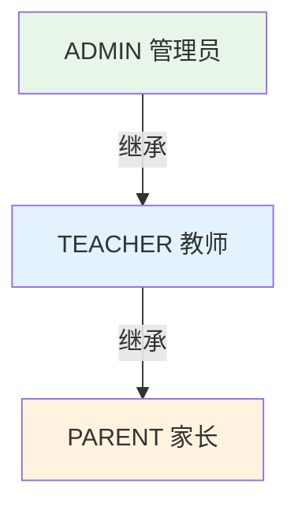

# 06. 数据模型设计

> 本文档定义 OTTO 123 教育机器人平台的完整数据模型，涵盖机构管理、设备管理、多角色用户、编程作品、竞赛平台、内容推送、安全审计与使用监控等核心领域。模型参考 aipen 的 User -> Device -> Agent -> Chat -> Message -> Recording 分层模式，以及 xiaozhi-esp32-server 的 MySQL 设备管理方案。

---

## 1. 概述

### 1.1 设计范围

数据模型覆盖以下业务领域：

| 领域 | 核心实体 | 对应 PRD 需求 |
|------|----------|---------------|
| 组织架构 | Institution, Class, User | R24 |
| 设备管理 | Device | R13, R14 |
| 学生与家长 | Student, StudentParent | R24 |
| 编程作品 | ProgrammingWork | R16 |
| 竞赛平台 | Competition, CompetitionSubmission, Vote | R20 |
| 对话系统 | ConversationSession, ConversationMessage | R12 |
| 安全审计 | SafetyAudit | R26 |
| 内容推送 | ContentPush, ContentResource | R25 |
| 使用监控 | UsageMetric | R27 |

### 1.2 技术选型

- **生产数据库**：MySQL 8.0+（ACID 事务、JSON 列支持、成熟运维生态）
- **ORM 框架**：SQLModel / SQLAlchemy 2.x（Python 生态，与 FastAPI 深度集成）
- **数据库迁移**：Alembic（版本化 schema 变更，参考 aipen 的迁移模式）
- **权限引擎**：Casbin（RBAC 策略管理，支持动态角色-资源-动作绑定）

---

## 2. 实体关系总览

```mermaid
erDiagram
    Institution ||--o{ Class : "has many"
    Institution ||--o{ Device : "has many"
    Institution ||--o{ User : "has many admins"
    Institution ||--o{ Competition : "has many"
    Institution ||--o{ ContentPush : "has many"
    Institution ||--o{ UsageMetric : "has many"

    Class ||--o{ Student : "has many"
    Class ||--o{ Device : "assigned"
    Class ||--o{ ContentPush : "target"
    Class ||--o{ Competition : "scope"
    Class ||--o{ UsageMetric : "aggregates"

    User ||--o{ ContentPush : "sends"
    User ||--|{ StudentParent : "as parent"

    Student ||--o{ StudentParent : "binds"
    Student ||--o{ ProgrammingWork : "creates"
    Student ||--o{ ConversationSession : "participates"
    Student ||--o{ CompetitionSubmission : "submits"
    Student ||--o{ Vote : "casts"
    Student ||--o{ SafetyAudit : "triggers"
    Student ||--o{ UsageMetric : "tracked"

    Device ||--o{ ConversationSession : "hosts"
    Device ||--o{ ProgrammingWork : "runs"

    ConversationSession ||--o{ ConversationMessage : "contains"
    ConversationSession ||--o{ SafetyAudit : "audited"

    Competition ||--o{ CompetitionSubmission : "receives"
    Competition ||--o{ Vote : "accepts"

    ContentResource ||--o{ ContentPush : "referenced by"
```

---

## 3. 核心实体设计

### 3.1 Institution（机构）

```sql
CREATE TABLE institution (
    id              BIGINT UNSIGNED AUTO_INCREMENT PRIMARY KEY,
    name            VARCHAR(128) NOT NULL COMMENT '机构名称',
    address         VARCHAR(256) DEFAULT NULL COMMENT '机构地址',
    contact_phone   VARCHAR(20) DEFAULT NULL COMMENT '联系电话',
    plan_type       ENUM('TRIAL', 'BASIC', 'PRO') NOT NULL DEFAULT 'TRIAL' COMMENT '套餐类型',
    max_devices     INT UNSIGNED NOT NULL DEFAULT 20 COMMENT '最大设备数',
    created_at      DATETIME NOT NULL DEFAULT CURRENT_TIMESTAMP,
    updated_at      DATETIME NOT NULL DEFAULT CURRENT_TIMESTAMP ON UPDATE CURRENT_TIMESTAMP,

    INDEX idx_plan_type (plan_type)
) ENGINE=InnoDB DEFAULT CHARSET=utf8mb4 COMMENT='机构表';
```

关联关系：一对多关联 Class、Device、User（管理员角色）。

### 3.2 Class（班级）

```sql
CREATE TABLE class (
    id              BIGINT UNSIGNED AUTO_INCREMENT PRIMARY KEY,
    institution_id  BIGINT UNSIGNED NOT NULL COMMENT '所属机构',
    name            VARCHAR(64) NOT NULL COMMENT '班级名称',
    grade           VARCHAR(32) DEFAULT NULL COMMENT '年级',
    teacher_id      BIGINT UNSIGNED DEFAULT NULL COMMENT '班主任（User.id）',
    created_at      DATETIME NOT NULL DEFAULT CURRENT_TIMESTAMP,

    INDEX idx_institution (institution_id),
    INDEX idx_teacher (teacher_id),
    FOREIGN KEY (institution_id) REFERENCES institution(id) ON DELETE CASCADE,
    FOREIGN KEY (teacher_id) REFERENCES user(id) ON DELETE SET NULL
) ENGINE=InnoDB DEFAULT CHARSET=utf8mb4 COMMENT='班级表';
```

### 3.3 User（用户）

```sql
CREATE TABLE user (
    id              BIGINT UNSIGNED AUTO_INCREMENT PRIMARY KEY,
    phone           VARCHAR(20) UNIQUE NOT NULL COMMENT '手机号（登录凭证）',
    password_hash   VARCHAR(256) NOT NULL COMMENT '密码哈希',
    username        VARCHAR(64) NOT NULL COMMENT '登录名',
    nickname        VARCHAR(64) DEFAULT NULL COMMENT '昵称',
    avatar          VARCHAR(512) DEFAULT NULL COMMENT '头像 URL',
    role            ENUM('ADMIN', 'TEACHER', 'PARENT') NOT NULL COMMENT '角色',
    institution_id  BIGINT UNSIGNED DEFAULT NULL COMMENT '所属机构',
    class_id        BIGINT UNSIGNED DEFAULT NULL COMMENT '管理的班级（教师）',
    created_at      DATETIME NOT NULL DEFAULT CURRENT_TIMESTAMP,
    updated_at      DATETIME NOT NULL DEFAULT CURRENT_TIMESTAMP ON UPDATE CURRENT_TIMESTAMP,

    INDEX idx_role_institution (role, institution_id),
    UNIQUE INDEX idx_phone (phone),
    FOREIGN KEY (institution_id) REFERENCES institution(id) ON DELETE CASCADE
) ENGINE=InnoDB DEFAULT CHARSET=utf8mb4 COMMENT='用户表';
```

角色说明（R24）：

| 角色 | 权限范围 |
|------|----------|
| ADMIN | 管理全机构设备、账号、内容推送、安全策略、数据统计 |
| TEACHER | 管理本班设备和学生，推送课程内容，管理班级竞赛，查看本班数据 |
| PARENT | 查看孩子使用摘要，推送个性化鼓励内容 |

### 3.4 Student（学生）

```sql
CREATE TABLE student (
    id              BIGINT UNSIGNED AUTO_INCREMENT PRIMARY KEY,
    nickname        VARCHAR(64) NOT NULL COMMENT '学生昵称',
    grade           VARCHAR(32) DEFAULT NULL COMMENT '年级',
    class_id        BIGINT UNSIGNED NOT NULL COMMENT '所属班级',
    institution_id  BIGINT UNSIGNED NOT NULL COMMENT '所属机构',
    created_at      DATETIME NOT NULL DEFAULT CURRENT_TIMESTAMP,

    INDEX idx_class (class_id),
    INDEX idx_institution (institution_id),
    FOREIGN KEY (class_id) REFERENCES class(id) ON DELETE CASCADE,
    FOREIGN KEY (institution_id) REFERENCES institution(id) ON DELETE CASCADE
) ENGINE=InnoDB DEFAULT CHARSET=utf8mb4 COMMENT='学生表';
```

### 3.5 StudentParent（学生-家长绑定）

```sql
CREATE TABLE student_parent (
    id              BIGINT UNSIGNED AUTO_INCREMENT PRIMARY KEY,
    student_id      BIGINT UNSIGNED NOT NULL COMMENT '学生 ID',
    parent_id       BIGINT UNSIGNED NOT NULL COMMENT '家长（User.id）',
    bind_code       VARCHAR(16) NOT NULL COMMENT '绑定激活码',
    status          ENUM('PENDING', 'APPROVED', 'REJECTED') NOT NULL DEFAULT 'PENDING' COMMENT '绑定状态',
    created_at      DATETIME NOT NULL DEFAULT CURRENT_TIMESTAMP,

    UNIQUE INDEX idx_bind_code (bind_code),
    INDEX idx_student (student_id),
    INDEX idx_parent (parent_id),
    FOREIGN KEY (student_id) REFERENCES student(id) ON DELETE CASCADE,
    FOREIGN KEY (parent_id) REFERENCES user(id) ON DELETE CASCADE
) ENGINE=InnoDB DEFAULT CHARSET=utf8mb4 COMMENT='学生家长绑定表';
```

绑定流程：机构管理员生成激活码 -> 家长扫码输入 -> 管理员审批通过。

### 3.6 Device（设备）

```sql
CREATE TABLE device (
    id                  BIGINT UNSIGNED AUTO_INCREMENT PRIMARY KEY,
    device_id           VARCHAR(64) UNIQUE NOT NULL COMMENT '硬件唯一标识（芯片 ID）',
    mac_address         VARCHAR(17) DEFAULT NULL COMMENT 'MAC 地址',
    institution_id      BIGINT UNSIGNED NOT NULL COMMENT '所属机构',
    class_id            BIGINT UNSIGNED DEFAULT NULL COMMENT '分配班级',
    firmware_version    VARCHAR(32) NOT NULL DEFAULT '1.0.0' COMMENT '当前固件版本',
    status              ENUM('ONLINE', 'OFFLINE', 'ERROR') NOT NULL DEFAULT 'OFFLINE' COMMENT '在线状态',
    last_heartbeat      DATETIME DEFAULT NULL COMMENT '最近心跳时间',
    battery_level       TINYINT UNSIGNED DEFAULT NULL COMMENT '电池电量 0-100',
    wifi_rssi           SMALLINT DEFAULT NULL COMMENT 'Wi-Fi 信号强度 dBm',
    current_version     VARCHAR(32) NOT NULL DEFAULT '1.0.0' COMMENT '当前版本（OTA 别名）',
    target_version      VARCHAR(32) DEFAULT NULL COMMENT '目标升级版本',
    upgrade_status      ENUM('NONE', 'DOWNLOADING', 'UPGRADING', 'SUCCESS', 'FAILED') NOT NULL DEFAULT 'NONE',
    created_at          DATETIME NOT NULL DEFAULT CURRENT_TIMESTAMP,
    updated_at          DATETIME NOT NULL DEFAULT CURRENT_TIMESTAMP ON UPDATE CURRENT_TIMESTAMP,

    INDEX idx_institution_status (institution_id, status),
    INDEX idx_class (class_id),
    INDEX idx_last_heartbeat (last_heartbeat),
    FOREIGN KEY (institution_id) REFERENCES institution(id) ON DELETE CASCADE
) ENGINE=InnoDB DEFAULT CHARSET=utf8mb4 COMMENT='设备表';
```

### 3.7 ProgrammingWork（编程作品）

```sql
CREATE TABLE programming_work (
    id                  BIGINT UNSIGNED AUTO_INCREMENT PRIMARY KEY,
    student_id          BIGINT UNSIGNED NOT NULL COMMENT '创建学生',
    device_id           BIGINT UNSIGNED DEFAULT NULL COMMENT '运行设备',
    title               VARCHAR(128) NOT NULL COMMENT '作品标题',
    description         TEXT DEFAULT NULL COMMENT '作品描述',
    block_data          JSON NOT NULL COMMENT 'Blockly 积木数据',
    version             INT UNSIGNED NOT NULL DEFAULT 1 COMMENT '当前版本号',
    version_history     JSON DEFAULT NULL COMMENT '版本历史（最多 10 个）',
    is_deleted          BOOLEAN NOT NULL DEFAULT FALSE COMMENT '软删除标记',
    deleted_at          DATETIME DEFAULT NULL COMMENT '删除时间（回收站 30 天）',
    is_ai_assisted      BOOLEAN NOT NULL DEFAULT FALSE COMMENT '是否 AI 辅助创作',
    shared_scope        ENUM('PRIVATE', 'CLASS', 'INSTITUTION') NOT NULL DEFAULT 'PRIVATE' COMMENT '分享范围',
    created_at          DATETIME NOT NULL DEFAULT CURRENT_TIMESTAMP,
    updated_at          DATETIME NOT NULL DEFAULT CURRENT_TIMESTAMP ON UPDATE CURRENT_TIMESTAMP,

    INDEX idx_student (student_id),
    INDEX idx_shared (shared_scope, class_id),
    INDEX idx_deleted (is_deleted, deleted_at),
    FOREIGN KEY (student_id) REFERENCES student(id) ON DELETE CASCADE
) ENGINE=InnoDB DEFAULT CHARSET=utf8mb4 COMMENT='编程作品表';
```

设计要点（R16）：
- **版本历史**：`version_history` JSON 字段存储最近 10 个版本的 block_data 快照，每次保存时写入，超出时 FIFO 淘汰最旧版本
- **回收站**：`is_deleted` + `deleted_at` 实现软删除，定时任务清理超过 30 天的已删除作品
- **分享范围**：PRIVATE（仅自己）、CLASS（班级内可见）、INSTITUTION（机构内可见）

### 3.8 Competition（竞赛）

```sql
CREATE TABLE competition (
    id                  BIGINT UNSIGNED AUTO_INCREMENT PRIMARY KEY,
    institution_id      BIGINT UNSIGNED NOT NULL COMMENT '所属机构',
    class_id            BIGINT UNSIGNED DEFAULT NULL COMMENT '限定班级（NULL 表示全机构）',
    title               VARCHAR(128) NOT NULL COMMENT '竞赛标题',
    type                ENUM('APPEARANCE', 'ACTION_MANUAL', 'ACTION_AI', 'INNOVATION') NOT NULL COMMENT '竞赛类型',
    status              ENUM('DRAFT', 'OPEN', 'VOTING', 'CLOSED') NOT NULL DEFAULT 'DRAFT' COMMENT '竞赛状态',
    scoring_template    JSON DEFAULT NULL COMMENT '评分模板（维度与权重）',
    created_at          DATETIME NOT NULL DEFAULT CURRENT_TIMESTAMP,
    start_at            DATETIME DEFAULT NULL COMMENT '开始时间',
    end_at              DATETIME DEFAULT NULL COMMENT '截止时间',

    INDEX idx_institution_status (institution_id, status),
    FOREIGN KEY (institution_id) REFERENCES institution(id) ON DELETE CASCADE
) ENGINE=InnoDB DEFAULT CHARSET=utf8mb4 COMMENT='竞赛表';
```

竞赛类型说明（R20）：

| type | 名称 | 评比方式 |
|------|------|----------|
| APPEARANCE | 外观选美 | 学生上传照片，同学投票 |
| ACTION_MANUAL | 动作技能（手动组） | 教师评分：动作数量 + 舵机维度 + 流畅度 |
| ACTION_AI | 动作技能（AI 组） | 教师评分：创意度 + 描述匹配度 |
| INNOVATION | 功能创新赛 | 教师评分：扩展创意 + 功能组合 |

### 3.9 CompetitionSubmission（竞赛作品）与 Vote（投票）

```sql
CREATE TABLE competition_submission (
    id              BIGINT UNSIGNED AUTO_INCREMENT PRIMARY KEY,
    competition_id  BIGINT UNSIGNED NOT NULL COMMENT '所属竞赛',
    student_id      BIGINT UNSIGNED NOT NULL COMMENT '提交学生',
    work_id         BIGINT UNSIGNED DEFAULT NULL COMMENT '关联编程作品',
    photo_url       VARCHAR(512) DEFAULT NULL COMMENT '外观照片 URL',
    scores          JSON DEFAULT NULL COMMENT '各维度评分',
    total_score     DECIMAL(5,2) DEFAULT NULL COMMENT '总分',
    rank            INT UNSIGNED DEFAULT NULL COMMENT '排名',
    created_at      DATETIME NOT NULL DEFAULT CURRENT_TIMESTAMP,

    UNIQUE INDEX idx_competition_student (competition_id, student_id),
    INDEX idx_competition_rank (competition_id, rank),
    FOREIGN KEY (competition_id) REFERENCES competition(id) ON DELETE CASCADE,
    FOREIGN KEY (student_id) REFERENCES student(id) ON DELETE CASCADE
) ENGINE=InnoDB DEFAULT CHARSET=utf8mb4 COMMENT='竞赛提交表';

CREATE TABLE vote (
    id                  BIGINT UNSIGNED AUTO_INCREMENT PRIMARY KEY,
    competition_id      BIGINT UNSIGNED NOT NULL COMMENT '所属竞赛',
    voter_student_id    BIGINT UNSIGNED NOT NULL COMMENT '投票学生',
    submission_id       BIGINT UNSIGNED NOT NULL COMMENT '投票目标',
    created_at          DATETIME NOT NULL DEFAULT CURRENT_TIMESTAMP,

    UNIQUE INDEX idx_voter_competition_submission (voter_student_id, competition_id, submission_id),
    INDEX idx_competition (competition_id),
    FOREIGN KEY (competition_id) REFERENCES competition(id) ON DELETE CASCADE
) ENGINE=InnoDB DEFAULT CHARSET=utf8mb4 COMMENT='投票表';
```

投票约束（R20）：每人每竞赛最多 3 票，不可投自己（应用层校验）。

### 3.10 ConversationSession（对话会话）与 ConversationMessage（对话消息）

```sql
CREATE TABLE conversation_session (
    id                  BIGINT UNSIGNED AUTO_INCREMENT PRIMARY KEY,
    device_id           BIGINT UNSIGNED NOT NULL COMMENT '设备 ID',
    student_id          BIGINT UNSIGNED NOT NULL COMMENT '学生 ID',
    started_at          DATETIME NOT NULL COMMENT '会话开始时间',
    ended_at            DATETIME DEFAULT NULL COMMENT '会话结束时间',
    duration_seconds    INT UNSIGNED DEFAULT NULL COMMENT '会话时长（秒）',
    message_count       INT UNSIGNED NOT NULL DEFAULT 0 COMMENT '消息总数',

    INDEX idx_device (device_id),
    INDEX idx_student_time (student_id, started_at),
    INDEX idx_ended (ended_at),
    FOREIGN KEY (device_id) REFERENCES device(id) ON DELETE CASCADE,
    FOREIGN KEY (student_id) REFERENCES student(id) ON DELETE CASCADE
) ENGINE=InnoDB DEFAULT CHARSET=utf8mb4 COMMENT='对话会话表';

CREATE TABLE conversation_message (
    id              BIGINT UNSIGNED AUTO_INCREMENT PRIMARY KEY,
    session_id      BIGINT UNSIGNED NOT NULL COMMENT '所属会话',
    role            ENUM('USER', 'ASSISTANT', 'SYSTEM') NOT NULL COMMENT '消息角色',
    content         TEXT NOT NULL COMMENT '消息内容',
    audio_url       VARCHAR(512) DEFAULT NULL COMMENT '语音录音 URL',
    created_at      DATETIME NOT NULL DEFAULT CURRENT_TIMESTAMP,

    INDEX idx_session (session_id),
    FOREIGN KEY (session_id) REFERENCES conversation_session(id) ON DELETE CASCADE
) ENGINE=InnoDB DEFAULT CHARSET=utf8mb4 COMMENT='对话消息表';
```

设计参考 aipen 的 Chat -> Message 分层模式，将一次连续对话抽象为 Session，每条消息挂在 Session 下。

### 3.11 SafetyAudit（安全审计记录）

```sql
CREATE TABLE safety_audit (
    id                  BIGINT UNSIGNED AUTO_INCREMENT PRIMARY KEY,
    session_id          BIGINT UNSIGNED NOT NULL COMMENT '触发会话',
    student_id          BIGINT UNSIGNED NOT NULL COMMENT '学生 ID',
    trigger_keyword     VARCHAR(128) NOT NULL COMMENT '触发关键词',
    context_summary     TEXT NOT NULL COMMENT '上下文摘要（前后 2 轮对话）',
    severity            ENUM('GENERAL', 'SEVERE') NOT NULL DEFAULT 'GENERAL' COMMENT '严重程度',
    status              ENUM('PENDING', 'NOTIFIED', 'RESOLVED') NOT NULL DEFAULT 'PENDING' COMMENT '处理状态',
    notified_teacher    BOOLEAN NOT NULL DEFAULT FALSE COMMENT '是否已通知教师',
    notified_parent     BOOLEAN NOT NULL DEFAULT FALSE COMMENT '是否已通知家长',
    created_at          DATETIME NOT NULL DEFAULT CURRENT_TIMESTAMP,

    INDEX idx_student (student_id),
    INDEX idx_severity_status (severity, status),
    INDEX idx_created (created_at),
    FOREIGN KEY (session_id) REFERENCES conversation_session(id) ON DELETE CASCADE,
    FOREIGN KEY (student_id) REFERENCES student(id) ON DELETE CASCADE
) ENGINE=InnoDB DEFAULT CHARSET=utf8mb4 COMMENT='安全审计表';
```

设计要点（R26）：
- 对话结束后 1 分钟内完成敏感词 + AI 语义检测，检测结果写入本表
- GENERAL 级别仅通知教师，SEVERE 级别额外通知家长
- 通知频率上限由应用层控制（家长每天最多 3 条）

### 3.12 ContentPush（内容推送）与 ContentResource（内容资源库）

```sql
CREATE TABLE content_push (
    id              BIGINT UNSIGNED AUTO_INCREMENT PRIMARY KEY,
    institution_id  BIGINT UNSIGNED NOT NULL COMMENT '推送机构',
    class_id        BIGINT UNSIGNED DEFAULT NULL COMMENT '目标班级（NULL 表示全机构）',
    student_id      BIGINT UNSIGNED DEFAULT NULL COMMENT '目标学生（NULL 表示全班/全机构）',
    sender_id       BIGINT UNSIGNED NOT NULL COMMENT '发送者 User.id',
    sender_role     ENUM('ADMIN', 'TEACHER', 'PARENT') NOT NULL COMMENT '发送者角色',
    content_type    ENUM('TEXT', 'VOICE', 'ACTION') NOT NULL COMMENT '内容类型',
    content         TEXT NOT NULL COMMENT '推送内容',
    timing_mode     ENUM('IMMEDIATE', 'NEXT_DIALOG', 'BREAK') NOT NULL DEFAULT 'IMMEDIATE' COMMENT '推送时机',
    priority        TINYINT UNSIGNED NOT NULL DEFAULT 5 COMMENT '优先级 1-10',
    status          ENUM('QUEUED', 'DELIVERED', 'EXPIRED') NOT NULL DEFAULT 'QUEUED' COMMENT '推送状态',
    expires_at      DATETIME DEFAULT NULL COMMENT '过期时间',
    delivered_at    DATETIME DEFAULT NULL COMMENT '送达时间',
    created_at      DATETIME NOT NULL DEFAULT CURRENT_TIMESTAMP,

    INDEX idx_student_status (student_id, status),
    INDEX idx_timing (timing_mode, status),
    INDEX idx_priority (priority DESC),
    FOREIGN KEY (sender_id) REFERENCES user(id) ON DELETE CASCADE
) ENGINE=InnoDB DEFAULT CHARSET=utf8mb4 COMMENT='内容推送表';

CREATE TABLE content_resource (
    id              BIGINT UNSIGNED AUTO_INCREMENT PRIMARY KEY,
    title           VARCHAR(128) NOT NULL COMMENT '资源标题',
    category        ENUM('COURSE', 'HOLIDAY', 'ENCOURAGEMENT') NOT NULL COMMENT '资源分类',
    content_type    ENUM('TEXT', 'VOICE', 'ACTION') NOT NULL COMMENT '内容类型',
    content         TEXT NOT NULL COMMENT '资源内容',
    tags            JSON DEFAULT NULL COMMENT '标签（数组）',
    created_at      DATETIME NOT NULL DEFAULT CURRENT_TIMESTAMP,

    INDEX idx_category (category)
) ENGINE=InnoDB DEFAULT CHARSET=utf8mb4 COMMENT='内容资源库表';
```

推送时机说明（R25）：
- **IMMEDIATE**：立即执行
- **NEXT_DIALOG**：下次对话时播报
- **BREAK**：课间播报

推送频率上限由机构管理员配置，应用层校验。

### 3.13 UsageMetric（使用统计）

```sql
CREATE TABLE usage_metric (
    id                  BIGINT UNSIGNED AUTO_INCREMENT PRIMARY KEY,
    student_id          BIGINT UNSIGNED NOT NULL COMMENT '学生 ID',
    institution_id      BIGINT UNSIGNED NOT NULL COMMENT '机构 ID',
    class_id            BIGINT UNSIGNED NOT NULL COMMENT '班级 ID',
    date                DATE NOT NULL COMMENT '统计日期',
    interaction_count   INT UNSIGNED NOT NULL DEFAULT 0 COMMENT '互动次数',
    duration_seconds    INT UNSIGNED NOT NULL DEFAULT 0 COMMENT '使用时长（秒）',
    works_completed     INT UNSIGNED NOT NULL DEFAULT 0 COMMENT '完成作品数',
    created_at          DATETIME NOT NULL DEFAULT CURRENT_TIMESTAMP,

    UNIQUE INDEX idx_student_date (student_id, date),
    INDEX idx_class_date (class_id, date),
    INDEX idx_institution_date (institution_id, date),
    FOREIGN KEY (student_id) REFERENCES student(id) ON DELETE CASCADE
) ENGINE=InnoDB DEFAULT CHARSET=utf8mb4 COMMENT='使用统计表';
```

设计要点（R27）：
- 按天聚合，每日定时任务从 ConversationSession 和 ProgrammingWork 统计写入
- 参与度预警：连续 3 次课使用时长低于班级平均 50% 时触发通知（应用层逻辑）

---

## 4. RBAC 权限模型

基于 Casbin 实现 RBAC，定义角色、资源和操作的映射关系。

### 4.1 角色层级



ADMIN 继承 TEACHER 的全部权限，TEACHER 继承 PARENT 的全部权限。

### 4.2 Casbin Model 定义

```ini
[request_definition]
r = sub, obj, act

[policy_definition]
p = sub, obj, act

[role_definition]
g = _, _

[policy_effect]
e = some(where (p.eft == allow))

[matchers]
m = g(r.sub, p.sub) && r.obj == p.obj && r.act == p.act
```

### 4.3 权限策略

```
# ADMIN 权限
p, ADMIN, institution, read
p, ADMIN, institution, write
p, ADMIN, institution, manage
p, ADMIN, class, read
p, ADMIN, class, write
p, ADMIN, class, delete
p, ADMIN, device, read
p, ADMIN, device, write
p, ADMIN, device, manage
p, ADMIN, student, read
p, ADMIN, student, write
p, ADMIN, student, delete
p, ADMIN, competition, manage
p, ADMIN, push, manage
p, ADMIN, audit, read
p, ADMIN, audit, manage
p, ADMIN, metric, read

# TEACHER 权限
p, TEACHER, class, read
p, TEACHER, class, write
p, TEACHER, device, read
p, TEACHER, device, write
p, TEACHER, student, read
p, TEACHER, student, write
p, TEACHER, competition, manage
p, TEACHER, push, write
p, TEACHER, audit, read
p, TEACHER, metric, read

# PARENT 权限
p, PARENT, student, read
p, PARENT, push, write
p, PARENT, metric, read

# 角色继承
g, ADMIN, TEACHER
g, TEACHER, PARENT
```

---

## 5. 数据库设计决策

### 5.1 MySQL 8 选型理由

- **ACID 事务**：设备状态更新、投票计数、竞赛评分等场景需要强一致性
- **JSON 列支持**：`version_history`、`scoring_template`、`block_data`、`scores`、`tags` 等灵活结构字段，避免过度规范化
- **成熟运维**：备份恢复、主从复制、监控工具生态完善
- **参考实践**：xiaozhi-esp32-server 已验证 MySQL 在 IoT 设备管理场景的可靠性

### 5.2 Schema 迁移

使用 Alembic 管理 schema 版本，参考 aipen 项目的迁移模式：

```
alembic/
├── versions/
│   ├── 001_initial_schema.py          # 基础表结构
│   ├── 002_add_competition.py         # 竞赛相关表
│   ├── 003_add_content_push.py        # 内容推送表
│   ├── 004_add_safety_audit.py        # 安全审计表
│   └── 005_add_usage_metrics.py       # 使用统计表
├── env.py
└── alembic.ini
```

### 5.3 索引策略

| 场景 | 索引 | 说明 |
|------|------|------|
| 设备在线状态查询 | `(institution_id, status)` | 管理员查看机构设备概况 |
| 设备心跳超时检测 | `(last_heartbeat)` | 定时任务扫描离线设备 |
| 学生使用趋势 | `(student_id, date)` | 按天聚合查询 |
| 班级使用统计 | `(class_id, date)` | 教师查看班级数据 |
| 竞赛排行榜 | `(competition_id, rank)` | 排序查询优化 |
| 推送队列 | `(timing_mode, status, priority)` | 定时任务消费队列 |
| 安全审计检索 | `(severity, status)` | 管理员处理待审计记录 |

### 5.4 软删除与 JSON 列

- **软删除**：ProgrammingWork 使用 `is_deleted` + `deleted_at` 字段实现回收站机制，保留 30 天后物理删除
- **JSON 列**：MySQL 8 原生支持 JSON 类型，可进行 JSON 函数查询（如 `JSON_CONTAINS`、`JSON_EXTRACT`），适合存储结构灵活且不频繁查询的字段

---

## 6. PRD 需求映射表

| PRD 需求 | 数据模型支撑 | 关键设计点 |
|-----------|-------------|-----------|
| R16 自定义动作保存 | ProgrammingWork | version_history JSON（10 版本），is_deleted 软删除（30 天），shared_scope 分享 |
| R20 竞赛平台 | Competition, CompetitionSubmission, Vote | 4 种竞赛类型，评分模板 JSON，投票约束（3 票/人，不投自己） |
| R24 三级权限 | User.role, Casbin RBAC | ADMIN > TEACHER > PARENT 继承链，StudentParent 绑定激活码 |
| R25 内容推送 | ContentPush, ContentResource | 3 种内容类型，3 种推送时机，优先级队列，资源库分类管理 |
| R26 安全审计 | SafetyAudit | 会话级检测，severity 分级通知，context_summary 存储上下文 |
| R27 使用监控 | UsageMetric, ConversationSession | 按天聚合，班级/机构维度统计，参与度预警应用层实现 |

---

## 7. 参考借鉴

### aipen

- **分层模式**：User -> Device -> Agent -> Chat -> Message -> Recording，本文档采用类似的 User -> Device -> ConversationSession -> ConversationMessage 分层
- **ORM 实践**：SQLModel 定义数据模型，Pydantic schema 校验，Alembic 管理迁移
- **JSON 字段使用**：配置、版本历史等灵活数据存储在 JSON 列中

### xiaozhi-esp32-server

- **设备管理**：MySQL 存储设备注册信息、在线状态、OTA 升级进度
- **心跳机制**：device.last_heartbeat 字段 + 定时任务检测离线设备
- **IoT 场景验证**：MySQL 在 IoT 设备管理场景的性能和可靠性
