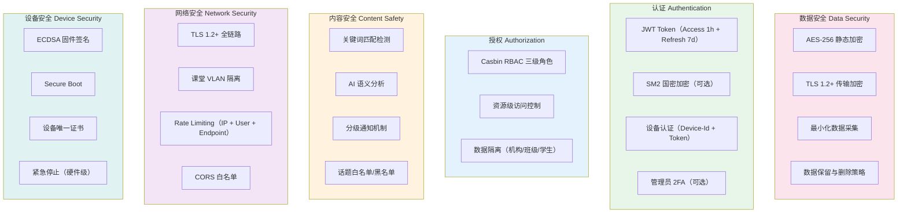
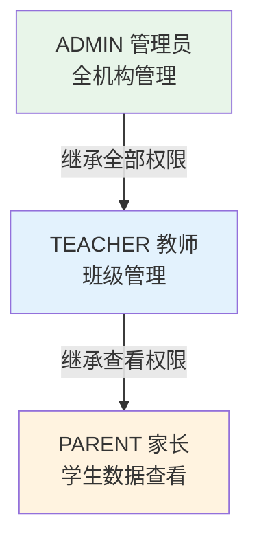
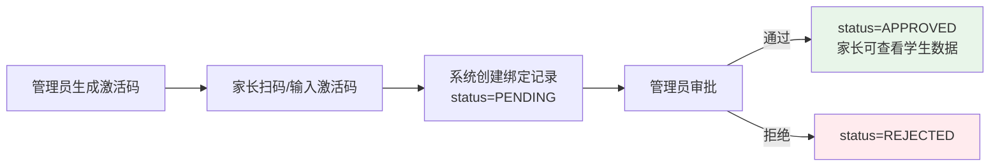
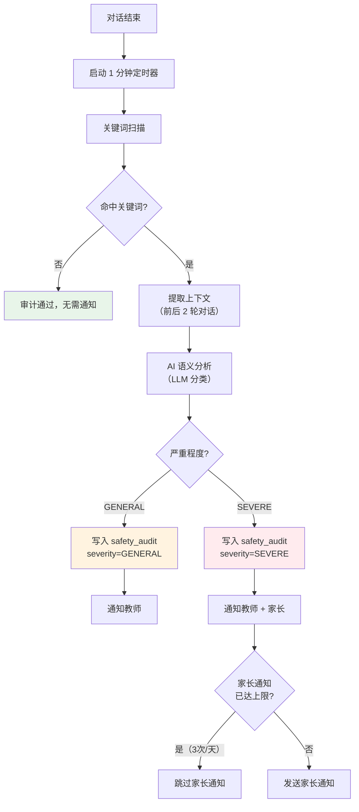
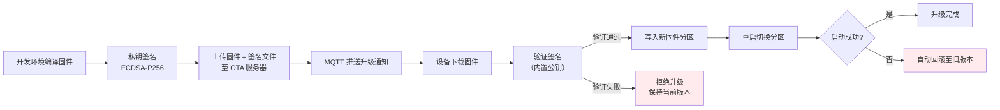

# 07. 安全架构设计

> 本文档定义 OTTO 123 教育机器人平台的安全架构，涵盖认证授权、数据隐私、内容审计、设备安全和网络安全。由于用户群体为未成年人（12-15 岁），安全设计以《未成年人保护法》和《个人信息保护法》（PIPL）为合规基线，参考 aipen 的 JWT + SM2 认证方案和 xiaozhi-esp32-server 的设备通信安全实践。

---

## 1. 概述

### 1.1 安全范围

OTTO 123 的安全架构覆盖以下领域：

| 领域 | 安全目标 | 对应 PRD 需求 |
|------|----------|---------------|
| 身份认证 | 确保用户和设备身份可信，防止未授权访问 | R24, R33 |
| 访问授权 | 三级角色权限隔离，数据按机构和班级隔离 | R24 |
| 数据隐私 | 最小化采集未成年人信息，加密存储和传输 | R3, R26 |
| 内容安全 | 对话内容事后审计，敏感内容分级通知 | R3, R26 |
| 设备安全 | 固件完整性验证，安全 OTA，防止恶意固件注入 | R8, R33 |
| 网络安全 | 传输加密，课堂网络隔离，API 限流防护 | R4, R30 |

### 1.2 威胁模型

教育 IoT 平台面临的主要威胁：

| 威胁类型 | 攻击面 | 风险等级 | 缓解措施 |
|----------|--------|----------|----------|
| 未授权访问 | API 接口、管理后台 | 高 | JWT 认证 + Casbin RBAC + 限流 |
| 设备伪造 | MQTT/WebSocket 连接 | 高 | Device-Id + Token 双重校验 + 设备证书 |
| 数据泄露 | 未成年人对话内容、个人信息 | 高 | AES-256 加密存储、TLS 传输、最小化采集 |
| 恶意固件 | OTA 升级通道 | 中 | ECDSA 签名验证 + Secure Boot |
| 内容风险 | LLM 生成的回复内容 | 高 | 关键词 + AI 语义双重审计（R26） |
| 暴力破解 | 登录接口 | 中 | bcrypt 哈希 + 登录失败锁定 |
| 中间人攻击 | 课堂 Wi-Fi 环境 | 中 | TLS 1.2+ 全链路加密 |
| 越权访问 | 多角色数据隔离边界 | 中 | Casbin 策略强制 + 数据层过滤 |

### 1.3 合规要求

本系统需满足以下中国法律法规的核心要求：

- **《未成年人保护法》**（2021 修订）：网络产品和服务应针对未成年人设置相应的时间管理、权限管理、消费管理等功能；不得收集与其提供服务无关的未成年人个人信息
- **《个人信息保护法》（PIPL）**：处理 14 周岁以下未成年人个人信息应取得监护人同意；实行最小必要原则；提供删除权和更正权
- **《数据安全法》**：建立数据分类分级保护制度，采取相应技术措施保障数据安全

---

## 2. 安全架构总览

安全架构分为六层，自底向上分别为网络安全、认证、授权、数据安全、内容安全和设备安全。



---

## 3. 认证系统

### 3.1 JWT Token 认证

用户身份认证采用 JWT，参考 aipen 项目的 Token 管理方案。

| Token 类型 | 有效期 | 用途 | 存储位置 |
|------------|--------|------|----------|
| Access Token | 1 小时 | API 请求鉴权 | 前端内存 + 请求 Header |
| Refresh Token | 7 天 | 刷新 Access Token | HttpOnly Cookie |

Token Payload 包含：`sub`（user_id）、`role`、`institution_id`、`permissions`、`iat`、`exp`。前端在 Access Token 过期前 5 分钟自动调用刷新接口，Refresh Token 过期后跳转登录页。传递方式：`Authorization: Bearer <access_token>`。

### 3.2 SM2 国密加密（可选）

参考 aipen 项目，支持 SM2 国密加密用于密码传输：服务端生成密钥对，客户端用公钥加密密码，服务端用私钥解密后进行 bcrypt 验证。SM2 仅用于密码传输环节，不替代 TLS。

```
Client                          Server
  |--- GET /api/auth/public-key --->|
  |<--- { public_key: "..." } ------|
  |--- POST /api/auth/login -------->|
  |     { phone: "...",              |
  |       encrypted_password: "..." }|
  |     (SM2 encrypted)              |
  |<--- { access_token, refresh } ---|
```

### 3.3 设备认证

参考 xiaozhi-esp32-server 方案，设备通过 MQTT 和 WebSocket 两种通道接入。

MQTT 认证：Username 为 Device-Id（芯片 ID），Password 为设备 JWT。mosquitto 配置 ACL 限制每台设备只能订阅和发布自己的 Topic（如 `otto/device/{device_id}/telemetry`）。

WebSocket 认证 Header：`Authorization`（Bearer Token）、`Device-Id`（硬件标识）、`Client-Id`（firmware / web / admin）。

### 3.4 密码策略与账户安全

- 最小长度 8 个字符（含大小写字母、数字）
- bcrypt 哈希（cost=12），参考 aipen 方案
- 连续 5 次登录失败 -> 锁定 30 分钟
- 管理员/教师可选启用 TOTP 二次认证
- 每用户最多 3 个活跃会话

---

## 4. 授权模型（Casbin RBAC）

### 4.1 角色层级



ADMIN 继承 TEACHER 的全部权限，TEACHER 继承 PARENT 的全部权限。角色层级定义见 [/system/06-数据模型设计.md](/system/06-数据模型设计.md) 第 4 节。

### 4.2 资源与操作类型

资源类型：institution、class、device、student、competition、push、audit_log、content_resource、metric

操作类型：read（查看）、write（创建/编辑）、delete（删除）、manage（管理）、push（推送）

### 4.3 权限策略矩阵

| 资源 | ADMIN | TEACHER | PARENT |
|------|-------|---------|--------|
| institution | read, write, manage | read | -- |
| class | read, write, delete | read, write | -- |
| device | read, write, manage | read, write | -- |
| student | read, write, delete | read, write | read（仅绑定学生） |
| competition | manage | manage | -- |
| push | manage | write | write（仅绑定学生） |
| audit_log | read, manage | read（本班） | -- |
| content_resource | read, write, manage | read, write | read |
| metric | read | read（本班） | read（仅绑定学生） |

### 4.4 家长-学生绑定机制

家长通过激活码绑定学生，参考 aipen 的扫码绑定 + 管理员审核流程（R24）：



**数据隔离规则**：

- 家长只能查看已绑定学生的数据（使用记录、审计记录、竞赛成绩）
- 教师只能查看所带班级的学生和设备数据
- 管理员可查看全机构数据

---

## 5. 数据安全与隐私

### 5.1 数据采集原则

严格遵循最小必要原则，仅采集业务必需的未成年人信息：

| 数据项 | 是否采集 | 存储方式 | 说明 |
|--------|----------|----------|------|
| 昵称 | 是 | 明文 | 学生使用昵称，不采集真实姓名 |
| 年级 | 是 | 明文 | 用于课程匹配和分组 |
| 班级 | 是 | 明文 | 关联 Class 实体 |
| 手机号 | 否 | -- | 不采集学生手机号 |
| 身份证号 | 否 | -- | 不采集 |
| 家庭住址 | 否 | -- | 不采集 |
| 对话文本 | 是（仅触发审计时） | AES-256 加密 | 仅存储触发关键词的上下文 |
| 音频数据 | 否 | -- | 实时处理后丢弃，不存储 |
| 人脸/照片 | 否 | -- | 不采集 |

### 5.2 传输与存储安全

所有通信通道强制 TLS 1.2+：HTTP API（HTTPS + HSTS）、WebSocket（WSS）、MQTT（MQTTS）、音频流（WebSocket over TLS）。

存储加密方案：对话审计内容和学生个人信息使用 AES-256-GCM 字段级加密（密钥由 KMS 管理）；用户密码和 Refresh Token 使用 bcrypt 哈希存储。

### 5.3 音频数据处理

音频数据采用实时处理、不落盘的策略：机器人录音经 WebSocket 上传 -> ASR 转文字 -> LLM 处理 -> TTS 合成语音，音频流仅在内存中流转，不写入磁盘。仅当安全审计触发时，将触发关键词的前后 2 轮对话文本存入 safety_audit 表。

### 5.5 数据保留与删除策略

| 数据类型 | 保留期限 | 删除策略 |
|----------|----------|----------|
| 学生信息 | 在读期间 | 毕业后 30 天自动删除 |
| 对话审计记录 | 90 天 | 自动过期删除 |
| 安全审计记录 | 1 年 | 保留用于合规审计 |
| 操作日志 | 90 天 | 自动过期删除 |
| 安全事件日志 | 1 年 | 保留用于安全追溯 |
| 编程作品 | 学生在读 + 30 天 | 毕业后 30 天自动删除 |
| 竞赛记录 | 永久 | 用于历史查询 |

家长和管理员可手动申请提前删除学生数据，系统提供数据删除接口并记录删除操作日志。

---

## 6. 内容安全审计（R26）

### 6.1 审计流程

对话结束后，系统在 1 分钟内完成内容安全审计（R26 SLA 要求）。



### 6.2 关键词匹配

系统维护可配置的关键词列表，按类别组织：暴力（涉及暴力行为描述）、欺凌（校园欺凌用语）、自我伤害（自伤倾向关键词）、不当内容（不适合未成年人的内容）。关键词列表支持管理员在线编辑，匹配采用正则表达式支持模糊匹配。

### 6.3 AI 语义分析

关键词匹配命中后，系统调用 LLM 进行语义分析，判断实际严重程度：

```
Prompt: 分析以下对话内容是否涉及校园安全风险。
对话上下文：
[学生]: {context}

请判断严重程度：
- GENERAL: 轻微不当用语，需教师关注
- SEVERE: 严重安全风险，需立即通知家长和教师

输出格式：{"severity": "GENERAL|SEVERE", "reason": "..."}
```

AI 语义分析在关键词匹配命中后触发，避免对全部对话进行 LLM 分析以节省成本。

### 6.4 通知分级与频率控制

- GENERAL：仅通知教师（管理后台消息 + 可选推送）
- SEVERE：通知教师 + 家长（管理后台消息 + 微信/短信推送）
- 频率上限：家长通知每个机构每天最多 3 条，防止家长焦虑；教师通知无上限

### 6.5 话题白名单/黑名单

教师和管理员可配置话题策略控制机器人回复范围（R3）：白名单模式（课堂模式下仅允许学科知识、编程、机器人）和黑名单模式（全局禁止暴力、色情、政治、赌博）。配置存储在 institution 表的 JSON 字段中，LLM 通过 System Prompt 注入话题约束。

### 6.6 离线审计

网络中断时，对话内容暂存于设备本地缓冲区：

1. 离线对话内容写入本地 Flash 缓冲（最大 10 条会话）
2. 网络恢复后自动上传至云端审计
3. 审计延迟不受 1 分钟 SLA 约束，但应在恢复后 5 分钟内完成

---

## 7. 设备安全

### 7.1 固件 OTA 安全（R8, R33）

固件升级采用 ECDSA 签名验证，防止恶意固件注入：



**签名流程**：

- 开发环境持有 ECDSA 私钥（离线保管，不入库）
- 固件发布时生成 `.bin.sig` 签名文件
- 设备内置 ECDSA 公钥（烧录时写入 efuse）
- 升级前验证签名，失败则拒绝安装

### 7.2 Secure Boot 与设备证书

ESP32-S3 Secure Boot V2 实现三级签名链：ROM -> Bootloader -> Application，防止运行未授权固件。每台设备在生产时写入唯一标识：Device-Id（ESP32 芯片 ID，efuse）、ECDSA 公钥（烧录 efuse）、设备激活码（服务器生成，首次绑定到机构）。

### 7.4 紧急停止（R30）

物理紧急停止按钮在固件层实现，不依赖网络：

- 按下按钮 -> 固件立即释放所有舵机力矩 -> 停止音频播放 -> 忽略云端指令
- 紧急停止状态通过 MQTT 上报云端，管理后台展示告警
- 恢复操作：再次长按按钮（3 秒）-> 解除紧急停止

---

## 8. 网络安全

### 8.1 课堂网络与通信加密

课堂网络隔离措施：每间教室独立 5GHz AP（15-20 台并发）、VLAN 隔离课堂与办公网络、WPA3-Enterprise 加密、MAC 地址白名单。通信加密：MQTT（MQTTS + mosquitto TLS）、WebSocket（WSS + Nginx 反向代理）、HTTP API（HTTPS + HSTS）、音频流（WebSocket over TLS）。

### 8.3 API 限流

参考 aipen 的 SlowAPI 限流方案，采用多层级限流策略：

| 限流维度 | 阈值 | 说明 |
|----------|------|------|
| IP 级别 | 100 次/分钟 | 防爬虫和 DDoS |
| 用户级别 | 50 次/分钟 | 防凭证泄露后的批量操作 |
| 端点级别 | 自定义 | 登录接口：5 次/分钟；OTA 接口：10 次/分钟 |
| 设备级别 | 30 次/分钟 | 限制单台设备的 API 调用频率 |

超出限流返回 HTTP 429 Too Many Requests（响应头包含 `Retry-After`）。

### 8.3 CORS 配置

生产环境严格 CORS 白名单（仅允许已知域名），拒绝 `*` 通配符。允许的 Header：Authorization、Content-Type、Device-Id、Client-Id。

---

## 9. 安全审计日志

### 9.1 记录事件与保留策略

记录事件：登录/登出（INFO）、权限变更（WARN）、数据导出（INFO）、OTA 操作（WARN）、审计触发（WARN）、安全事件如暴力破解和越权尝试（ERROR）、日志访问（INFO）。

保留策略：操作日志 90 天、安全事件日志 1 年、审计记录 1 年。日志仅 ADMIN 角色可查看，查询和导出操作本身也记录审计日志。

---

## 10. PRD 需求映射表

| PRD 需求 | 安全架构支撑 | 关键设计点 |
|-----------|-------------|-----------|
| R3 语音内容适龄 | 话题白名单/黑名单 + LLM System Prompt 约束 | 课堂模式下限制回复范围，禁止暴力/色情/政治内容 |
| R8 OTA 升级 | ECDSA 签名验证 + Secure Boot + 自动回滚 | 防止恶意固件注入，升级失败自动恢复 |
| R24 三级 RBAC | Casbin RBAC + JWT + 家长激活码绑定 | ADMIN > TEACHER > PARENT 继承链，数据按机构/班级/学生隔离 |
| R26 安全审计 | 关键词 + AI 语义双重检测 + 分级通知 | 1 分钟 SLA，GENERAL 仅教师，SEVERE 教师 + 家长（3 条/天上限） |
| R30 紧急停止 | 固件层物理按钮，不依赖网络 | 立即释放舵机力矩，停止音频，忽略云端指令 |
| R33 设备管理 | Device-Id 唯一标识 + 设备证书 + 配置同步 | 备用设备替换时自动同步配置，设备激活码绑定机构 |

---

## 11. 参考借鉴

### 11.1 aipen

| 借鉴点 | 在本系统中的应用 |
|--------|------------------|
| JWT 认证 | Access Token（1h）+ Refresh Token（7d）+ Bearer 传递方式 |
| SM2 国密加密 | 可选的密码传输加密，服务端生成密钥对，客户端公钥加密 |
| bcrypt 密码哈希 | cost=12，不可逆存储，防止密码泄露 |
| SlowAPI 限流 | IP 级别 + 用户级别 + 端点级别多维度限流 |
| 标准响应格式 | 统一的 API 响应 envelope（success/data/error） |

### 11.2 xiaozhi-esp32-server

| 借鉴点 | 在本系统中的应用 |
|--------|------------------|
| WebSocket 认证 | Bearer Token + Device-Id + Client-Id 三 Header 认证 |
| MQTT TLS | mosquitto 配置 TLS 证书，设备通过 MQTTS 连接 |
| 设备激活码 | 设备首次绑定到机构使用激活码机制 |
| AES-CTR 音频加密 | 音频流传输加密方案（可选，用于增强传输安全） |

---

> 上一篇：[06-数据模型设计](/system/06-数据模型设计.md)
